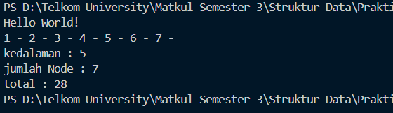
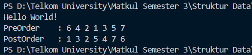

# <h1 align="center">Laporan Praktikum Modul 10 - Tree (Bagian Pertama)</h1>

<p align="center">Faiz Az-Zahra Winanto Putra - 10311243001</p>

## Dasar Teori


##### Pengertian Rekursif

Rekursif adalah suatu konsep dalam matematika dan ilmu komputer yang memungkinkan suatu fungsi atau prosedur untuk memanggil dirinya sendiri secara terus-menerus. Dalam rekursif, fungsi atau prosedur tersebut dapat memanggil dirinya sendiri dengan parameter yang berbeda-beda, sehingga dapat menyelesaikan masalah yang kompleks dengan cara yang lebih efektif. Rekursif digunakan dalam berbagai bidang, seperti algoritma, teori graf, dan analisis fungsi.[1]

Dalam rekursif, fungsi atau prosedur tersebut dapat memanggil dirinya sendiri dengan parameter yang berbeda-beda, sehingga dapat menyelesaikan masalah yang kompleks dengan cara yang lebih efektif. Rekursif juga digunakan dalam berbagai aplikasi, seperti penghitungan faktorial, penghitungan deret, dan penghitungan polinomial.[1]


##### Pengertian Tree

Pohon ( tree) adalah graph terhubung yang tidak mengandung sirkuit. Pohon (tree) merupakan stuktur data yang tidak linier yang digambarkan dengan hubungan yang bersifat hirarkis antar satu elemen.[2]

##### Struktur data B-Tree

B-tree merupakanpohon cari keseimbangan yang dibuat untuk penyimpanan pada magnitic disk karena operasi yang sangat lambat dibandingkan dengan RAM.B-tree mulai di perkenalkan pada tahun1960 tujuan dikembangkan metode ini adalah sebagai file system yang disebut dengan metode akses yang digunakan untuk beberapa mesin sperti Sperry Univac Corporation. Orangyang pertama kali menciptakan adalah Rudolf Bayer dan Ed McCreighttidak menjelaskan huruf B pada B-tree namun yang paling diyakini adalah B merupakan kependekan dari Balance yang artinya seimbang, karena semua simpul daun pada pohon berada pada tingkat atau level yang salam, namun ada sebagian yang mengartikan B merupakan Bayer nama depan dari penciptanya atau Boeing kerena merka bekerja untuk Boeing Scientific Research Labs. Balance tree merupakan pohon seimbang dimana tidak ada simpul daun yang lebih panjang dari yang lainnya. B-Tree merupakan sebuah m-ary balanced search tree yang digunakan untuk basis data, hal ini disebabkan strukturnya memungkinkan data yang disimpan dapat dengan mudah untuk disisipi, dihapus dan diambil dengan jaminan proses dengan waktu yang tidak bagus, dimana setiap simpulnya terdiri dari (m/2) samapai m buah simpul anak, dimana m>1 merupakan bilangan bulat positif dimana m merupakan orde. Akar pohon B tree paling sedikit memiliki 2 simpul anak.[2]


## Guided

### 1.  Guided 1 

rekursifpangkat2.h
```C++
#include<iostream>

using namespace std;
  

int pangkat_2(int x){
    if(x == 0){ // basis
        return 1;
    } else if (x > 0){ // rekurens
        return 2 * pangkat_2(x - 1);
    }
}

int main(){
    cout << "=== REKURSIF PANGKAT 2 ===" << endl;
    int x;
    cout << "Masukkan nilai x: ";
    cin >> x;
    cout << endl;
    cout << "2 pangkat " << x << " adalah : " << pangkat_2(x);

  

    return 0;

}

  

// misal x = 3
// pangkat_2(3)
// 2 * pangkat_2(2)
// 2 * (2 * pangkat_2(1))
// 2 * (2 * (2 * pangkat_2(0)))
// = 2 * 2 * 2

// = 8
```

Program tersebut menghitung nilai 2x2^x2x menggunakan fungsi rekursif. Jika x = 0, fungsi mengembalikan 1 sebagai basis, dan jika x > 0, fungsi memanggil dirinya sendiri dengan `x - 1` lalu mengalikan hasilnya dengan 2. Di `main`, program meminta input x dari pengguna dan menampilkan hasil perhitungan. Contohnya, untuk x = 3, proses rekursinya menghasilkan 2 × 2 × 2 = 8.

### 2. Guided BST 1

##### BST1.h
```c
 #ifndef BST1_H

#define BST1_H

  

#include <iostream>

  

using namespace std;

  

typedef int infotype;

typedef struct Node *address;

  

struct Node{

    infotype info;

    address left;

    address right;

};

  

bool isEmpty(address root);

void createTree(address &root);

address newNode(infotype x);

address insertNode(address root, infotype x);

void preOrder(address root);

void inOrder(address root);

void postOrder(address root);

int countNodes(address root);

int treeDepth(address root);

  

#endif
```

##### BST1.cpp
```c
#include "BST1.h"
 
#include <iostream>

  

using namespace std;

  

//isEmpty & createTree

bool isEmpty(address root) { //function untuk mengecek apakah BST kosong atau tidak

    if(root == NULL){

        return true;

    } else {

        return false;

    }

}

  

void createTree(address &root) { //function untuk membuat BST nya (root di-set sebagai NULL)

    root = NULL;

}

  
  

//alokasi & insert

address newNode(infotype x) { //function untuk memasukkan data (infotype) kedalam node

    address temp = new Node;

    temp->info = x;

    temp->left = NULL;

    temp->right = NULL;

    return temp;

}

  

address insertNode(address root, infotype x) { //function untuk memasukkan node kedalam BST

    if (root == NULL) {

        return newNode(x);

    }

  

    if (x < root->info) {

        root->left = insertNode(root->left, x);

    } else if (x > root->info) {

        root->right = insertNode(root->right, x);

    }

  

    return root;

}

  
  

//Traversal

void preOrder(address root) { //function traversal tree secara pre-order (tengah - kiri - kanan atau root - child kiri - child kanan)

    if (root != NULL) {

        cout << root->info << " ";

        preOrder(root->left);

        preOrder(root->right);

    }

}

  

void inOrder(address root) { //function traversal tree secara in-order (kiri - tengah - kanan atau child kiri - root - child kanan)

    if (root != NULL) {

        inOrder(root->left);

        cout << root->info << " ";

        inOrder(root->right);

    }

}

  

void postOrder(address root) { //function traversal tree secara post-order (kiri - kanan - tengah atau child kiri - child kanan - root)

    if (root != NULL) {

        postOrder(root->left);

        postOrder(root->right);

        cout << root->info << " ";

    }

}

  
  

//Utilities

int countNodes(address root) { //function untuk menghitung size atau ukuran atau jumlah node yang ada didalam tree

    if (isEmpty(root) == true) {

        return 0;

    } else {

        return 1 + countNodes(root->left) + countNodes(root->right);

    }

}

  

int treeDepth(address root) { //function untuk menghitung height atau kedalaman atau level tree

    if (isEmpty(root) == true) {

        return -1; //tree kosong jika depth = -1

    } else {

        int leftDepth = treeDepth(root->left);

        int rightDepth = treeDepth(root->right);

        return (leftDepth > rightDepth ? leftDepth : rightDepth) + 1;

    }

}
```

##### main.cpp
```c
#include <iostream>

#include "BST1.h"

  

using namespace std;

  

int main(){

    address root;

    createTree(root);

  

    cout << "Binary Search Tree Insert & Traversal" << endl;

    cout << endl;

  

    root = insertNode(root, 20); // Root awal

    insertNode(root, 10);

    insertNode(root, 35);

    insertNode(root, 5);

    insertNode(root, 18);

    insertNode(root, 40);

  

    cout << "Hasil InOrder Traversal : ";

    inOrder(root);

    cout << endl;

  

    cout << "Hasil PreOrder Traversal : ";

    preOrder(root);

    cout << endl;

  

    cout << "Hasil PostOrder Traversal : ";

    postOrder(root);

    cout << endl;

  

    cout << endl;

    cout << "Jumlah Node : " << countNodes(root) << endl;

    cout << "Kedalaman Tree : " << treeDepth(root) << endl;

  
  

    return 0;

}
```

Program ini merupakan implementasi modular struktur data Binary Search Tree (BST) dalam bahasa C++ yang memisahkan deklarasi, logika fungsi, dan eksekusi utama ke dalam file BST1.h, BST1.cpp, dan main.cpp. Program mendefinisikan tipe data abstrak berupa struct Node yang memanfaatkan pointer dan alokasi memori dinamis untuk menyimpan data integer serta menghubungkannya dengan child kiri dan kanan. Fungsionalitas utama mencakup operasi insertNode yang menyusun data secara otomatis berdasarkan aturan BST (nilai lebih kecil dari root ditempatkan di kiri, dan yang lebih besar di kanan), serta tiga metode traversal rekursif (PreOrder, InOrder, PostOrder) untuk menelusuri dan menampilkan isi pohon. Selain itu, program dilengkapi dengan utilitas countNodes untuk menghitung total simpul dan treeDepth untuk mengukur kedalaman pohon. Pada fungsi main, program mendemonstrasikan pembentukan pohon dengan menyisipkan serangkaian angka (dimulai dari 20 sebagai root), kemudian menampilkan hasil penelusuran urutan data serta statistik jumlah node dan kedalaman pohon tersebut ke layar.

### 2. Guided BST 2

##### BST2.h
```c
#ifndef BST1_H

#define BST1_H

  

#include <iostream>

  

using namespace std;

  

typedef int infotype; // alias infotype untuk data integer

typedef struct Node *address; // alias address sebagai pointer ke struct Node (Node*)

  

struct Node {

    infotype info; // info data yang disimpan (integer)

    address left; // pointer left

    address right; // pointer right

};

  

// isEmpty & createTree

bool isEmpty(address root); // function untuk mengecek apakah BST kosong atau tidak

void createTree(address &root); // function untuk membuat BST nya (root di-set sebagai NULL)

  

// alokasi & insert

address newNode(infotype x); // function untuk memasukkan data (infotype) ke dalam node

address insertNode(address root, infotype x); // function untuk memasukkan node ke dalam BST

  

// Traversal

void preOrder(address root); // function traversal tree secara pre-order (tengah - kiri - kanan atau root - child kiri - child kanan)

void inOrder(address root); // function traversal tree secara in-order (kiri - tengah - kanan atau child kiri - root - child kanan)

void postOrder(address root); // function traversal tree secara post-order (kiri - kanan - tengah atau child kiri - child kanan - root)

  

// Utilities

int countNodes(address root); // function untuk menghitung size atau ukuran atau jumlah node yang ada di dalam tree

int treeDepth(address root); // function untuk menghitung height atau kedalaman atau level tree

  

//FUNCTION & PROSEDUR BARU

//searching

void searchByData(address root, infotype x); //function untuk melakukan searching data tertentu

  

//mostleft & mostright

address mostLeft(address root); // function untuk menampilkan mostleft atau node paling kiri

address mostRight(address root); // function untuk menampilkan mostleft atau node paling kanan

  

//delete

bool deleteNode(address &root, infotype x);

void deleteTree(address &root); //prosedur untuk menghapus BST (menghapus seluruh node BST)

  

#endif
```

##### BST2.cpp
```c
#include "BST2.h"

#include <iostream>

  

using namespace std;

  

//FUNCTION & PROSEDUR SEBELUMNYA

//isEmpty & createTree

bool isEmpty(address root) { //function untuk mengecek apakah BST kosong atau tidak

    if(root == NULL){

        return true;

    } else {

        return false;

    }

}

  

void createTree(address &root) { //function untuk membuat BST nya (root di-set sebagai NULL)

    root = NULL;

}

  
  

//alokasi & insert

address newNode(infotype x) { //function untuk memasukkan data (infotype) kedalam node

    address temp = new Node;

    temp->info = x;

    temp->left = NULL;

    temp->right = NULL;

    return temp;

}

  

address insertNode(address root, infotype x) { //function untuk memasukkan node kedalam BST

    if (root == NULL) {

        return newNode(x);

    }

  

    if (x < root->info) {

        root->left = insertNode(root->left, x);

    } else if (x > root->info) {

        root->right = insertNode(root->right, x);

    }

  

    return root;

}

  
  

//Traversal

void preOrder(address root) { //function traversal tree secara pre-order (tengah - kiri - kanan atau root - child kiri - child kanan)

    if (root != NULL) {

        cout << root->info << " ";

        preOrder(root->left);

        preOrder(root->right);

    }

}

  

void inOrder(address root) { //function traversal tree secara in-order (kiri - tengah - kanan atau child kiri - root - child kanan)

    if (root != NULL) {

        inOrder(root->left);

        cout << root->info << " ";

        inOrder(root->right);

    }

}

  

void postOrder(address root) { //function traversal tree secara post-order (kiri - kanan - tengah atau child kiri - child kanan - root)

    if (root != NULL) {

        postOrder(root->left);

        postOrder(root->right);

        cout << root->info << " ";

    }

}

  
  

//Utilities

int countNodes(address root) { //function untuk menghitung size atau ukuran atau jumlah node yang ada didalam tree

    if (isEmpty(root) == true) {

        return 0;

    } else {

        return 1 + countNodes(root->left) + countNodes(root->right);

    }

}

  

int treeDepth(address root) { //function untuk menghitung height atau kedalaman atau level tree

    if (isEmpty(root) == true) {

        return -1; //tree kosong jika depth = -1

    } else {

        int leftDepth = treeDepth(root->left);

        int rightDepth = treeDepth(root->right);

        return (leftDepth > rightDepth ? leftDepth : rightDepth) + 1;

    }

}

  
  

//FUNCTION & PROSEDUR BARU

//searching

void searchByData(address root, infotype x) { //function untuk melakukan searching data tertentu

    if(isEmpty(root) == true){

        cout << "BST kosong!" << endl;

    } else {

        address nodeBantu = root;

        address parent = NULL;

        bool ketemu = false;

        while(nodeBantu != NULL){

            if(x < nodeBantu->info){

                parent = nodeBantu;

                nodeBantu = nodeBantu->left;

            } else if(x > nodeBantu->info){

                parent = nodeBantu;

                nodeBantu = nodeBantu->right;

            } else if(x == nodeBantu->info){

                ketemu = true;

                break;

            }

        }

        if(ketemu == false){

            cout << "Data tidak ditemukan" << endl;

        } else if(ketemu == true){

            cout << "Data ditemukan didalam BST!" << endl;

            cout << "Data Angka : " << nodeBantu->info << endl;

  

            //menampilkan parentnya & pengecekan sibling

            address sibling = NULL;

            if(parent != NULL){

                cout << "Parent : " << parent->info << endl;

                if(parent->left == nodeBantu){

                    sibling = parent->right;

                } else if(parent->right == nodeBantu){

                    sibling = parent->left;

                }

            } else {

                cout << "Parent : - (node root)"<< endl;

            }

  

            //menampilkan siblingnya

            if(sibling != NULL){

                cout << "Sibling : " << sibling->info << endl;

            } else {

                cout << "Sibling : - " << endl;

            }

  

            //menampilkan childnya

            if(nodeBantu->left != NULL){

                cout << "Child kiri : " << nodeBantu->left->info << endl;

            } else if(nodeBantu->left == NULL){

                cout << "Child kiri : -" << endl;

            }

            if(nodeBantu->right != NULL){

                cout << "Child kanan : " << nodeBantu->right->info << endl;

            } else if(nodeBantu->right == NULL){

                cout << "Child kanan : -" << endl;

            }

        }

    }

}

  
  

//mostleft & mostright

address mostLeft(address root) { //function untuk menampilkan mostleft atau node paling kiri (node dengan nilai terkecil) didalam BST

    while (root->left != NULL){

        root = root->left;

    }

    return root;

}

  

address mostRight(address root) { //function untuk menampilkan mostright atau node paling kanan (node dengan nilai terbesar) didalam BST

    while (root->right != NULL){

        root = root->right;

    }

    return root;

}

  
  

//delete

bool deleteNode(address &root, infotype x) { //function untuk menghapus node tertentu didalam BST (menghapus berdasarkan parameter infotype)

    if (root == NULL) {

        return false; //data tidak ditemukan di subtree ini

    } else {

        if (x < root->info) {

            return deleteNode(root->left, x);

        } else if (x > root->info) {

            return deleteNode(root->right, x);

        } else {

            //jika node yang mau dihapus ditemukan

            //Case 1 : node yang mau dihapus adalah leaf

            if (root->left == NULL && root->right == NULL) {

                address temp = root;

                root = NULL;

                delete temp;

            }

            //Case 2 : node yang mau dihapus hanya punya right child

            else if (root->left == NULL) {

                address temp = root;

                root = root->right;

                delete temp;

            }

            //Case 3 : node yang mau dihapus hanya punya left child

            else if (root->right == NULL) {

                address temp = root;

                root = root->left;

                delete temp;

            }

            // Case 4 : jika node yang mau dihapus punya dua child, maka ambil mostleft dari subtree kanan untuk menggantikan node yang mau dihapus

            else {

                //mostleft dari subtree kanan = node successor (node penerus)

                address successor = mostLeft(root->right);

                //salin data successor ke node saat ini

                root->info = successor->info;

                //hapus successor pada subtree kanan

                return deleteNode(root->right, successor->info);

            }

            return true; //berhasil dihapus

        }

    }

}

  

void deleteTree(address &root) { //prosedur untuk menghapus BST (menghapus seluruh node BST)

    if(root == NULL){

        return;

    } else {

        deleteTree(root->left);

        deleteTree(root->right);

        delete root;

        root = NULL;

    }

}
```

##### main.cpp
```c
 #include <iostream>

#include "BST2.h"

  

using namespace std;

  

int main(){

    address root;

    createTree(root);

  

    cout << "=== Binary Search Tree ==" << endl;

    cout << endl;

  

    root = insertNode(root, 30); // Root awal

    insertNode(root, 15);

    insertNode(root, 35);

    insertNode(root, 11);

    insertNode(root, 17);

    insertNode(root, 20);

    insertNode(root, 38);

    insertNode(root, 16);

    insertNode(root, 22);

    insertNode(root, 33);

    insertNode(root, 18);

  

    cout << "Hasil InOrder Traversal : ";

    inOrder(root);

    cout << endl;

  

    cout << endl;

    cout << "Jumlah Node : " << countNodes(root) << endl;

    cout << "Kedalaman Tree : " << treeDepth(root) << endl;

  

    cout << endl;

    searchByData(root, 17);

    cout << endl;

    cout << "Node mostleft : " << mostLeft(root)->info << endl;

    cout << "Node mostright : " << mostRight(root)->info << endl;

  

    cout << endl;

    infotype angkaHapus;

    cout << "Masukkan angka yang ingin dihapus: ";

    cin >> angkaHapus;

    //misal angka yang dihapus adalah angka 17

    if(deleteNode(root, angkaHapus)){

        cout << "Data " << angkaHapus << " berhasil dihapus!" << endl;

    } else {

        cout << "Data " << angkaHapus << " tidak ditemukan!" << endl;

    }

    cout << endl;

  

    searchByData(root, 17);

    cout << endl;

    searchByData(root, 18);

  

    cout << endl;

    cout << "Hasil InOrder Traversal : ";

    inOrder(root);

    cout << endl;

  

    cout << endl;

    deleteTree(root);

    cout << "Seluruh tree berhasil dihapus!" << endl;

  

    cout << endl;

    if(isEmpty(root) == true){

        cout << "BST kosong!" << endl;

    } else {

        cout << "Hasil InOrder Traversal : ";

        inOrder(root);

    }

  

    return 0;

}
```

Program ini merupakan pengembangan lanjutan dari implementasi Binary Search Tree (BST) guided sebelumnya yang disusun secara modular dalam file BST2.h, BST2.cpp, dan main.cpp. Fokus utama pengembangan pada program ini adalah penambahan fitur manipulasi data yang lebih kompleks, meliputi fungsi pencarian (searchByData) yang tidak hanya melacak keberadaan nilai tetapi juga menampilkan informasi relasional node (seperti parent, sibling, dan child), serta fungsi mostLeft dan mostRight untuk mengidentifikasi nilai minimum dan maksimum dalam pohon. Selain itu, program ini mengimplementasikan logika penghapusan data (deleteNode) yang menangani tiga skenario kritis: penghapusan leaf node, node dengan satu anak, dan node dengan dua anak yang diselesaikan menggunakan teknik penggantian nilai dengan successor (nilai terkecil di subtree kanan). Pada eksekusi utama, program mendemonstrasikan siklus lengkap penggunaan BST, mulai dari penyisipan data, validasi pencarian, operasi penghapusan node dinamis berdasarkan input pengguna, hingga prosedur deleteTree yang membersihkan seluruh struktur pohon dari memori secara rekursif.

## Unguided

### 1.  Unguided 1 & 2
bstree.h
```C++
#ifndef BSTREE_H

#define BSTREE_H

  

typedef int infotype;

typedef struct Node* address;

  

struct Node {

    infotype info;

    address left;

    address right;

};

  

// ADT BST

address alokasi(infotype x);

void insertNode(address &root, infotype x);

address findNode(infotype x, address root);

void InOrder(address root);

  

// Fungsi Tambahan

int hitungJumlahNode(address root);

int hitungTotalInfo(address root);

int hitungKedalaman(address root, int start);

  

#endif
```

bstree.cpp
```C++
#include <iostream>

#include "bstree.h"

using namespace std;

  

// Alokasi node baru

address alokasi(infotype x) {

    address p = new Node;

    p->info = x;

    p->left = NULL;

    p->right = NULL;

    return p;

}

  

// Insert ke BST

void insertNode(address &root, infotype x) {

    if (root == NULL) {

        root = alokasi(x);

    } else if (x < root->info) {

        insertNode(root->left, x);

    } else if (x > root->info) {

        insertNode(root->right, x);

    }

}

  

// Cari node

address findNode(infotype x, address root) {

    if (root == NULL)

        return NULL;

    else if (x == root->info)

        return root;

    else if (x < root->info)

        return findNode(x, root->left);

    else

        return findNode(x, root->right);

}

  

// Traversal InOrder

void InOrder(address root) {

    if (root != NULL) {

        InOrder(root->left);

        cout << root->info << " - ";

        InOrder(root->right);

    }

}

  

// Menghitung jumlah node

int hitungJumlahNode(address root) {

    if (root == NULL)

        return 0;

    else

        return 1 + hitungJumlahNode(root->left) + hitungJumlahNode(root->right);

}

  

// Menghitung total seluruh nilai node

int hitungTotalInfo(address root) {

    if (root == NULL)

        return 0;

    else

        return root->info + hitungTotalInfo(root->left) + hitungTotalInfo(root->right);

}

  

// Menghitung kedalaman maksimum BST

int hitungKedalaman(address root, int start) {

    if (root == NULL)

        return start;

    int kiri = hitungKedalaman(root->left, start + 1);

    int kanan = hitungKedalaman(root->right, start + 1);

  

    return (kiri > kanan) ? kiri : kanan;

}
```


main.cpp
```C++
#include <iostream>

#include "bstree.h"

using namespace std;

  

int main() {

    cout << "Hello World!" << endl;

  

    address root = NULL;

  

    insertNode(root, 1);
    insertNode(root, 2);
    insertNode(root, 6);
    insertNode(root, 4);
    insertNode(root, 5);
    insertNode(root, 3);
    insertNode(root, 6);  // duplikat, tidak akan ditambahkan
    insertNode(root, 7);

    InOrder(root);

    cout << endl;

  

    cout << "kedalaman : " << hitungKedalaman(root, 0) << endl;
    cout << "jumlah Node : " << hitungJumlahNode(root) << endl;
    cout << "total : " << hitungTotalInfo(root) << endl;

    return 0;
}
```

##### Output 

Program ini mengimplementasikan struktur data Binary Search Tree (BST) menggunakan tipe data Node yang menyimpan nilai integer serta pointer ke anak kiri dan kanan. Fungsi alokasi digunakan untuk membuat node baru, sementara insertNode menyisipkan data ke dalam tree sesuai aturan BST secara rekursif. Fungsi findNode memungkinkan pencarian node berdasarkan nilai tertentu. Tree dapat ditampilkan secara terurut melalui inOrder, yang menelusuri node dari kiri–root–kanan. Program juga dilengkapi fungsi analisis tree, seperti hitungJumlahNode untuk menghitung total node, hitungTotalInfo untuk menjumlahkan seluruh nilai info di dalam tree, serta hitungKedalaman untuk menentukan kedalaman maksimum tree. Fungsi-fungsi ini bekerja dengan rekursi sehingga memudahkan proses penelusuran struktur tree secara efisien.

### Unguided 3

bstree.h

```c
#ifndef BSTREE_H

#define BSTREE_H

  

#include <iostream>

#define Nil NULL

  

using namespace std;

  

// Definisi tipe data

typedef int infotype;

typedef struct Node *address;

  

struct Node {

    infotype info;

    address left;

    address right;

};

  

// Prototype Fungsi & Prosedur Dasar

address alokasi(infotype x);

void insertNode(address &root, infotype x);

address findNode(infotype x, address root);

void printInorder(address root);

  

// Fungsi Statistik

int hitungJumlahNode(address root);

int hitungTotalInfo(address root);

// Menggunakan parameter 'start' sesuai request soal gambar, default biasanya 0

int hitungKedalaman(address root, int start);

  

void printPreorder(address root);

void printPostorder(address root);

  

#endif
```

bstree.cpp

```c
#include "bstree.h"

#include <iostream>

using namespace std;

  

address alokasi(infotype x) {

    address p = new Node;

    p->info = x;

    p->left = Nil;

    p->right = Nil;

    return p;

}

  

void insertNode(address &root, infotype x) {

    if (root == Nil) {

        root = alokasi(x);

    } else {

        if (x < root->info) {

            insertNode(root->left, x);

        } else if (x > root->info) {

            insertNode(root->right, x);

        }

    }

}

  

address findNode(infotype x, address root) {

    if (root == Nil) {

        return Nil;

    } else if (root->info == x) {

        return root;

    } else {

        if (x < root->info) {

            return findNode(x, root->left);

        } else {

            return findNode(x, root->right);

        }

    }

}

  

void printInorder(address root) {

    if (root != Nil) {

        printInorder(root->left);

        cout << root->info << " - ";

        printInorder(root->right);

    }

}

  

int hitungJumlahNode(address root) {

    if (root == Nil) {

        return 0;

    } else {

        return 1 + hitungJumlahNode(root->left) + hitungJumlahNode(root->right);

    }

}

  

int hitungTotalInfo(address root) {

    if (root == Nil) {

        return 0;

    } else {

        return root->info + hitungTotalInfo(root->left) + hitungTotalInfo(root->right);

    }

}

  

// Implementasi rekursif untuk kedalaman (max depth)

int hitungKedalaman(address root, int start) {

    if (root == Nil) {

        return start; // Mengembalikan level terakhir yang dicapai

    } else {

        int leftDepth = hitungKedalaman(root->left, start + 1);

        int rightDepth = hitungKedalaman(root->right, start + 1);

        if (leftDepth > rightDepth) return leftDepth;

        else return rightDepth;

    }

}

  

void printPreorder(address root) {

    if (root != Nil) {

        cout << root->info << " ";      

        printPreorder(root->left);      

        printPreorder(root->right);    

    }

}

  

void printPostorder(address root) {

    if (root != Nil) {

        printPostorder(root->left);    

        printPostorder(root->right);    

        cout << root->info << " ";      

    }

}
```

main.cpp

```c
#include <iostream>

#include "bstree.h"

using namespace std;

  

int main() {

    cout << "Hello World!" << endl;

    address root = Nil;

  

    // Insert data

    insertNode(root, 6);

    insertNode(root, 4);

    insertNode(root, 7);

    insertNode(root, 2);

    insertNode(root, 5);

    insertNode(root, 1);

    insertNode(root, 3);

  

    cout << "PreOrder    : ";

    printPreorder(root);

    cout << endl;

  

    cout << "PostOrder   : ";

    printPostorder(root);

    cout << endl;

  

    return 0;

}
```

##### Output pada 3 program

Program ini merupakan implementasi modular struktur data Binary Search Tree (BST) dalam bahasa C++ yang membagi kode menjadi deklarasi ADT (bstree.h), implementasi logika (bstree.cpp), dan eksekusi utama (main.cpp). Program mendefinisikan struct Node yang memanfaatkan alokasi memori dinamis dan pointer untuk membentuk hierarki data, serta menyediakan fungsi lengkap untuk manipulasi pohon, termasuk penyisipan data (insertNode), pencarian, perhitungan statistik (jumlah node, total nilai, dan kedalaman), serta tiga jenis penelusuran (traversal). Pada eksekusi utamanya, program secara spesifik membangun pohon dengan menyisipkan serangkaian bilangan bulat (dimulai dari 6 sebagai root, diikuti 4, 7, 2, 5, 1, dan 3) dan menampilkan hasil penelusuran struktur pohon tersebut menggunakan metode PreOrder (cetak akar di awal) dan PostOrder (cetak akar di akhir) ke layar.
## Kesimpulan
Rekursif adalah suatu konsep dalam matematika dan ilmu komputer yang memungkinkan suatu fungsi atau prosedur untuk memanggil dirinya sendiri secara terus-menerus. Dalam rekursif, fungsi atau prosedur tersebut dapat memanggil dirinya sendiri dengan parameter yang berbeda-beda, sehingga dapat menyelesaikan masalah yang kompleks dengan cara yang lebih efektif. Rekursif digunakan dalam berbagai bidang, seperti algoritma, teori graf, dan analisis fungsi. sedangkan, 

Pohon ( tree) adalah graph terhubung yang tidak mengandung sirkuit. Pohon (tree) merupakan stuktur data yang tidak linier yang digambarkan dengan hubungan yang bersifat hirarkis antar satu elemen.

  

## Referensi

[1] Rahmawati, E., Medina, P., & Azhari, D. S. (2024). Rekursif Dalam Pemrograman Teori Dan Praktek. _Innovative: Journal Of Social Science Research_, _4_(4), 5622-5630. Diakses pada 02 Desember 2025 melalui [[https://j-innovative.org/index.php/Innovative/article/view/13762/9166]]
 
[2] Latifah, F. (2016). Penerapan Algorithma Pohon untuk Operasi Pengolahan dan Penyimpanan Data Dalam Teknik Pemrograman (Kajian Algorithma Pohon pada Teknik Pemrograman). _Jurnal Techno Nusa Mandiri_, _13_(2), 111-120. Diakses pada 02 Desember 2025 melalui [[https://ejournal.nusamandiri.ac.id/index.php/techno/article/view/203/179]]
