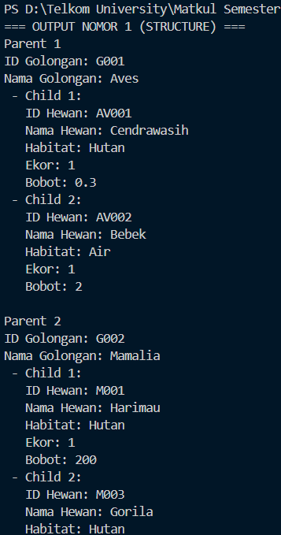
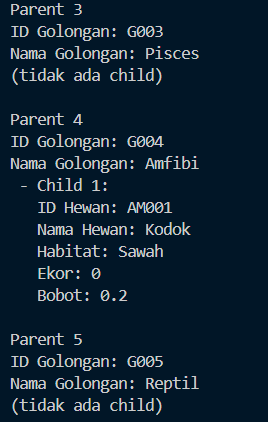
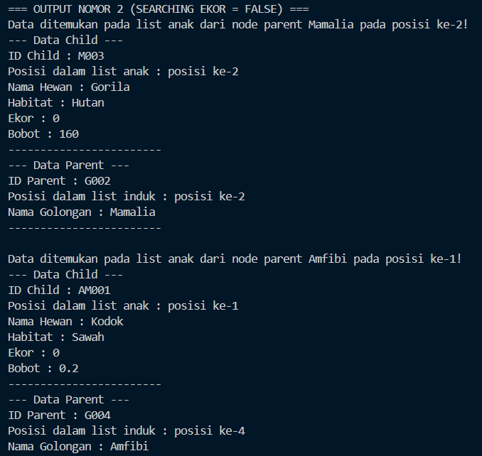
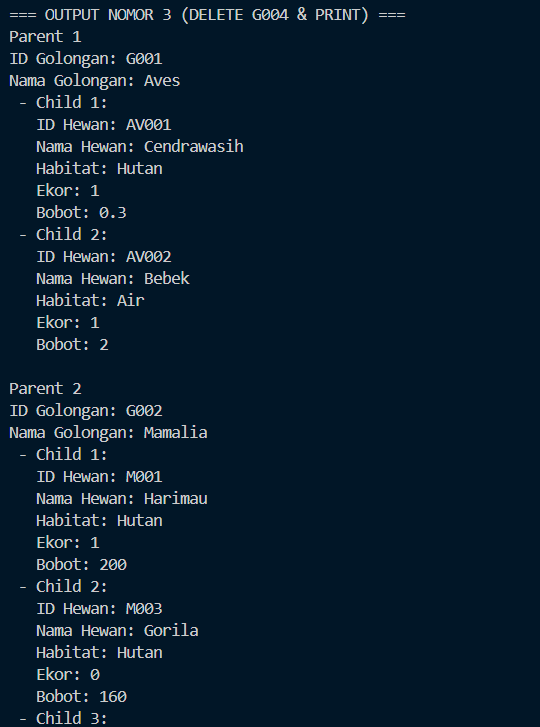
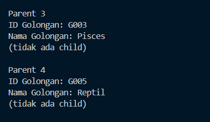

# <h1 align="center">Laporan Praktikum Modul 13 - Multi Linked List</h1>

<p align="center">Faiz Az-Zahra Winanto Putra - 10311243001</p>

## Dasar Teori


Multi linked list N-N merupakan jenis multi linked list dimana satu elemen pada list pertama dapat memiliki relasi ke satu atau lebih elemen pada list kedua, serta satu elemen pada list kedua juga dapat memiliki relasi ke satu atau lebih elemen pada list pertama. Pada multi linked list N-N, jumlah listnya tidak dibatasi hanya dua list saja, tetapi juga dapat lebih dari dua list sesuai yang dibutuhkan. Untuk menghubungkan list-list yang terdapat dalam satu multi linked list tersebut dibuat satu list baru yang disebut dengan List Relasi. Dalam implementasinya, Multi Linked List dapat menggunakan Single Linked List, Double Linked List, Circular Linked List, atau jenis list lainnya. Dalam bab ini, jenis list yang digunakan untuk membangun Multi Linked List N-N adalah Single Linked List. Contoh kasus yang menggunakan Multi Linked List N-N yaitu relasi antara mahasiswa dengan mata kuliah, dimana satu mahasiswa dapat mengambil lebih dari satu mata kuliah dan satu mata kuliah dapat diambil oleh lebih dari satu mahasiswa. [1]

##### Struktur Data Multi Linked List N-N

Secara umum, list-list yang terdapat dalam multi linked list N-N memiliki struktur data yang sama dengan single linked list, akan tetapi dengan tambahan list relasi yang elemennya berisi pointer ke list-list lainnya. Sebagai contoh, multi linked list pada Gambar 2, memiliki tiga jenis list, yaitu List_1, List_2, dan List Relasi. List_1 dan List_2 merupakan list utama yang memiliki info, sedangkan list relasi merupakan list yang menghubungkan List_1 dan List_2. [2]


## Guided

### 1.  Guided 1 

multilist.h
```C++
#ifndef MULTILIST_H

#define MULTILIST_H

  

#include <iostream>

  

using namespace std;

  

typedef struct nodeParent *NodeParent; // alias pointer ke struct nodeParent

typedef struct nodeChild *NodeChild; // alias pointer ke struct nodeChild

  

struct nodeChild { // node child

    string idMakanan;

    string namaMakanan;

    NodeChild next;

    NodeChild prev;

};

  

struct listAnak { // list child

    NodeChild first;

    NodeChild last;

};

  

struct nodeParent { // node parent

    string idKategoriMakanan;

    string namaKategoriMakanan;

    NodeParent next;

    NodeParent prev;

    listAnak L_Anak;

};

  

struct listInduk { // list parent

    NodeParent first;

    NodeParent last;

};

  

// create list

void createListInduk(listInduk &LInduk);

void createListAnak(listAnak &LAnak);

  

// alokasi & dealokasi parent

NodeParent alokasiNodeParent(string idKategoriMakanan, string namaKategoriMakanan);

void dealokasiNodeParent(NodeParent &nodeInduk);

  

// alokasi & dealokasi child

NodeChild alokasiNodeChild(string idMakanan, string namaMakanan);

void dealokasiNodeChild(NodeChild &nodeAnak);

  

// operasi pada parent

void insertLastParent(listInduk &LInduk, NodeParent nodeBaruParent);

void hapusListAnak(listAnak &LAnak);

void deleteAfterParent(listInduk &LInduk, NodeParent nodePrev);

  

// operasi pada child

void insertLastChild(listAnak &LAnak, NodeChild nodeBaruChild);

void deleteAfterChild(listAnak &LAnak, NodeChild nodePrev);

void findChildByID(listInduk &LInduk, string IDCari);

  

// operasi print

void printStrukturMLL(listInduk &LInduk);

  

#endif
```

multilist.cpp
```C++
#include "multilist.h"

#include <iostream>

  

using namespace std;

  

//create list

void createListInduk(listInduk &LInduk){

    LInduk.first = LInduk.last = NULL;

}

  

void createListAnak(listAnak &LAnak){

    LAnak.first = LAnak.last = NULL;

}

  

//alokasi & dealokasi parent

NodeParent alokasiNodeParent(string idKategoriMakanan, string namaKategoriMakanan){

    NodeParent nodeBaruParent = new nodeParent;

    nodeBaruParent->idKategoriMakanan = idKategoriMakanan;

    nodeBaruParent->namaKategoriMakanan = namaKategoriMakanan;

    nodeBaruParent->next = NULL;

    nodeBaruParent->prev = NULL;

    createListAnak(nodeBaruParent->L_Anak);

    return nodeBaruParent;

}

  

void dealokasiNodeParent(NodeParent &nodeInduk){

    if(nodeInduk != NULL) {

        nodeInduk->next = nodeInduk->prev = NULL;

        delete nodeInduk;

        nodeInduk = NULL;

    }

}

  

//alokasi & delaokasi child

NodeChild alokasiNodeChild(string idMakanan, string namaMakanan){

    NodeChild nodeBaruChild = new nodeChild;

    nodeBaruChild->idMakanan = idMakanan;

    nodeBaruChild->namaMakanan = namaMakanan;

    nodeBaruChild->next = NULL;

    nodeBaruChild->prev = NULL;

    return nodeBaruChild;

}

  

void dealokasiNodeChild(NodeChild &nodeAnak){

    if(nodeAnak != NULL) {

        nodeAnak->next = nodeAnak->prev = NULL;

        delete nodeAnak;

        nodeAnak = NULL;

    }

}

  

//operasi pada parent

void insertLastParent(listInduk &LInduk, NodeParent nodeBaruParent){

    if(LInduk.first == NULL) {

        LInduk.first = LInduk.last = nodeBaruParent;

    } else {

        nodeBaruParent->prev = LInduk.last;

        LInduk.last->next = nodeBaruParent;

        LInduk.last = nodeBaruParent;

    }

    cout << "Node parent "<< nodeBaruParent->namaKategoriMakanan << " berhasil ditambahkan kedalam urutan terakhir di list Induk!" << endl;

}

  

void hapusListAnak(listAnak &LAnak){

    NodeChild nodeBantu = LAnak.first;

    while(nodeBantu != NULL) {

        NodeChild nodeHapus = nodeBantu;

        nodeBantu = nodeBantu->next;

        dealokasiNodeChild(nodeHapus);

    }

    LAnak.first = LAnak.last = NULL;

}

  

void deleteAfterParent(listInduk &LInduk, NodeParent nodePrev){

    if(LInduk.first == NULL){

        cout << "List induk kosong!" << endl;

    } else {

        if(nodePrev != NULL && nodePrev->next != NULL){

            NodeParent nodeHapus = nodePrev->next;

            nodePrev->next = nodeHapus->next;

            if (nodeHapus->next != NULL){

                (nodeHapus->next)->prev = nodePrev;

            } else {

                LInduk.last = nodePrev;

            }

            nodeHapus->next = NULL;

            if(nodeHapus->L_Anak.first != NULL){

                hapusListAnak(nodeHapus->L_Anak);

            }

            dealokasiNodeParent(nodeHapus);

            cout << "Node parent setelah node " << nodePrev->namaKategoriMakanan << " berhasil dihapus beserta anak-anaknya!" << endl;

        } else {

            cout << "Node prev tidak valid!" << endl;

        }

    }

}

  

//operasi pada child

void insertLastChild(listAnak &LAnak, NodeChild nodeBaruChild){

    if(LAnak.first == NULL) {

        LAnak.first = LAnak.last = nodeBaruChild;

    } else {

        nodeBaruChild->prev = LAnak.last;

        LAnak.last->next = nodeBaruChild;

        LAnak.last = nodeBaruChild;

    }

    cout << "Node child "<< nodeBaruChild->namaMakanan << " berhasil ditambahkan kedalam urutan terakhir di list Anak!" << endl;

}

  

void deleteAfterChild(listAnak &LAnak, NodeChild nodePrev){

    if(LAnak.first == NULL){

        cout << "List anak kosong!" << endl;

    } else {

        if(nodePrev != NULL && nodePrev->next != NULL){

            NodeChild nodeHapus = nodePrev->next;

            nodePrev->next = nodeHapus->next;

            if (nodeHapus->next != NULL){

                (nodeHapus->next)->prev = nodePrev;

            } else {

                LAnak.last = nodePrev;

            }

            nodeHapus->next = NULL;

            dealokasiNodeChild(nodeHapus);

            cout << "Node child setelah node " << nodePrev->namaMakanan << " berhasil dihapus!" << endl;

        } else {

            cout << "Node prev tidak valid!" << endl;

        }

    }

}

  

void findChildByID(listInduk &LInduk, string IDCari){

    if(LInduk.first == NULL){

        cout << "List induk kosong!" << endl;

    } else {

        NodeParent nodeBantuParent = LInduk.first;

        int indexParent = 1;

        int ketemu = false;

        while(nodeBantuParent != NULL){

            NodeChild nodeBantuChild = nodeBantuParent->L_Anak.first;

            int indexChild = 1;

            while(nodeBantuChild != NULL){

                if(nodeBantuChild->idMakanan == IDCari) {

                    cout << "Data ID child ditemukan pada list anak dari node parent " << nodeBantuParent->namaKategoriMakanan << " pada posisi ke-" << indexChild << "!" << endl;

                    cout << "--- Data Child ---" << endl;

                    cout << "ID Child (ID Makanan) : " << nodeBantuChild->idMakanan << endl;

                    cout << "Posisi dalam list anak : posisi ke-" << indexChild << endl;

                    cout << "Nama Makanan : " << nodeBantuChild->namaMakanan << endl;

                    cout << "---------------------------" << endl;

                    cout << "--- Data Parent ---" << endl;

                    cout << "ID Parent (ID Kategori Makanan): " << nodeBantuParent->idKategoriMakanan << endl;

                    cout << "Posisi dalam list induk : posisi ke-" << indexParent << endl;

                    cout << "Nama Kategori Makanan : " << nodeBantuParent->namaKategoriMakanan << endl;

                    ketemu = true;

                    break;

                } else {

                    nodeBantuChild = nodeBantuChild->next;

                    indexChild++;

                }

            }

            if(ketemu){

                break;

            } else {

                nodeBantuParent = nodeBantuParent->next;

                indexParent++;

            }

        }

        if(!ketemu){

            cout << "Data ID child tidak ditemukan didalam list anak!" << endl;

        }

    }

}

  

//operasi print

void printStrukturMLL(listInduk &LInduk){

    if(LInduk.first == NULL) {

        cout << "List induk kosong!" << endl;

    } else {

        NodeParent nodeBantuParent = LInduk.first;

        int indexParent = 1;

        while(nodeBantuParent != NULL) {

            cout << "=== Parent " << indexParent << " ===" << endl;

            cout << "ID Kategori Makanan : " << nodeBantuParent->idKategoriMakanan << endl;

            cout << "Nama Kategori Makanan : " << nodeBantuParent->namaKategoriMakanan << endl;

  

            //print list anak dari node parentnya

            NodeChild nodeBantuChild = nodeBantuParent->L_Anak.first;

            if(nodeBantuChild == NULL) {

                cout << "  (tidak ada child)" << endl;

            } else {

                int indexChild = 1;

                while(nodeBantuChild != NULL) {

                    cout << "  - Child " << indexChild << " :" << endl;

                    cout << "      ID Makanan : " << nodeBantuChild->idMakanan << endl;

                    cout << "      Nama Makanan : " << nodeBantuChild->namaMakanan << endl;

                    nodeBantuChild = nodeBantuChild->next;

                    indexChild++;

                }

            }

            cout << "---------------------------" << endl;

            nodeBantuParent = nodeBantuParent->next;

            indexParent++;

        }

    }

}
```

main.cpp
```C++
#include "multilist.h"

#include <iostream>

  

using namespace std;

  

int main() {

    // 1. Inisialisasi List

    listInduk LInduk;

    createListInduk(LInduk);

  

    // 2. Membuat Data Parent (Kategori Makanan)

    NodeParent K01 = alokasiNodeParent("K01", "Makanan Berat");

    insertLastParent(LInduk, K01);

    NodeParent K02 = alokasiNodeParent("K02", "Minuman");

    insertLastParent(LInduk, K02);

    NodeParent K03 = alokasiNodeParent("K03", "Dessert");

    insertLastParent(LInduk, K03);

    cout << endl;

  

    // 3. Memasukkan Data Child (Menu Makanan) ke Kategori Tertentu

    // --> Isi Kategori Makanan Berat (K01)

    NodeChild M01 = alokasiNodeChild("M01", "Nasi Goreng Spesial");

    insertLastChild(K01->L_Anak, M01);

    NodeChild M02 = alokasiNodeChild("M02", "Ayam Bakar Madu");

    insertLastChild(K01->L_Anak, M02);

    // --> Isi Kategori Minuman (K02)

    NodeChild D02 = alokasiNodeChild("D02", "Jus Alpukat");

    insertLastChild(K02->L_Anak, D02);

    NodeChild D01 = alokasiNodeChild("D01", "Es Teh Manis");

    insertLastChild(K02->L_Anak, D01);

    // --> Isi Kategori Dessert (K03)

    NodeChild S01 = alokasiNodeChild("S01", "Puding Cokelat");

    insertLastChild(K03->L_Anak, S01);

    cout << endl;

  

    // 4. Print mll setelah insert-insert

    printStrukturMLL(LInduk);

    cout << endl;

  

    // 5. searching node child

    findChildByID(LInduk, "D01");

    cout << endl;

  

    // 6. delete node child

    deleteAfterChild(K01->L_Anak, M01); //  menghapus node child ayam bakar madu

    cout << endl;

  

    // 7. delete node parent

    deleteAfterParent(LInduk, K02); // menghapus node parent Dessert

    cout << endl;

  

    // 8. print mll setelah delete-delete

    printStrukturMLL(LInduk);

    cout << endl;

    return 0;

}
```

Program ini mengimplementasikan **Multi Linked List (MLL)** dalam C++ untuk mengelola hubungan hierarkis antara **kategori makanan sebagai parent** dan **menu makanan sebagai child**, di mana setiap parent dan child menggunakan **double linked list**. Program menyediakan fungsi inisialisasi list, alokasi dan dealokasi node, penambahan serta penghapusan parent dan child (penghapusan parent otomatis menghapus seluruh child), pencarian child berdasarkan ID, dan pencetakan seluruh struktur data. Pada fungsi `main()`, seluruh fitur tersebut didemonstrasikan secara berurutan, mulai dari pembuatan kategori dan menu, penampilan data, pencarian menu tertentu, hingga penghapusan dan penampilan ulang struktur akhir.


## Unguided

### 1.  Unguided 1
MultiLL.h
```C++
#ifndef MULTILL_H

#define MULTILL_H

  

#include <iostream>

#include <string>

  

using namespace std;

  

// Definisi Struktur Data

struct golonganHewan {

    string idGolongan;

    string namaGolongan;

};

  

struct dataHewan {

    string idHewan;

    string namaHewan;

    string habitat;

    bool ekor; // 1 (True) jika berekor, 0 (False) jika tidak

    float bobot;

};

  

typedef struct nodeParent *NodeParent;

typedef struct nodeChild *NodeChild;

  

struct nodeChild {

    dataHewan isidata;

    NodeChild next;

    NodeChild prev;

};

  

struct listChild {

    NodeChild first;

    NodeChild last;

};

  

struct nodeParent {

    golonganHewan isidata;

    NodeParent next;

    NodeParent prev;

    listChild L_Child; // List child berada di dalam node parent

};

  

struct listParent {

    NodeParent first;

    NodeParent last;

};

  

// --- Prototypes ---

  

// Cek Kosong

bool isEmptyParent(listParent L);

bool isEmptyChild(listChild L);

  

// Create List

void createListParent(listParent &L);

void createListChild(listChild &L);

  

// Alokasi Node

NodeParent allocNodeParent(string idGol, string namaGol);

NodeChild allocNodeChild(string idHwn, string namaHwn, string habitat, bool tail, float weight);

  

// Dealokasi

void deallocNodeParent(NodeParent p); // Menghapus node parent

void deallocNodeChild(NodeChild c);   // Menghapus node child

  

// Operasi Parent (Double Linked List)

void insertFirstParent(listParent &L, NodeParent P);

void insertLastParent(listParent &L, NodeParent P);

void deleteFirstParent(listParent &L);

void deleteAfterParent(listParent &L, NodeParent Pre); // Dibutuhkan untuk menghapus G004 (setelah G003)

void deleteListChild(listChild &L); // Helper untuk membersihkan child sebelum parent dihapus

  

// Operasi Child (Double Linked List)

void insertFirstChild(listChild &L, NodeChild C);

void insertLastChild(listChild &L, NodeChild C);

void deleteFirstChild(listChild &L);

void deleteAfterChild(listChild &L, NodeChild Pre);

  

// Print

void printMLLStructure(listParent L);

  

// SEARCHING (Untuk Nomor 2)

void searchHewanByEkor(listParent L, bool tail);

  

#endif
```

MultiLL.cpp
```C++
#include "MultiLL.h"

  
  
  

bool isEmptyParent(listParent L) {

    return L.first == NULL;

}

  

bool isEmptyChild(listChild L) {

    return L.first == NULL;

}

  

void createListParent(listParent &L) {

    L.first = NULL;

    L.last = NULL;

}

  

void createListChild(listChild &L) {

    L.first = NULL;

    L.last = NULL;

}

  

NodeParent allocNodeParent(string idGol, string namaGol) {

    NodeParent P = new nodeParent;

    P->isidata.idGolongan = idGol;

    P->isidata.namaGolongan = namaGol;

    P->next = NULL;

    P->prev = NULL;

    createListChild(P->L_Child); // Penting: inisialisasi list child

    return P;

}

  

NodeChild allocNodeChild(string idHwn, string namaHwn, string habitat, bool tail, float weight) {

    NodeChild C = new nodeChild;

    C->isidata.idHewan = idHwn;

    C->isidata.namaHewan = namaHwn;

    C->isidata.habitat = habitat;

    C->isidata.ekor = tail;

    C->isidata.bobot = weight;

    C->next = NULL;

    C->prev = NULL;

    return C;

}

  

void insertLastParent(listParent &L, NodeParent P) {

    if (isEmptyParent(L)) {

        L.first = P;

        L.last = P;

    } else {

        P->prev = L.last;

        L.last->next = P;

        L.last = P;

    }

}

  

void insertLastChild(listChild &L, NodeChild C) {

    if (isEmptyChild(L)) {

        L.first = C;

        L.last = C;

    } else {

        C->prev = L.last;

        L.last->next = C;

        L.last = C;

    }

}

  

void deleteFirstChild(listChild &L) {

    if (!isEmptyChild(L)) {

        NodeChild P = L.first;

        if (L.first == L.last) {

            L.first = NULL;

            L.last = NULL;

        } else {

            L.first = P->next;

            L.first->prev = NULL;

            P->next = NULL;

        }

        delete P;

    }

}

  

void deleteListChild(listChild &L) {

    while (!isEmptyChild(L)) {

        deleteFirstChild(L);

    }

}

  

void deleteAfterParent(listParent &L, NodeParent Pre) {

    if (Pre != NULL && Pre->next != NULL) {

        NodeParent Del = Pre->next;

        deleteListChild(Del->L_Child);

  

        Pre->next = Del->next;

        if (Del->next != NULL) {

            Del->next->prev = Pre;

        } else {

            L.last = Pre;

        }

        delete Del;

    }

}

  

void printMLLStructure(listParent L) {

    NodeParent P = L.first;

    int i = 1;

    while (P != NULL) {

        cout << "Parent " << i << endl;

        cout << "ID Golongan: " << P->isidata.idGolongan << endl;

        cout << "Nama Golongan: " << P->isidata.namaGolongan << endl;

  

        if (isEmptyChild(P->L_Child)) {

            cout << "(tidak ada child)" << endl;

        } else {

            NodeChild C = P->L_Child.first;

            int j = 1;

            while (C != NULL) {

                cout << " - Child " << j << ":" << endl;

                cout << "   ID Hewan: " << C->isidata.idHewan << endl;

                cout << "   Nama Hewan: " << C->isidata.namaHewan << endl;

                cout << "   Habitat: " << C->isidata.habitat << endl;

                cout << "   Ekor: " << C->isidata.ekor << endl;

                cout << "   Bobot: " << C->isidata.bobot << endl;

                C = C->next;

                j++;

            }

        }

        cout << endl;

        P = P->next;

        i++;

    }

}

  

// --- IMPLEMENTASI NOMOR 2 (SEARCHING) ---

void searchHewanByEkor(listParent L, bool tail) {

    NodeParent P = L.first;

    int idxParent = 1;

  

    while (P != NULL) {

        if (!isEmptyChild(P->L_Child)) {

            NodeChild C = P->L_Child.first;

            int idxChild = 1;

            while (C != NULL) {

                // Cek kondisi ekor (False/0 sesuai soal)

                if (C->isidata.ekor == tail) {

                    cout << "Data ditemukan pada list anak dari node parent "

                         << P->isidata.namaGolongan << " pada posisi ke-" << idxChild << "!" << endl;

                    cout << "--- Data Child ---" << endl;

                    cout << "ID Child : " << C->isidata.idHewan << endl;

                    cout << "Posisi dalam list anak : posisi ke-" << idxChild << endl;

                    cout << "Nama Hewan : " << C->isidata.namaHewan << endl;

                    cout << "Habitat : " << C->isidata.habitat << endl;

                    cout << "Ekor : " << C->isidata.ekor << endl;

                    cout << "Bobot : " << C->isidata.bobot << endl;

                    cout << "------------------------" << endl;

                    cout << "--- Data Parent ---" << endl;

                    cout << "ID Parent : " << P->isidata.idGolongan << endl;

                    cout << "Posisi dalam list induk : posisi ke-" << idxParent << endl;

                    cout << "Nama Golongan : " << P->isidata.namaGolongan << endl;

                    cout << "------------------------" << endl << endl;

                }

                C = C->next;

                idxChild++;

            }

        }

        P = P->next;

        idxParent++;

    }

}
```


main.cpp
```C++
#include "MultiLL.h"

  
  

listParent LP;

  

int main() {

    // --- BAGIAN NOMOR 1: CREATE & INSERT ---

    createListParent(LP);

  

    NodeParent P;

    NodeChild C;

  

    // 1. Insert Parent G001 (Aves)

    P = allocNodeParent("G001", "Aves");

    insertLastParent(LP, P);

        // Child G001

        C = allocNodeChild("AV001", "Cendrawasih", "Hutan", true, 0.3);

        insertLastChild(P->L_Child, C);

        C = allocNodeChild("AV002", "Bebek", "Air", true, 2.0);

        insertLastChild(P->L_Child, C);

  

    // 2. Insert Parent G002 (Mamalia)

    P = allocNodeParent("G002", "Mamalia");

    insertLastParent(LP, P);

        // Child G002

        C = allocNodeChild("M001", "Harimau", "Hutan", true, 200);

        insertLastChild(P->L_Child, C);

        C = allocNodeChild("M003", "Gorila", "Hutan", false, 160);

        insertLastChild(P->L_Child, C);

        C = allocNodeChild("M002", "Kucing", "Darat", true, 4);

        insertLastChild(P->L_Child, C);

  

    // 3. Insert Parent G003 (Pisces)

    P = allocNodeParent("G003", "Pisces");

    insertLastParent(LP, P);

        // No Child

  

    // 4. Insert Parent G004 (Amfibi)

    P = allocNodeParent("G004", "Amfibi");

    insertLastParent(LP, P);

        // Child G004

        C = allocNodeChild("AM001", "Kodok", "Sawah", false, 0.2);

        insertLastChild(P->L_Child, C);

  

    // 5. Insert Parent G005 (Reptil)

    P = allocNodeParent("G005", "Reptil");

    insertLastParent(LP, P);

        // No Child

  

    // PRINT HASIL NOMOR 1

    cout << "=== OUTPUT NOMOR 1 (STRUCTURE) ===" << endl;

    printMLLStructure(LP);

    cout << "==================================" << endl << endl;

  

    // --- BAGIAN NOMOR 2: SEARCHING ---

    cout << "=== OUTPUT NOMOR 2 (SEARCHING EKOR = FALSE) ===" << endl;

    searchHewanByEkor(LP, false);

    cout << "===============================================" << endl << endl;

  

    // --- BAGIAN NOMOR 3: DELETE G004 ---

    cout << "=== OUTPUT NOMOR 3 (DELETE G004 & PRINT) ===" << endl;

    NodeParent P_Search = LP.first;

    NodeParent Pre_Node = NULL;

    while(P_Search != NULL){

        if(P_Search->isidata.idGolongan == "G003"){

            Pre_Node = P_Search;

            break;

        }

        P_Search = P_Search->next;

    }

  

    // Lakukan penghapusan jika G003 ditemukan

    if (Pre_Node != NULL) {

        deleteAfterParent(LP, Pre_Node); // Ini akan menghapus G004 beserta childnya

    }

  

    // Print hasil setelah penghapusan

    printMLLStructure(LP);

    cout << "============================================" << endl;

    return 0;

}
```

##### Output 

#### A.) Insert





#### B.) Search



#### C.) Delete node G004




Program ini merupakan implementasi Multi Linked List menggunakan bahasa C++ yang memodelkan hubungan golongan hewan sebagai node parent dan data hewan sebagai node child. Setiap node parent menyimpan satu golongan hewan dan memiliki list child yang berisi data hewan sesuai golongannya. Program menyediakan operasi pembuatan list, alokasi dan dealokasi node, penambahan dan penghapusan data parent maupun child, pencetakan seluruh struktur multilevel linked list, serta pencarian data hewan berdasarkan atribut ekor. Dengan struktur ini, program dapat menampilkan, menelusuri, dan mengelola data hewan secara bertingkat sesuai golongannya.


## Kesimpulan

Multi Linked List (MLL) merupakan pengembangan struktur data dinamis yang dirancang untuk mengatasi keterbatasan Single Linked List dalam merepresentasikan hubungan data yang kompleks, khususnya relasi One-to-Many atau Many-to-Many. Melalui mekanisme penggunaan pointer ganda pada node, MLL mampu membentuk hierarki Parent-Child yang lebih efisien dalam penggunaan memori dibandingkan array multidimensi karena tidak memerlukan alokasi ruang statis untuk slot kosong. Meskipun menawarkan fleksibilitas yang tinggi dalam penyisipan dan penghapusan data, implementasi MLL dalam bahasa C++ memiliki tingkat kompleksitas yang lebih tinggi, terutama pada operasi traversal yang membutuhkan perulangan bersarang serta manajemen memori yang ketat untuk mencegah terjadinya kesalahan seperti memory leak atau dangling pointer.

  

## Referensi

[1] Wisesty, U. N., Nurrahmi, H., Yunanto, P. E., Rismala, R., & Sthevanie, F. (2025). _STRUKTUR DATA MENGGUNAKAN C++_. PENERBIT KBM INDONESIA. Diakses pada 13 Desember 2025 melalui [[https://books.google.co.id/books?hl=id&lr=&id=JwCTEQAAQBAJ&oi=fnd&pg=PA157&dq=definisi+multi+linked+list&ots=Wt5zSe_h5s&sig=VFP3HEShv7vkGkF3XKgYmXDQ3OI&redir_esc=y#v=onepage&q=definisi%20multi%20linked%20list&f=false]]
 
[2] Wulandari, G. (2015). Analisis Performansi Metode Graph Decomposition Index pada Graph Database. Diakses pada 13 Desember 2025 melalui [[https://www.academia.edu/download/88779209/2545.pdf]]
