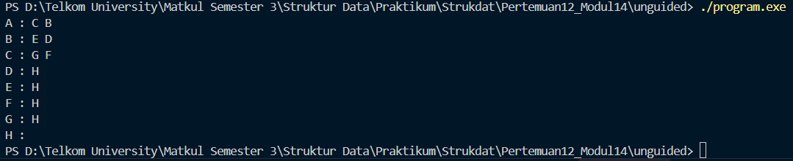
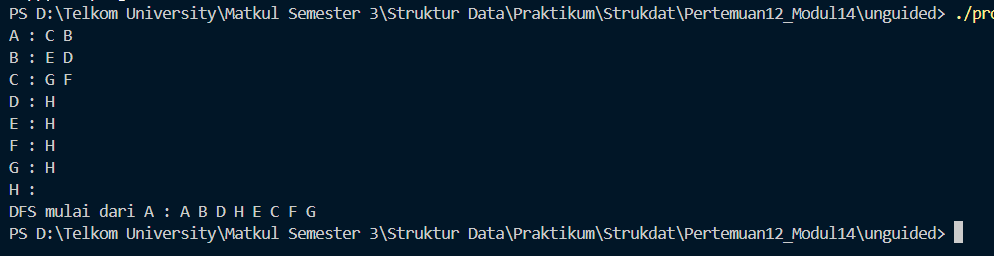
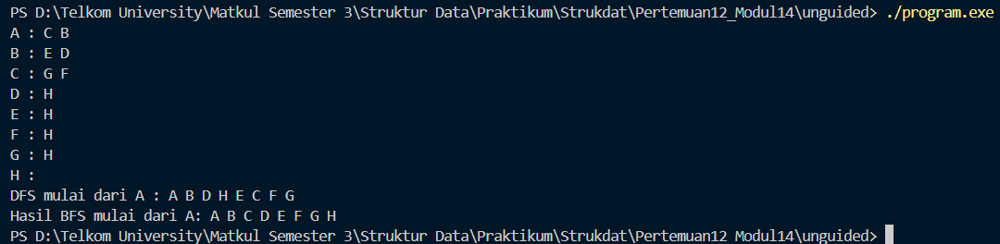

# <h1 align="center">Laporan Praktikum Modul 14 -Graph</h1>

<p align="center">Faiz Az-Zahra Winanto Putra - 10311243001</p>

## Dasar Teori

Graph merupakan representasi suatu permasalahan menggunakan sekumpulan lingkaran (simpul/node) yang dimungkinkan untuk terhubungkan dengan sekumpulan garis (sisi/edge). Dalam konsep dasar graph diketahui bahwa definisi dari graph dan unsur-unsurnya akan disusun dengan menggunakan bahasa himpunan. Oleh sebab itu, sebelum membahas mengenai definisi dari graph, akan dijelaskan terlebih dahulu mengenai syarat dari sebuah himpunan. Dimana, suatu himpunan sendiri disyaratkan bahwa setiap elemen didalamnya hanya akan muncul sekali saja. Graph sendiri merupakan “alat” yang digunakan untuk merepresentasikan objek-objek pada suatu diskrit dan hubungan yang terdiri antara objek-objek tersebut[1]

Graph (G) didefinisikan dengan sebuah pasangan himbunan yang terdiri dari himpunan tak kosong dari simpul-simpul yang biasanya disimbolkan dengan (V/vertice), dan himpunan rusuk yang disimbolkan dengan (E/edge). Dimana, baik V/E menghasilkan sepasang simpul pada G. Kemudian, himpulan simpul pada G akan dinotasikan sebagai V, dan himpunan rusuk pada G akan dinotasikan dengan E. Sehingga, akan menghasilkan rumus sebagai berikut G=(V, E).[2]


## Guided

### 1.  Guided 1 

graph_edge.cpp
```C++
#include "graph.h"

  

adrNode findNode(Graph G, infoGraph X) {

    adrNode P = G.first;

    while (P != NULL) {

        if (P->info == X) return P;

        else {

        P = P->next;

        }

    }

    return NULL;

}

  
  

void connectNode(Graph &G, infoGraph start, infoGraph end) {

    adrNode pStart = findNode(G, start);

    adrNode pEnd = findNode(G, end);

    if (pStart != NULL && pEnd != NULL) {

        adrEdge newEdge = new ElmEdge;

        newEdge-> node = pEnd;

        newEdge->next = pStart->firstEdge;

        pStart->firstEdge = newEdge;

 }

}
```

graph.h
```C++
#ifndef GRAPH_H

#define GRAPH_H

#include <iostream>

using namespace std;

  
  

typedef char infoGraph;

typedef struct ElmNode *adrNode;

typedef struct ElmEdge *adrEdge;

  

struct ElmNode {

    infoGraph info;

    bool visited;

    adrEdge firstEdge;

    adrNode next;

};

  

struct ElmEdge {

   adrNode node;

   adrEdge next;

};

  

struct Graph{

    adrNode first;

};

  

void createGraph(Graph &G);

adrNode allocateNode(infoGraph x);

void insertNode(Graph &G, infoGraph x);

void connectNode(Graph &G, infoGraph start, infoGraph end);

void printGraoh(Graph G);

  

#endif
```

graph_init.cpp
```C++
#include "graph.h"

void createGraph(Graph &G) {
    G.first = NULL;
}

  

adrNode allocateNode (infoGraph X) {

    adrNode P = new ElmNode;

    P->info = X;

    P->visited = false;

    P->firstEdge = NULL;

    P->next = NULL;

    return P;

}

  

void insertNode(Graph &G, infoGraph X) {

    adrNode P = allocateNode(X);

    if (G.first == NULL) {

        G.first = P;

    } else {

        adrNode Q = G.first;

        while (Q->next != NULL) {

            Q = Q->next;

        }

        Q->next = P;

}


```

graph_print.cpp
```C++
#include "graph.h"

  

void printGraph(Graph G){

    adrNode P = G.first;

    while(P != NULL){

        cout << "Node " << P->info << " terhubung ke: ";

        adrEdge E = P->firstEdge;

        while (E != NULL){

            cout << E->node->info << " ";

            E = E->next;

        }

        cout << endl;

        P = P->next;

    }

}
```

main.cpp
```C++
#include "graph.h"

#include <iostream>

using namespace std;

  

int main(){

    Graph G;

    createGraph(G);

  

    // Menambahkan Node

    insertNode(G, 'A');

    insertNode(G, 'B');

    insertNode(G, 'C');

    insertNode(G, 'D');

  

    // Menghubungkan Node

    connectNode(G, 'A', 'B');

    connectNode(G, 'A', 'C');

    connectNode(G, 'B', 'D');

    connectNode(G, 'C', 'D');

  

    cout << "Isi Graph:" << endl;

    printGraph(G);

  

    return 0;

}
```

Program ini merupakan implementasi struktur data Graph Berarah (Directed Graph) menggunakan bahasa C++ dengan metode representasi Adjacency List. Struktur kode disusun secara modular dalam beberapa file terpisah untuk membedakan fungsi deklarasi (graph.h), inisialisasi simpul (graph_init.cpp), pengelolaan sisi atau hubungan antar simpul (graph_edge.cpp), dan pencetakan hasil (graph_print.cpp). Dalam implementasi ini, setiap simpul (Node) disimpan dalam sebuah linked list utama, di mana setiap simpul tersebut memiliki linked list sekunder (Edge) yang menyimpan pointer ke simpul-simpul tetangganya, memungkinkan penggunaan memori yang dinamis dan efisien.

Secara fungsional, program menyediakan operasi dasar untuk memanipulasi graph. Fungsi insertNode digunakan untuk menambahkan simpul baru yang berisi data karakter (seperti 'A', 'B') ke dalam graph. Fungsi connectNode bertugas menciptakan hubungan antar simpul dengan cara mencari alamat simpul asal dan tujuan, lalu menambahkan edge baru pada simpul asal. Terakhir, fungsi printGraph bekerja dengan menelusuri seluruh simpul yang ada dan menampilkan daftar tetangga yang terhubung dengan simpul tersebut ke layar konsol.

Pada eksekusi utama di main.cpp, program mendemonstrasikan pembuatan sebuah graph sederhana yang terdiri dari empat simpul: 'A', 'B', 'C', dan 'D'. Program kemudian membentuk jalur koneksi spesifik (A ke B, A ke C, B ke D, dan C ke D) dan mencetak struktur graph tersebut. Hasil akhirnya menampilkan daftar keterhubungan yang menunjukkan node mana saja yang dapat dijangkau dari node lainnya sesuai dengan sisi yang telah dibuat.


## Unguided

### 1.  Unguided 1

graph.h
```C++
#ifndef GRAPH_H

#define GRAPH_H

  

#include <iostream>

#include <vector>

using namespace std;

  

typedef char infoGraph;

typedef struct ElmNode *adrNode;

typedef struct ElmEdge *adrEdge;

  

struct ElmEdge {

    adrNode node;

    adrEdge next;

};

  

struct ElmNode {

    infoGraph info;

    adrEdge firstEdge;

    adrNode next;

};

  

struct Graph {

    adrNode first;

};

  

void CreateGraph(Graph &G);

void InsertNode(Graph &G, infoGraph X);

adrNode FindNode(Graph G, infoGraph X);

void ConnectNode(Graph &G, adrNode N1, adrNode N2);

void PrintInfoGraph(Graph G);

  

void DFS(Graph G, adrNode P, bool visited[]);

void PrintDFS(Graph G, char start);

  

void PrintBFS(Graph G, char start);

  

#endif
```

graph.cpp
```C++
#include "graph.h"

#include <algorithm>

#include <queue>

#include <vector>

#include <algorithm>

  

void CreateGraph(Graph &G){

    G.first = NULL;

}

  

void InsertNode(Graph &G, infoGraph X){

    adrNode P = new ElmNode;

    P->info = X;

    P->firstEdge = NULL;

    P->next = NULL;

  

    if(G.first == NULL){

        G.first = P;

    } else {

        adrNode Q = G.first;

        while(Q->next != NULL){

            Q = Q->next;

        }

        Q->next = P;

    }

}

  

adrNode FindNode(Graph G, infoGraph X){

    adrNode P = G.first;

    while(P != NULL){

        if(P->info == X){

            return P;

        }

        P = P->next;

    }

    return NULL;

}

  

void ConnectNode(Graph &G, adrNode N1, adrNode N2){

    adrEdge E = new ElmEdge;

    E->node = N2;

    E->next = N1->firstEdge;

    N1->firstEdge = E;

}

  

void PrintInfoGraph(Graph G){

    adrNode P = G.first;

  

    while(P != NULL){

        cout << P->info << " : ";

        adrEdge E = P->firstEdge;

  

        while(E != NULL){

            cout << E->node->info << " ";

            E = E->next;

        }

  

        cout << endl;

        P = P->next;

    }

}
```


main.cpp
```C++
#include <iostream>

#include "graph.h"

using namespace std;

  

int main(){

    Graph G;

    CreateGraph(G);

  

    InsertNode(G, 'A');

    InsertNode(G, 'B');

    InsertNode(G, 'C');

    InsertNode(G, 'D');

    InsertNode(G, 'E');

    InsertNode(G, 'F');

    InsertNode(G, 'G');

    InsertNode(G, 'H');

  

    adrNode A = FindNode(G, 'A');

    adrNode B = FindNode(G, 'B');

    adrNode C = FindNode(G, 'C');

    adrNode D = FindNode(G, 'D');

    adrNode E = FindNode(G, 'E');

    adrNode F = FindNode(G, 'F');

    adrNode NodeG = FindNode(G, 'G');

    adrNode H = FindNode(G, 'H');

  

    ConnectNode(G, A, B);

    ConnectNode(G, A, C);

    ConnectNode(G, B, D);

    ConnectNode(G, B, E);

    ConnectNode(G, C, F);

    ConnectNode(G, C, NodeG);

    ConnectNode(G, D, H);

    ConnectNode(G, E, H);

    ConnectNode(G, F, H);

    ConnectNode(G, NodeG, H);

  

    PrintInfoGraph(G);

  

    return 0;

}
```

##### Output 



Program tersebut merupakan implementasi **graph berarah** menggunakan **adjacency list berbasis linked list** dalam C++. Graph terdiri dari node (simpul) yang menyimpan karakter dan edge (sisi) yang menunjukkan hubungan ke node lain. Program menyediakan fungsi untuk membuat graph, menambah node, mencari node, menghubungkan antar node, dan menampilkan isi graph. Pada fungsi `main`, dibuat node A hingga H, kemudian dibentuk hubungan berarah antar node sesuai struktur tertentu, dan hasilnya ditampilkan dalam bentuk daftar ketetanggaan yang menunjukkan node beserta node-node tujuan yang terhubung dengannya.

### 2.  Unguided 2

graph.h
```C++
#ifndef GRAPH_H

#define GRAPH_H

  

#include <iostream>

#include <vector>

using namespace std;

  

typedef char infoGraph;

typedef struct ElmNode *adrNode;

typedef struct ElmEdge *adrEdge;

  

struct ElmEdge {

    adrNode node;

    adrEdge next;

};

  

struct ElmNode {

    infoGraph info;

    adrEdge firstEdge;

    adrNode next;

};

  

struct Graph {

    adrNode first;

};

  

void CreateGraph(Graph &G);

void InsertNode(Graph &G, infoGraph X);

adrNode FindNode(Graph G, infoGraph X);

void ConnectNode(Graph &G, adrNode N1, adrNode N2);

void PrintInfoGraph(Graph G);

  

void DFS(Graph G, adrNode P, bool visited[]);

void PrintDFS(Graph G, char start);

  

void PrintBFS(Graph G, char start);

  

#endif
```

graph.cpp
```C++
#include "graph.h"

#include <algorithm>

#include <queue>

#include <vector>

#include <algorithm>

  

void CreateGraph(Graph &G){

    G.first = NULL;

}

  

void InsertNode(Graph &G, infoGraph X){

    adrNode P = new ElmNode;

    P->info = X;

    P->firstEdge = NULL;

    P->next = NULL;

  

    if(G.first == NULL){

        G.first = P;

    } else {

        adrNode Q = G.first;

        while(Q->next != NULL){

            Q = Q->next;

        }

        Q->next = P;

    }

}

  

adrNode FindNode(Graph G, infoGraph X){

    adrNode P = G.first;

    while(P != NULL){

        if(P->info == X){

            return P;

        }

        P = P->next;

    }

    return NULL;

}

  

void ConnectNode(Graph &G, adrNode N1, adrNode N2){

    adrEdge E = new ElmEdge;

    E->node = N2;

    E->next = N1->firstEdge;

    N1->firstEdge = E;

}

  

void PrintInfoGraph(Graph G){

    adrNode P = G.first;

  

    while(P != NULL){

        cout << P->info << " : ";

        adrEdge E = P->firstEdge;

  

        while(E != NULL){

            cout << E->node->info << " ";

            E = E->next;

        }

  

        cout << endl;

        P = P->next;

    }

}

//soal2
void DFS(Graph G, adrNode P, bool visited[]){

    if(P == NULL) return;

  

    cout << P->info << " ";

    visited[P->info - 'A'] = true;

  

    vector<char> neighbours;

    adrEdge E = P->firstEdge;

  

    while(E != NULL){

        neighbours.push_back(E->node->info);

        E = E->next;

    }

  

    sort(neighbours.begin(), neighbours.end());

  

    for(char c : neighbours){

        adrNode next = FindNode(G, c);

        if(!visited[c - 'A']){

            DFS(G, next, visited);

        }

    }

}

  

void PrintDFS(Graph G, char start){

    adrNode P = FindNode(G, start);

    if(P == NULL){

        cout << "Node tidak ditemukan.\n";

        return;

    }

  

    bool visited[26] = {false};

  

    cout << "DFS mulai dari " << start << " : ";

    DFS(G, P, visited);

    cout << endl;

}
```


main.cpp
```C++
#include <iostream>

#include "graph.h"

using namespace std;

  

int main(){

    Graph G;

    CreateGraph(G);

  

    InsertNode(G, 'A');

    InsertNode(G, 'B');

    InsertNode(G, 'C');

    InsertNode(G, 'D');

    InsertNode(G, 'E');

    InsertNode(G, 'F');

    InsertNode(G, 'G');

    InsertNode(G, 'H');

  

    adrNode A = FindNode(G, 'A');

    adrNode B = FindNode(G, 'B');

    adrNode C = FindNode(G, 'C');

    adrNode D = FindNode(G, 'D');

    adrNode E = FindNode(G, 'E');

    adrNode F = FindNode(G, 'F');

    adrNode NodeG = FindNode(G, 'G');

    adrNode H = FindNode(G, 'H');

  

    ConnectNode(G, A, B);

    ConnectNode(G, A, C);

    ConnectNode(G, B, D);

    ConnectNode(G, B, E);

    ConnectNode(G, C, F);

    ConnectNode(G, C, NodeG);

    ConnectNode(G, D, H);

    ConnectNode(G, E, H);

    ConnectNode(G, F, H);

    ConnectNode(G, NodeG, H);


    PrintInfoGraph(G);
    
    //soal2
    PrintDFS(G, 'A');

    return 0;

}
```

##### Output 



Program ini merupakan implementasi **graph berarah** menggunakan **adjacency list berbasis linked list** dalam C++. Graph terdiri dari node yang menyimpan data karakter (A–H) dan edge yang menunjukkan hubungan ke node lain. Program menyediakan fungsi untuk membuat graph, menambah node, mencari node, menghubungkan node, serta menampilkan struktur graph. Selain itu, ditambahkan algoritma **Depth First Search (DFS)** yang menelusuri graph secara rekursif mulai dari node tertentu dengan bantuan array `visited` agar node tidak dikunjungi ulang, serta pengurutan tetangga agar hasil DFS teratur secara alfabet. Pada fungsi `main`, graph dibangun dengan node A sampai H, dihubungkan sesuai relasi yang ditentukan, kemudian ditampilkan adjacency list-nya dan hasil penelusuran DFS yang dimulai dari node A.

### 3.  Unguided 3

graph.h
```C++
#ifndef GRAPH_H

#define GRAPH_H

  

#include <iostream>

#include <vector>

using namespace std;

  

typedef char infoGraph;

typedef struct ElmNode *adrNode;

typedef struct ElmEdge *adrEdge;

  

struct ElmEdge {

    adrNode node;

    adrEdge next;

};

  

struct ElmNode {

    infoGraph info;

    adrEdge firstEdge;

    adrNode next;

};

  

struct Graph {

    adrNode first;

};

  

void CreateGraph(Graph &G);

void InsertNode(Graph &G, infoGraph X);

adrNode FindNode(Graph G, infoGraph X);

void ConnectNode(Graph &G, adrNode N1, adrNode N2);

void PrintInfoGraph(Graph G);

  

void DFS(Graph G, adrNode P, bool visited[]);

void PrintDFS(Graph G, char start);

  

void PrintBFS(Graph G, char start);

  

#endif
```

graph.cpp
```C++
#include "graph.h"

#include <algorithm>

#include <queue>

#include <vector>

#include <algorithm>

  

void CreateGraph(Graph &G){

    G.first = NULL;

}

  

void InsertNode(Graph &G, infoGraph X){

    adrNode P = new ElmNode;

    P->info = X;

    P->firstEdge = NULL;

    P->next = NULL;

  

    if(G.first == NULL){

        G.first = P;

    } else {

        adrNode Q = G.first;

        while(Q->next != NULL){

            Q = Q->next;

        }

        Q->next = P;

    }

}

  

adrNode FindNode(Graph G, infoGraph X){

    adrNode P = G.first;

    while(P != NULL){

        if(P->info == X){

            return P;

        }

        P = P->next;

    }

    return NULL;

}

  

void ConnectNode(Graph &G, adrNode N1, adrNode N2){

    adrEdge E = new ElmEdge;

    E->node = N2;

    E->next = N1->firstEdge;

    N1->firstEdge = E;

}

  

void PrintInfoGraph(Graph G){

    adrNode P = G.first;

  

    while(P != NULL){

        cout << P->info << " : ";

        adrEdge E = P->firstEdge;

  

        while(E != NULL){

            cout << E->node->info << " ";

            E = E->next;

        }

  

        cout << endl;

        P = P->next;

    }

}

//soal2

void DFS(Graph G, adrNode P, bool visited[]){

    if(P == NULL) return;

  

    cout << P->info << " ";

    visited[P->info - 'A'] = true;

  

    vector<char> neighbours;

    adrEdge E = P->firstEdge;

  

    while(E != NULL){

        neighbours.push_back(E->node->info);

        E = E->next;

    }

  

    sort(neighbours.begin(), neighbours.end());

  

    for(char c : neighbours){

        adrNode next = FindNode(G, c);

        if(!visited[c - 'A']){

            DFS(G, next, visited);

        }

    }

}

  

void PrintDFS(Graph G, char start){

    adrNode P = FindNode(G, start);

    if(P == NULL){

        cout << "Node tidak ditemukan.\n";

        return;

    }

  

    bool visited[26] = {false};

  

    cout << "DFS mulai dari " << start << " : ";

    DFS(G, P, visited);

    cout << endl;

}

  

//soal3

void PrintBFS(Graph G, char start){

  

    bool visited[26] = { false };

  

    adrNode P = G.first;

  

    // cari node awal

    while(P != nullptr && P->info != start){

        P = P->next;

    }

  

    if(P == nullptr){

        cout << "Node tidak ditemukan.\n";

        return;

    }

  

    queue<adrNode> Q;

    Q.push(P);

    visited[P->info - 'A'] = true;

  

    cout << "Hasil BFS mulai dari " << start << ": ";

  

    while(!Q.empty()){

        adrNode curr = Q.front();

        Q.pop();

  

        cout << curr->info << " ";

  

        vector<char> tetangga;

  

        adrEdge E = curr->firstEdge;

        while(E != nullptr){

            tetangga.push_back(E->node->info);

            E = E->next;

        }

  

        sort(tetangga.begin(), tetangga.end());

  

        for(char c : tetangga){

            adrNode next = FindNode(G, c);

            if(!visited[c - 'A']){

                visited[c - 'A'] = true;

                Q.push(next);

            }

        }

    }

  

    cout << endl;

}
```


main.cpp
```C++
#include <iostream>

#include "graph.h"

using namespace std;

  

int main(){

    Graph G;

    CreateGraph(G);

  

    InsertNode(G, 'A');

    InsertNode(G, 'B');

    InsertNode(G, 'C');

    InsertNode(G, 'D');

    InsertNode(G, 'E');

    InsertNode(G, 'F');

    InsertNode(G, 'G');

    InsertNode(G, 'H');

  

    adrNode A = FindNode(G, 'A');

    adrNode B = FindNode(G, 'B');

    adrNode C = FindNode(G, 'C');

    adrNode D = FindNode(G, 'D');

    adrNode E = FindNode(G, 'E');

    adrNode F = FindNode(G, 'F');

    adrNode NodeG = FindNode(G, 'G');

    adrNode H = FindNode(G, 'H');

  

    ConnectNode(G, A, B);

    ConnectNode(G, A, C);

    ConnectNode(G, B, D);

    ConnectNode(G, B, E);

    ConnectNode(G, C, F);

    ConnectNode(G, C, NodeG);

    ConnectNode(G, D, H);

    ConnectNode(G, E, H);

    ConnectNode(G, F, H);

    ConnectNode(G, NodeG, H);

  

    PrintInfoGraph(G);
    
    //soal2

    PrintDFS(G, 'A');

    //soal3

    PrintBFS(G, 'A');

  

    return 0;

}
```

##### Output 



Program ini mengimplementasikan **graph berarah** menggunakan **adjacency list berbasis linked list** dalam bahasa C++. Graph terdiri dari node yang menyimpan data berupa karakter (A–H) dan edge yang menunjukkan hubungan ke node lain. Program menyediakan fungsi untuk membuat graph, menambah node, mencari node, menghubungkan node, serta menampilkan struktur graph. Selain itu, diimplementasikan algoritma **Depth First Search (DFS)** dan **Breadth First Search (BFS)** yang menelusuri graph mulai dari node tertentu dengan bantuan array `visited` agar node tidak dikunjungi berulang, serta pengurutan tetangga secara alfabet agar hasil penelusuran teratur. Pada fungsi `main`, graph dibangun dengan node A sampai H, dihubungkan sesuai relasi yang ditentukan, lalu ditampilkan adjacency list, hasil DFS dari node A, dan hasil BFS dari node A.
## Kesimpulan

Graph merupakan struktur data non-linear yang fundamental untuk memodelkan hubungan kompleks antar objek melalui himpunan simpul (vertices) dan sisi (edges). Struktur ini memiliki fleksibilitas tinggi dengan berbagai variasi jenis, seperti Directed Graph dan Undirected Graph, serta kemampuan menampung bobot (weighted) yang krusial untuk algoritma pencarian jalur. Dalam implementasi teknis menggunakan C++, pemilihan metode representasi menjadi aspek penting, di mana Adjacency Matrix menawarkan kecepatan akses data konstan namun membutuhkan memori besar, sedangkan Adjacency List memberikan efisiensi ruang yang lebih optimal. Selain itu, pengolahan data dalam Graph didukung oleh algoritma penelusuran utama, yaitu BFS (Breadth-First Search) dan DFS (Depth-First Search), yang masing-masing memanfaatkan struktur data antrian dan tumpukan untuk mengunjungi elemen-elemen di dalamnya.
## Referensi

[1] Nurhikmah, M. R. TEKNIK GRAPH. Diakses pada 16 Desember 2025 melalui [[https://d1wqtxts1xzle7.cloudfront.net/78496908/TEKNIK_GRAPH-libre.pdf?1641894849=&response-content-disposition=inline%3B+filename%3DTEKNIK_GRAPH.pdf&Expires=1765851546&Signature=I9t0NtSjYX74Z6uj~gzf2zr1B-~NnUzBkU39l~SZOLuWqhH4fLrShTAkXqJvk3ymKAkdbPEQWf3sNBkdDFDmyHIg0e4XnOvTzxxcyCdBfxZtOz19WUblvbrmjt~hyB-L69vAKGMA]]
 
[2] Wulandari, G. (2015). Analisis Performansi Metode Graph Decomposition Index pada Graph Database. Diakses pada 13 Desember 2025 melalui [[https://www.academia.edu/download/88779209/2545.pdf]]
