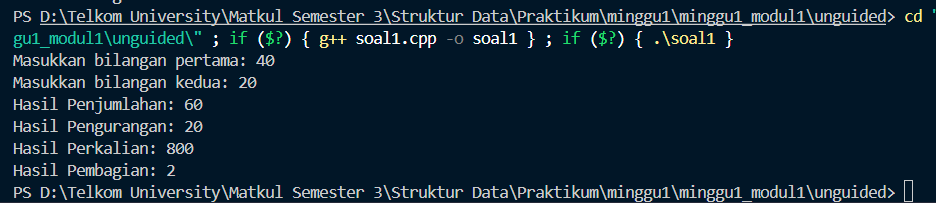
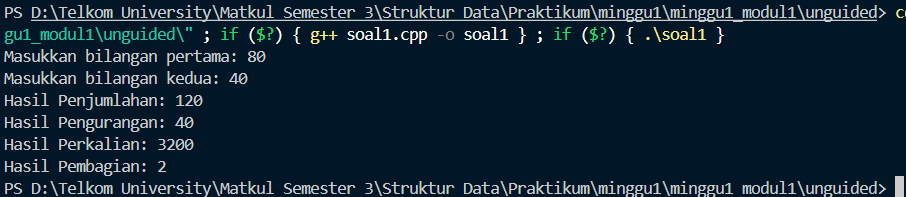
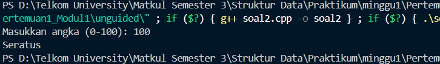
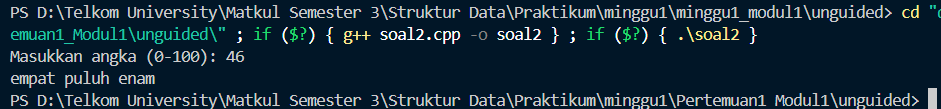
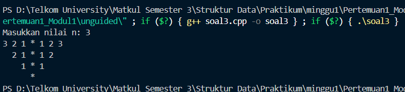
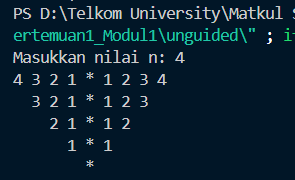

# <h1 align="center">Laporan Praktikum Modul 1 - Codeblocks IDE & Pengenalan Bahas C++ (Bagian Pertama)</h1>

<p align="center">Faiz Az-Zahra Winanto Putra - 10311243001</p>

  

## Dasar Teori

Dalam konteks pemrograman, terdapat sejumlah bahasa pemrograman, seperti Pascal, C, C++, dan BASIC. Secara garis besar, bahasa-bahasa pemrograman dapat dikelompokkan menjadi dua yaitu bahasa beraras-tinggi (high-level language) dan bahasa beraras-rendah (low-level language).[1], Berikut penjelasan lebih lanjut mengenai pemrograman C++ :

### A. Input dan Output

Input
Suatu algoritme dapat memiki U(noll atau Tebih masukan (input). Hal terse- but bermakna bahwa suatu algoritme memungkinkan untuk tidak memi- liki masukan secara langsung dari pengguna, tetapi dapat juga memiliki beberapa masukan. Algoritme yang tidak memiliki masukan langsung dari pengguna, biasanya semua data yang dibutuhkan dalam pemrosesan sudah diinisialisasi atau dibangkitkan dalam algoritme.[2]

Output
Suatu algoritme wajib memiliki satu atau lebih keluaran. Suatu algoritme yang tidak menghasilkan keluaran dapat dikatakan sebagai algoritme yang sia-sia atau algoritme yang tidak perlu dilakukan. Tujuan dari algoritme ada- lah menghasilkan sesuatu, yaitu berupa keluaran.[2]

  

### B. Operator [2]

Operator aritmatika yang digunakan kurang lebih sama seperti bahasa pemrograman lain, yaitu:

| Operator | Arti            |
| -------- | --------------- |
| +        | Penjumlahan     |
| -        | Pengurangan     |
| *        | Perkalian       |
| /        | Pembagian       |
| ^        | Perpangkatan    |
| DIV      | Pembagian Bulat |
| MOD      | Sisa Bagi       |
| ABS      | Harga Mutlak    |
#### 2. Operator Perbandingan
Operator perbandingan berfungsi untuk membandingkan

| Operator | Arti                         |
| -------- | ---------------------------- |
| =        | Sama dengan                  |
| <        | Lebih kecil                  |
| >        | Lebih besar                  |
| <=       | Lebih kecil atau sama dengan |
| >=       | Lebih besar atau sama dengan |
| <>       | Tidak sama dengan            |
#### 3. Operator Logika
Operator logika digunakan untuk operasi logika. Operator ini akan menghasilkan nilai True atau False.

| Operator | Arti                                                   |
| -------- | ------------------------------------------------------ |
| AND      | Dan (Bernilai benar ketika keduanya bernilai benar)    |
| OR       | Atau (Bernilai benar ketika salah satu bernilai benar) |
| NOT      | Tidak (Jika benar maka salah, jika salah maka benar)   |
### 4. Percabangan

Percabangan merupakan baris kode yang akan memeriksa terlebih dahulu apakah bernilai True, atau false kemudian akan menghasilkan output tertentu tergantung dari hasil tersebut. Pada percabangan terjadi pemeriksaan kondisi secara urut dan menghasilkan output sesuai kondisi[3].

### 5. Perulangan

Perulangan merupakan struktur dimana terdapat proses pengulangan perintah yang sama sebanyak n kali. Struktur ini merupakan salah satu kelebihan yang dimiliki oleh mesin komputer. Sebagai contoh untuk mencetak teks “Algoritma Pemrograman” sebanyak 100 kali pada layar monitor, hanya diperlukan beberapa baris perintah meggunakan teknik atau struktur perulangan tersebut. Tanpa harus menuliskan perintah yang sama sebanyak 100 kali[3].

### 6. Switch Case

Pernyataan `switch case` di C++ adalah struktur kontrol yang mengeksekusi blok kode yang berbeda berdasarkan nilai suatu variabel atau ekspresi, menggantikan serangkaian pernyataan `if-else` yang rumit. `switch` digunakan ketika ada banyak kemungkinan nilai untuk satu variabel dan Anda ingin memilih blok kode yang berbeda untuk setiap nilai.
### 7. Struct

Tipe bentukan ini juga dikenal dengan tipe terstruktur, sesuai namanya, tipe ini menyimpan lebih dari satu variabel bertipe sama maupun berbeda[3].

## Guided

### 1. Input Output
```C++

#include<iostream>

using namespace std;

  

int main() {
    int angka;
    cout << "masukan angka: ";
    cin >> angka;
    cout << "angka yang anda masukan adalah: " << angka << endl;
    return 0;
}

```

Program ini akan berjalan dan meminta inputan dari user untuk memasukan angka dengan tipe data integer, kemudian setelah user memasukan inputan program akan menampilkan sesuai dengan inputan yang dimasukan, misal user input "7", program akan menampilkan "angka yang anda masukan adalah 7".
### 2. Operasi Aritmatika
```C++

#include<iostream>

using namespace std;
  
int main() {
    int angka1, angka2;
    cout << "masukan angka 1: ";
    cin >> angka1;
    cout << "masukan angka 2:";
    cin >> angka2;


    cout << "penjumlahan:" <<angka1 + angka2 << endl;
    cout << "pengurangan:" <<angka1 - angka2 << endl;

    cout << "pembagian:" <<angka1 / angka2 << endl;
    cout << "perkalian:" <<angka1 * angka2 << endl;
    cout << "sisabagi:" <<angka1 % angka2 << endl;

    return 0;
} 
```

Program diatas merupakan untuk menghitung aritmatika sesuai dengan kedua angka inputan dari user, misalkan user menginputkan 8 dan 2, nah program akan memproses/menghitung dari angka tersebut, ada operasi penjumlahan, pengurangan, pembagian, perkalian, modulus/sisa bagi.

### 3. Percabangan
```C++
#include<iostream>

using namespace std;

int main() {
    int angka1, angka2;

    cout << "masukan angka1" << endl;
    cin >> angka1;

    cout << "masukan angka2:" << endl;
    cin >> angka2;


    if (angka1 < angka2)
    {
        cout << "angka1 lebih kecil dari angka2" << endl;
    } else
    {
        cout << "angka1 lebih besar dari angka2" << endl;
    }
    if (angka1 == angka2)
    {
        cout << "angka1 sama dengan angka2" << endl;
    } else if (angka1 != angka2){
        cout << "angka berbeda" << endl;
    }

  
    int pilihan;
    cout << "MENU" << endl;
    cout <<"1. Penjumlahan" << endl;
    cout << "2. Pengurangan" << endl;
    cout << "3. Masukan Pilihan" << endl;
    cin >> pilihan;

  
    switch(pilihan){
        case 1:
        cout << "penjumlahan:" << angka1 + angka2 << endl;
        break;
        case 2 :
        cout << "pengurangan:" << angka1 - angka2 << endl;
        cout << endl;
        break;
        default :
        cout << "pilihan tidak ada" << endl;
    }

    return 0;
}

```

Program ini sebenernya hampir sama seperti program sebelumnya, yaitu program meminta untuk memasukan dua buah inputan bertipekan integer. Bedanya adalah di dalam pemrosesan nya, program ini menggunakan percabangan dan switch case.

Yang pertama adalah percabangan, percabangan disini akan di eksekusi terlebih dahulu. Angka pertama dan kedua akan dibandingkan, apakah angka satu sama dengan angka dua, angka satu lebih besar dari angka dua atau sebaliknya angka satu lebih kecil dari angka dua. Output yang dihasilkan adalah hasil perbandingan tersebut.

Setelah proses percabangan selesai program akan menampilkan beberapa menu, yang kemudian program akan meminta inputan dari user yang diinginkan, tersedia menu penjumlahan dan pengurangan jika user tidak memilih atau memilih luar dari menu nomer yang tersedia program akan menampilkan "pilihan tidak ada".

### 4. Perulangan
```C++

#include<iostream>

using namespace std;

  
int main() {
    int angka1;

    cout << "masukan angka 1 :" ;
    cin >> angka1;

    for(int i = 0; i <= angka1; i++){
        cout << i << "-";
    }
    cout << endl;


    int j = 10;
    while (j > angka1){
        cout << j << "-";
        j--;
    }

  
    cout << endl;
    int k = 10;
    do {
        cout << k << "-";
    }while ( k < angka1);
    return 0;
}

```


Program ini dimulai dengan meminta input dari pengguna berupa sebuah angka yang disimpan dalam variabel `angka1`. Selanjutnya digunakan perulangan **for** untuk mencetak deret angka mulai dari 0 hingga `angka1`, masing-masing dipisahkan dengan tanda hubung. Jika pengguna memasukkan angka 5, maka hasil dari perulangan ini adalah `0-1-2-3-4-5-`.

Kemudian program melanjutkan dengan perulangan **while**, yang mencetak angka mundur dari 10 selama nilainya masih lebih besar dari `angka1`. Setelah itu digunakan perulangan **do...while** dengan nilai awal 10. Karena sifat `do...while` yang selalu dijalankan minimal satu kali, angka 10 tetap dicetak meskipun kondisi perulangan tidak terpenuhi

### 5. Struct
```C++

#include<iostream>

using namespace std;
  
int main(){
    const int MAX = 3;
    struct rapot {
        char nama[3];
        float nilai;
    };
    rapot siswa [MAX];
  
    for (int i = 0; i < MAX; i++){
        cout << "masukan nama: ";
        cin >> siswa[i].nama;
        cout << endl;
        cout << "masukan nilai: ";
        cin >> siswa[i].nilai;
        cout << endl;
    }
    int j = 0;
    while(j < MAX) {
    cout << "nama siswa :" << siswa[j].nama << " , nilai : " << siswa[j].nilai << endl;
    j++;

}
return 0;
}
```

Program ini ada sebuah **struct bernama `rapot`** yang memiliki dua anggota, yaitu `nama` (tipe karakter array) dan nilai (tipe float). Struct ini digunakan untuk menyimpan data siswa berupa nama dan nilai. Kemudian dibuat sebuah array `siswa` berukuran MAX (konstanta bernilai 3), sehingga program dapat menyimpan data untuk tiga orang siswa.

Selanjutnya, program menggunakan perulangan **for** untuk mengisi data setiap siswa. Pada tiap iterasi, pengguna diminta memasukkan nama siswa dan nilai yang sesuai. Setelah data selesai dimasukkan, program menggunakan perulangan **while** untuk menampilkan kembali semua data siswa yang sudah tersimpan dalam array siswa, dengan format nama siswa , nilai . 
  

## Unguided

### 1. Buatlah program yang menerima input-an dua buah bilangan betipe float, kemudian memberikan output-an hasil penjumlahan, pengurangan, perkalian, dan pembagian dari dua bilangan tersebut.

  

```C++

#include <iostream>
using namespace std;

int main() {
    float num1, num2;

    cout << "Masukkan bilangan pertama: ";
    cin >> num1;
    cout << "Masukkan bilangan kedua: ";
    cin >> num2;

    cout << "Hasil Penjumlahan: " << num1 + num2 << endl;
    cout << "Hasil Pengurangan: " << num1 - num2 << endl;
    cout << "Hasil Perkalian: " << num1 * num2 << endl;
    
    if (num2 != 0) {
        cout << "Hasil Pembagian: " << num1 / num2 << endl;
    } else {
        cout << "Pembagian dengan nol tidak diperbolehkan!" << endl;
    }

    return 0;
}


```

### Output Unguided 1 :

##### Output 1


##### Output 2


Program di atas adalah perhitungan artimatika. User diminta memasukkan dua bilangan, lalu program menampilkan hasil penjumlahan, pengurangan, dan perkalian. Untuk pembagian, program mengecek apakah bilangan kedua bernilai nol. Jika bukan nol, hasil pembagian ditampilkan; jika nol, muncul peringatan bahwa pembagian dengan nol tidak diperbolehkan.

  

### 2. Buatlah sebuah program yang menerima masukan angka dan mengeluarkan output nilai angka tersebut dalam bentuk tulisan. Angka yang akan di- input-kan user adalah bilangan bulat positif mulai dari 0 s.d 100

```C++

#include <iostream>
#include <string>
using namespace std;

int main() {
    int angka;
    cout << "Masukkan angka (0-100): ";
    cin >> angka;

    string satuan[] = {"", "satu", "dua", "tiga", "empat", "lima", "enam", "tujuh", "delapan", "sembilan"};
    string puluhan[] = {"", "", "dua puluh", "tiga puluh", "empat puluh", "lima puluh", "enam puluh", "tujuh puluh", "delapan puluh", "sembilan puluh"};
    string puluhanKata[] = {"sepuluh", "sebelas", "dua belas", "tiga belas", "empat belas", "lima belas", "enam belas", "tujuh belas", "delapan belas", "sembilan belas"};
    
    if (angka == 0) {
        cout << "Nol" << endl;
    }
    else if (angka >= 1 && angka <= 9) {
        cout << satuan[angka] << endl;
    }
    else if (angka >= 10 && angka <= 19) {
        cout << puluhanKata[angka - 10] << endl;
    }
    else if (angka >= 20 && angka <= 99) {
        int puluh = angka / 10;
        int satu = angka % 10;
        if (satu == 0) {
            cout << puluhan[puluh] << endl;
        }
        else {
            cout << puluhan[puluh] << " " << satuan[satu] << endl;
        }
    }
    else if (angka == 100) {
        cout << "Seratus" << endl;
    }
    else {
        cout << "Angka yang dimasukkan tidak valid, harus antara 0 hingga 100." << endl;
    }

    return 0;
}
```

### Output Unguided 2 :

##### Output 1

##### Output 2

Program ini berfungsi untuk mengubah angka antara 0 sampai 100 menjadi bentuk kata dalam bahasa Indonesia. Program menggunakan tiga array string : satuan untuk angka 1–9, puluhan untuk kelipatan 10 mulai 20 hingga 90.Logika percabangan dipakai untuk menentukan output: jika angka 0 maka ditampilkan "Nol", 1–9 diambil dari satuan, 10–19 dari puluhanKata, 20–99 dihitung dengan membagi puluhan dan sisa satuan, sedangkan angka 100 ditampilkan "Seratus". Jika angka di luar rentang 0–100, program menampilkan pesan bahwa input tidak valid.

### 3. Buatlah program yang dapat memberikan input dan output sbb.

```C++
#include <iostream>

using namespace std;

int main() {
    int n;
    cout << "Masukkan nilai n: ";
    cin >> n;

  
    for (int i = n; i >= 1; i--) {
        for (int spasi = 0; spasi < n - i; spasi++) {
            cout << "  ";
        }

        for (int j = i; j >= 1; j--) {
            cout << j << " ";
        }
        cout << "* ";

        for (int j = 1; j <= i; j++) {
            cout << j << " ";
        }
        cout << endl;
    }

  
    for (int spasi = 0; spasi < n; spasi++) {
        cout << "  ";
    }
    cout << "*" << endl;
    return 0;
}

```

### Output Unguided 3 :
##### Output 1


##### Output 2


Program ini mencetak pola segitiga simetris berdasarkan input n. Setiap baris berisi angka menurun dari i ke 1, lalu tanda *, kemudian angka menaik dari 1 ke i, dengan spasi di depan agar pola rata tengah. Setelah semua baris tercetak, ditambahkan satu * di bagian bawah. Hasil akhirnya adalah segitiga angka simetris dengan * sebagai poros tengah.

  
## Kesimpulan

Pada Minggu pertama praktikum sudah perkenalan dengan bahasa C++, dimulai dengan struktur bahasanya, percabangan, perulangan 

  

## Referensi

[1] Dewi, Luh Joni Erawati. (2010). "MEDIA PEMBELAJARAN BAHASA PEMROGRAMAN C++". Jurusan Manajemen Informatika, FTK, Undiksha. Diakses pada 29 September 2025 melalui [https://ejournal.undiksha.ac.id/index.php/JPTK/article/download/31/25](https://ejournal.undiksha.ac.id/index.php/JPTK/article/download/31/25).
<br>[2] Hanief, Shofwan, I. Wayan Jepriana, and S. Kom. _Konsep Algoritme dan Aplikasinya dalam Bahasa Pemrograman C++_. Penerbit Andi, 2020. Diakses pada 29 September 2025 melalui https://books.google.com/books?hl=id&lr=&id=BRQQEAAAQBAJ&oi=fnd&pg=PP1&dq=bahasa+c%2B%2B&ots=0DeP4FsQlT&sig=nTwCCmbhC_3lSApO5Kt6_c0E_gs

[3] Indahyati, Uce., Rahmawati Yunianita. (2020). "BUKU AJAR ALGORITMA DAN PEMROGRAMAN DALAM BAHASA C++". Sidoarjo: Umsida Press. Diakses pada 29 September 2025 melalui [https://press.umsida.ac.id/index.php/umsidapress/article/download/978-623-6833-67-4/759/5250](https://press.umsida.ac.id/index.php/umsidapress/article/download/978-623-6833-67-4/759/5250).
<br>...