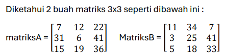
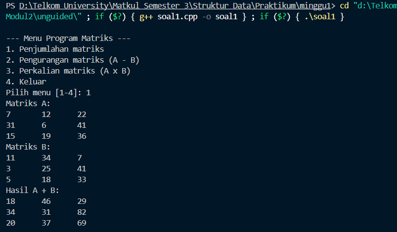
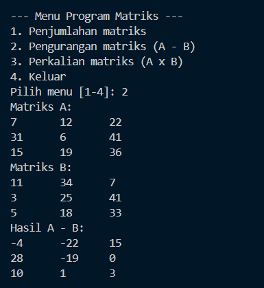
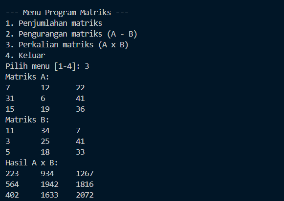
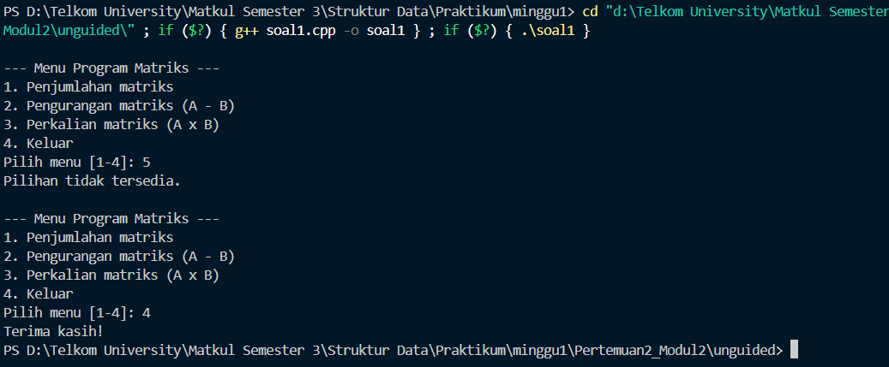
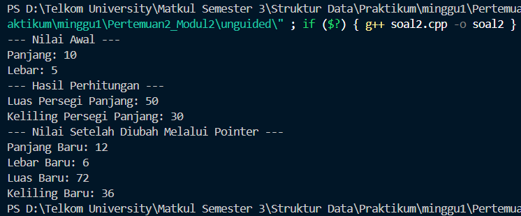

# <h1 align="center">Laporan Praktikum Modul 2 - PENGENALAN BAHASA C++ (BAGIAN KEDUA)</h1>

<p align="center">Faiz Az-Zahra Winanto Putra - 10311243001</p>

  

## Dasar Teori

### A. Array Satu Dimensi
Array satu dimensi adalah kumpulan elemen-elemen identik yang tersusun dalam satu baris, tetapi isi dari elemen tersebut boleh berbeda. Dapat disebut juga dengan istilah vektor yang menggambarkan data dalam suatu urutan.[1]

### B. Array Dua Dimensi

Array dua dimensi yang sering digambarkan sebagai sebuah matriks merupakan perluasan dari sebuah array satudimensi. Jika array satu dimensi hanya terdiri dari sebuah baris dengan beberapa
kolom elemen maka array dua dimensi terdiri dari beberapa baris dan beberapa kolom elemen yang bertipe sama.[1]

### C. Array Berdimensi Banyak[1]

Array banyak dimensi ini pada dasarnya sama dengan array sebelimnyakecuali pada jumlah dimensinya.
Deklarasi : Type_Data Nama_Variabel
[index1] [ndex2] [index3] [ndex4].....;
Misal : int A [3][4][2][5]

### D. Pointer
Variabel pointer merupakan dasar tipe variabel yang berisi integer dalam format heksadesimal. Pointer digunakan untuk menyimpan alamat memori variabel lain sehingga pointer dapat mengakses nilai dari variabel yang alamatnya ditunjuk.

### E. Fungsi 
Function adalah sebuah struktur, Pengelompokan yang mengandung sekelompok pernyataan yang akan dilaksanakan oleh CPU jika nama function tersebut dipanggil untuk dieksekusi, kecuali untuk function utama yaitu int main() yang akan dieksekusi secara otomatis.

##### Kegunaan fungsi

a) Untuk mengurangi pengulangan penulisan program yang sama.

b) Agar program menjadi lebih terstruktur sehingga mudah dipahami dan lebih mudah untuk dikembangkan.

c) Menguraikan tugas pemrograman rumit menjadi langkah- langkah yang lebih sederhana atau kecil.

d) Memecah program besar menjadi kecil sehingga dapat dikerjakan oleh programmer-programmer atau dipecah menjadi beberapa tahap sehingga mempermuda pengerjaan dalam sebuah projek. [2]

### F. Prosedur
Prosedur adalah bagian dari suatu program yang disusun secara terpisah untuk melakukan suatu tugas khusus atau fungsi tertentu. Prosedur adalah salah satu tipe subrutin, yang digunakan dalam algoritma dengan tujuan untuk:

a) menerapkan konsep program modular, yaitu memecah- mecah program yang rumit menjadi beberapa program yang lebih sederhana

b.) untuk mempersingkat pemrograman yaitu hanya menulis satu kali program yang berulang.[2]

## Guided

### 1. Array 1 Dimensi
```C++

#include<iostream>
using namespace std;

int main() {
    int arr[5];

    for (int i = 0; i < 5; i++) {
        cout << "Masukan value index ke-" << i << ": ";
        cin >> arr[i];
    }

  
    int j = 0;
    while (j < 5) {
        cout << "Isi index ke-" << j << ": " << arr[j] << endl;
        j++;
    }

    return 0;
}
```

Program ini berfungsi untuk **memasukkan dan menampilkan elemen-elemen array**. Pertama, program mendeklarasikan sebuah array bernama `arr` berukuran 5 elemen bertipe `int`. Kemudian, dengan menggunakan **perulangan for**, program meminta pengguna untuk memasukkan lima nilai, masing-masing disimpan pada indeks array dari 0 hingga 4. Setelah semua nilai dimasukkan, program menggunakan **perulangan while** untuk menampilkan kembali setiap nilai yang telah disimpan di array tersebut, lengkap dengan keterangan indeksnya. Dengan demikian, program ini menunjukkan cara menggunakan array, perulangan `for` untuk input data, dan perulangan `while` untuk menampilkan hasil output.
### 2. Array 2 Dimensi
```C++

#include<iostream>
using namespace std;


void tampilkanHasil(int arr[2][2]){
    for (int i = 0; i < 2; i++) {
        for (int j = 0; j < 2; j++) {
            cout << arr[i][j] << " ";
        }
        cout << endl;
    }
}

int main() {
    int arrA[2][2] = {
        {1,2},
        {3,4}
    };
    int arrB[2][2] = {
        {2,3},
        {4,5}
    };

    int arrC[2][2] = {0};
    int arrD[2][2] = {0};

    for(int i = 0; i < 2; i++){
        for(int j = 0; j < 2; j++){
            arrC[i][j] = arrA[i][j] + arrB[i][j];
        }
    }

    cout << "Hasil penjumlahan: " << endl;
    tampilkanHasil(arrC);

    cout << endl;

    for(int i = 0; i<2; i++){
        for(int j = 0; j<2; j++){
            for (int k = 0; k<2; k++){
                arrD[i][j] += arrA[i][k] * arrB[k][j];
            }
        }
    }

    cout << "Hasil perkalian: " << endl;
    tampilkanHasil(arrD);
}
```

Program ini berfungsi untuk **menjumlahkan dan mengalikan dua matriks 2×2**. Matriks `arrA` dan `arrB` berisi nilai awal, sedangkan `arrC` menyimpan hasil penjumlahan dan `arrD` hasil perkalian. Perulangan bersarang digunakan untuk menghitung tiap elemen, dan fungsi `tampilkanHasil()` menampilkan hasil dalam bentuk tabel. Program ini menunjukkan penggunaan **array dua dimensi dan nested loop** dalam operasi matriks.

### 3. Arr & Pointer
```C++
#include<iostream>
using namespace std;

int main() {
    int arr[] = {10,20,30,40,50};
    int* ptr = arr;
    for (int i=0; i<5; ++i) {
        cout << "Elemen array ke-" << i+1 << " Menggunakan pointer: " << *(ptr+i) << endl;
    }

    cout << endl;

    for (int i=0; i<5; ++i) {
        cout << "Elemen array ke-" << i+1 << " Menggunakan index ke-" << arr[i] << endl;
    }
    return 0;
}
```

Program di atas digunakan untuk **menampilkan elemen-elemen array dengan dua cara berbeda**, yaitu menggunakan **pointer** dan **indeks**. Pertama, array `arr` berisi lima nilai: 10, 20, 30, 40, dan 50. Pointer `ptr` diarahkan ke alamat awal array. Pada perulangan pertama, elemen array ditampilkan menggunakan pointer aritmetika `*(ptr + i)`, yang mengakses nilai berdasarkan posisi memori. Pada perulangan kedua, elemen yang sama ditampilkan dengan cara biasa menggunakan indeks `arr[i]`. Program ini menunjukkan bahwa **pointer dan indeks dapat digunakan secara setara untuk mengakses elemen array** di C++.


### 4. Pointer(bagian2)
```C++
#include<iostream>
using namespace std;

void ubahNilai(int* ptr) {
    *ptr = 20;
}

int main() {
    int x = 10;
    cout << "Nilai sebelum diubah: " << x << endl;
    ubahNilai(&x);
    cout << "Nilai setelah diubah: " << x << endl;
    return 0;
}
```


### 5. Pointer (bagian3)
```C++

#include<iostream>
using namespace std;

void ubahNilai(int& ref) {
    ref = 20;
}


int main() {
    int x = 10;
    cout << "Nilai sebelum diubah: " << x << endl;
    ubahNilai(x);
    cout << "Nilai setelah diubah: " << x << endl;
    return 0;

}
```

Fungsi `ubahNilai` menggunakan pointer untuk mengubah nilai dari variabel yang diberikan sebagai argumen. Di dalam fungsi `main`, variabel `x` dideklarasikan dan diinisialisasi dengan nilai 10. Kemudian, sebelum fungsi `ubahNilai` dipanggil, program mencetak nilai `x` yang masih 10. Fungsi `ubahNilai` dipanggil dengan mengirimkan alamat memori dari variabel `x` menggunakan operator `&` (yang memberikan pointer ke `x`). Di dalam fungsi `ubahNilai`, pointer yang diterima akan mengakses dan mengubah nilai yang ditunjuk oleh pointer tersebut, yaitu variabel `x`, menjadi 20. Setelah fungsi `ubahNilai` selesai, program kembali mencetak nilai `x`, yang sekarang sudah berubah menjadi 20. Dengan demikian, contoh ini menunjukkan bagaimana penggunaan pointer memungkinkan fungsi untuk mengubah nilai variabel yang ada di luar fungsi tersebut.

### 6. Fungsi Prosedur
```C++

#include<iostream>
using namespace std;

int cariMAX(int arr[], int ukuran) {
    int max = arr[0];
    for (int i = 1; i < ukuran; i++) {
        if (arr[i] > max) {
            max = arr[i];
        }
    }
    return max;
}

void operasiAritmatika(int arr[], int ukuran) {
    int totalJumlah = 0;
    for(int i = 0; i < ukuran; i++) {
        totalJumlah += arr[i];
    }
    cout << "Total penjumlahan: " << totalJumlah << endl;

    int totalKali = 1;
    for(int i = 0; i < ukuran; i++) {
        totalKali *= arr[i];
    }
    cout << "Total perkalian: " << totalKali << endl;
}

int main() {
    const int ukuran = 5;
    int arr[ukuran];
    for(int i = 0; i < ukuran; i++) {
        cout << "Masukan nilai array ke-" << i << ": ";
        cin >> arr[i];
    }
    cout << endl;
    cout << "nilai terbesar dalam array: " << cariMAX(arr, ukuran) << endl;
    operasiAritmatika(arr, ukuran);
    return 0;

}
```

Program C++ ini meminta pengguna memasukkan lima nilai ke dalam array, lalu menampilkan nilai terbesar, hasil penjumlahan, dan hasil perkalian dari seluruh elemen. Fungsi `cariMAX()` digunakan untuk mencari nilai terbesar, sedangkan `operasiAritmatika()` menghitung total penjumlahan dan perkalian.

## Unguided

### 1.

##### Buatlah program yang dapat melakukan operasi penjumlahan, pengurangan, dan perkalian matriks 3x3 tersebut. Buat prosedur untuk masing-masing operasi yang dilakukan; jumlahMatriks() untuk operasi penjumlahan, kurangMatriks() untuk pengurangan, dan kaliMatriks() untuk perkalian. Buat program tersebut menggunakan menu switch-case seperti berikut ini : 

##### --- Menu Program Matriks --- 
##### 1. Penjumlahan matriks 
##### 2. Pengurangan matriks 
##### 3. Perkalian matriks 
##### 4. Keluar


```C++
#include <iostream>
using namespace std;

void jumlahMatriks(const int A[3][3], const int B[3][3], int C[3][3]) {
    for (int i=0;i<3;i++)
        for (int j=0;j<3;j++)
            C[i][j] = A[i][j] + B[i][j];
}

void kurangMatriks(const int A[3][3], const int B[3][3], int C[3][3]) {
    for (int i=0;i<3;i++)
        for (int j=0;j<3;j++)
            C[i][j] = A[i][j] - B[i][j];
}

void kaliMatriks(const int A[3][3], const int B[3][3], int C[3][3]) {
    for (int i=0;i<3;i++) {
        for (int j=0;j<3;j++) {
            int sum = 0;
            for (int k=0;k<3;k++) sum += A[i][k] * B[k][j];
            C[i][j] = sum;
        }
    }
}

  
void printMatrix(const char* title, const int M[3][3]) {
    cout << title << '\n';
    for (int i=0;i<3;i++) {
        for (int j=0;j<3;j++) {
            cout << M[i][j] << '\t';
        }
        cout << '\n';
    }
}

  
int main() {
    int A[3][3] = {
        {7, 12, 22},
        {31, 6, 41},
        {15, 19, 36}
    };

    int B[3][3] = {
        {11, 34, 7},
        {3, 25, 41},
        {5, 18, 33}
    };

    while (true) {
        cout << "\n--- Menu Program Matriks ---\n";
        cout << "1. Penjumlahan matriks\n";
        cout << "2. Pengurangan matriks (A - B)\n";
        cout << "3. Perkalian matriks (A x B)\n";
        cout << "4. Keluar\n";
        cout << "Pilih menu [1-4]: ";

  
        int pilih;
        cin >> pilih;

        int C[3][3];


        switch (pilih) {
            case 1:
                printMatrix("Matriks A:", A);
                printMatrix("Matriks B:", B);
                jumlahMatriks(A, B, C);
                printMatrix("Hasil A + B:", C);
                break;

            case 2:
                printMatrix("Matriks A:", A);
                printMatrix("Matriks B:", B);
                kurangMatriks(A, B, C);
                printMatrix("Hasil A - B:", C);
                break;

            case 3:
                printMatrix("Matriks A:", A);
                printMatrix("Matriks B:", B);
                kaliMatriks(A, B, C);
                printMatrix("Hasil A x B:", C);
                break;

            case 4:
                cout << "Terima kasih!\n";
                return 0;
            default:
                cout << "Pilihan tidak tersedia.\n";
        }
    }
}


```

### Output Unguided 1 :

##### Output 1


##### Output 2


##### Output 3


##### Output 4


Program ini digunakan untuk melakukan berbagai operasi matematika pada dua matriks berukuran 3x3. Di dalamnya terdapat beberapa fungsi khusus, yaitu untuk menjumlahkan (`jumlahMatriks`), mengurangkan (`kurangMatriks`), dan mengalikan (`kaliMatriks`) dua matriks. Selain itu, terdapat fungsi `printMatrix` yang menampilkan matriks ke layar dengan format teratur. Matriks A dan B sudah ditentukan nilainya di awal program. Melalui menu interaktif berbasis perulangan dan struktur `switch-case`, pengguna dapat memilih operasi yang diinginkan, dan program akan menampilkan hasilnya sesuai pilihan dalam bentuk matriks hasil berukuran 3x3.

  

### 2. Buatlah program menghitung luas dan keliling persegi panjang dengan proses perhitungan dan perubahan nilainya menggunakan pointer, seperti berikut: 
1) Buatlah 3 variabel integer di fungsi main(): panjang (beri nilai 10), lebar (beri nilai 5), dan luas (beri nilai 0). 
2) Deklarasikan dua pointer: ptrPanjang yang menunjuk ke variabel panjang, dan ptrLebar yang menunjuk ke variabel lebar. 
3) Hitung luas persegi panjang tersebut dan simpan hasilnya ke dalam variabel luas. Syarat: Proses perhitungan ini wajib menggunakan ptrPanjang dan ptrLebar. 
4) Cetak nilai luas ke layar. 
5) Setelah itu, ubah nilai panjang menjadi 12 dan lebar menjadi 6, juga hanya melalui pointer ptrPanjang dan ptrLebar. 
6) Cetak nilai panjang dan lebar yang baru untuk membuktikan bahwa nilainya telah berubah.

```C++

#include <iostream>
using namespace std;

int main() {
    int panjang = 10, lebar = 5, luas;
    int* ptrPanjang = &panjang;
    int* ptrLebar = &lebar;


    luas = (*ptrPanjang) * (*ptrLebar);
    cout << "--- Nilai Awal ---" << endl;
    cout << "Panjang: " << *ptrPanjang << endl;
    cout << "Lebar: " << *ptrLebar << endl;
    cout << "--- Hasil Perhitungan ---" << endl;
    cout << "Luas Persegi Panjang: " << luas << endl;
    cout << "Keliling Persegi Panjang: " << 2 * (*ptrPanjang + *ptrLebar) << endl;

    *ptrPanjang = 12;
    *ptrLebar = 6;

    cout << "--- Nilai Setelah Diubah Melalui Pointer ---" << endl;
    cout << "Panjang Baru: " << *ptrPanjang << endl;
    cout << "Lebar Baru: " << *ptrLebar << endl;
    cout << "Luas Baru: " << (*ptrPanjang) * (*ptrLebar) << endl;
    cout << "Keliling Baru: " << 2 * (*ptrPanjang + *ptrLebar) << endl;
    return 0;
}
```

### Output Unguided 2 :

##### Output 1


Program ini berfungsi menghitung luas dan keliling persegi panjang dengan memanfaatkan konsep pointer. Nilai awal variabel `panjang` dan `lebar` masing-masing 10 dan 5, lalu alamat memorinya disimpan dalam pointer `ptrPanjang` dan `ptrLebar`. Perhitungan luas dan keliling dilakukan dengan mengakses nilai melalui pointer. Setelah itu, nilai kedua variabel diubah langsung melalui pointer menjadi 12 dan 6. Karena pointer terhubung ke alamat memori variabel asli, perubahan ini otomatis memperbarui nilainya. Program kemudian menampilkan hasil perhitungan sebelum dan sesudah perubahan, sehingga memperlihatkan bagaimana pointer dapat digunakan untuk membaca dan memodifikasi data secara langsung.
## Kesimpulan

Pada Minggu ketiga/modul ke 2 praktikum sudah mempelajari banyak hal diantara nya array ada banyak macamnya : array satu dimensi, array dua dimensi, array berdimensi banyak, penggunaan pointer, fungsi prosedur, dengan mempelajari ini bisa mengimplementasikan dari logika menjadi baris kode.

  

## Referensi

[1] Pratama, Muhammad Aldi. "STRUKTUR DATA ARRAY DUA DIMENSI PADA PEMROGRAMAN C++." (2020). Diakses pada 04 Oktober 2025 melalui [[https://osf.io/preprints/osf/vyech]].
<br>[2] Huda, Asrul, Noper Ardi, and Akrimmullah Muabi. _Pengantar coding berbasis C/C++_. UNP PRESS, 2021. Diakses pada 05 Oktober 2025 melalui https://books.google.co.id/books?hl=id&lr=&id=G9dbEAAAQBAJ&oi=fnd&pg=PA129&dq=function+prosedur+c%2B%2B&ots=6eHRcO9wdh&sig=89kWhtPlYWIIerQMFS5LpSummJc&redir_esc=y#v=onepage&q=function%20prosedur%20c%2B%2B&f=false
<br>...