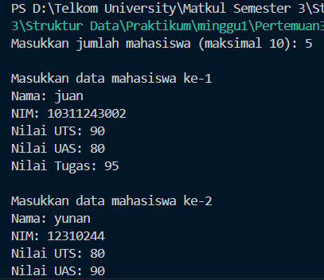
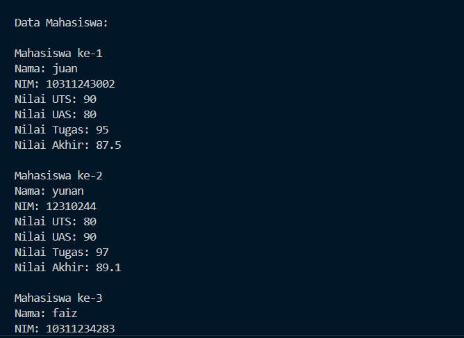
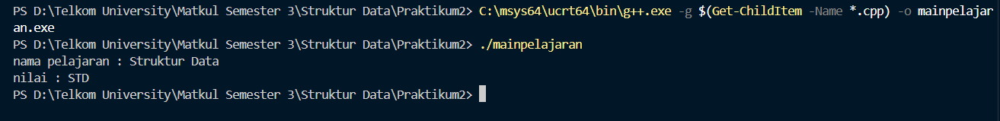
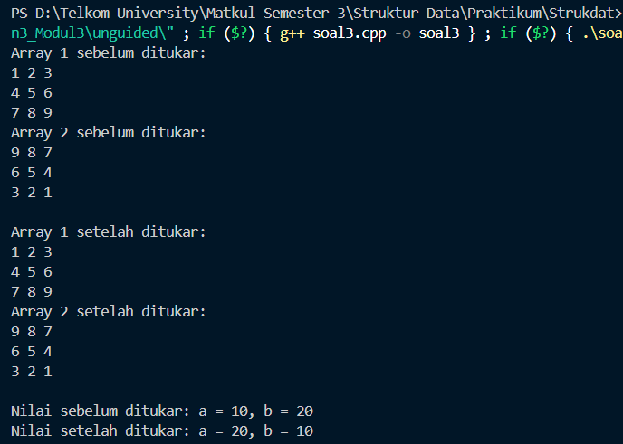

# <h1 align="center">Laporan Praktikum Modul 3 - Abstract Data Type (ADT)</h1>

<p align="center">Faiz Az-Zahra Winanto Putra - 10311243001</p>

  

## Dasar Teori

Abstraksi data didefinisikan sehagai sebuah proses pemisahan watak logis data dari
implementasinya. Definisi atas tipeJam dan beberapa operasi dasarnya adalah watak logis: penyimpanan objek-objek tipeJam di dalam komputer dan algoritma untuk melakukan perasi operasi tersebut adalah detil implementasi dari tipeJam.

ADT (abstract data type): Sebuah tipe data yang memisahkan watak logis dari detil implementasim

Sama seperti tipe data lain, ADT memiliki tiga hal: nama ADT, dikenal dengan nama himpunan nilai ADT, dikenal dengan domain; dan himpunan operasi pada data. [1]

Dalam bahasa C++, konsep ADT sering diimplementasikan menggunakan class atau struct, yang berfungsi sebagai wadah untuk mengenkapsulasi data (atribut) dan operasi (fungsi) dalam satu kesatuan . Dengan menggunakan prinsip encapsulation dan abstraction, programmer dapat melindungi data dari akses langsung dan hanya mengizinkan interaksi melalui metode tertentu. Contohnya, struktur data seperti Stack, Queue, dan List merupakan bentuk implementasi nyata dari ADT. Operasi dasar seperti push(), pop(), enqueue(), atau dequeue() didefinisikan dalam antarmuka ADT, sedangkan detail penyimpanan data (misalnya menggunakan array atau linked list) disembunyikan dari pengguna [2].


## Guided

### 1. Guided 1 

mahasiswa.h
```C++
#ifndef MAHASISWA_H

#define MAHASISWA_H 

struct mahasiswa {
    char nim[10];
    int nilai1,nilai2;
};

void inputMhs(mahasiswa &m);
float rata2(mahasiswa m);

#endif
```

mahasiswa.cpp

```C++
#include <iostream>
#include "mahasiswa.h"

using namespace std;

void inputMhs(mahasiswa &m){
    cout << "Masukkan NIM : ";
    cin >> m.nim;
    cout << "Masukkan Nilai 1 : ";
    cin >> m.nilai1;
    cout << "Masukkan Nilai 2 : ";
    cin >> m.nilai2;
}

  
float rata2(mahasiswa m){
    return(float)(m.nilai1 + m.nilai2)/2;
}
```

main.cpp

```C++
#include <iostream>
#include "mahasiswa.h"
#include <cstdlib>


using namespace std;

int main(){
    mahasiswa mhs;
    inputMhs(mhs);

    cout << "Rata-rata nilai adalah" << rata2(mhs) << endl;

    system("pause");
    return 0;
}
```


Program ini adalah untuk mengelola data mahasiswa, khususnya untuk memasukkan nilai dan menghitung rata-rata. Terdiri dari tiga bagian file yang mendefinisikan struktur data mahasiswa (NIM dan dua nilai), implementasi fungsi untuk memasukkan data (`inputMhs`) dan menghitung rata-rata (`rata2`), serta file utama yang memanggil fungsi-fungsi tersebut untuk menginput data dan menampilkan rata-rata nilai mahasiswa. Program ini sederhana, memungkinkan pengguna untuk memasukkan data, menghitung, dan menampilkan hasil rata-rata nilai mahasiswa.
### 2. Struct Guided 2
```C++

#include <iostream>
using namespace std;

struct mahasiswa {
    string nama;
    float nilai1, nilai2;
};

void inputMhs(mahasiswa &m) {
    cout << "Masukkan nama mahasiswa : ";
    cin >> m.nama;
    cout << "Masukkan nilai 1 : ";
    cin >> m.nilai1;
    cout << "Masukkan nilai 2 : ";
    cin >> m.nilai2;
}

float rata2(mahasiswa m) {
    return float (m.nilai1 + m.nilai2) / 2;
}

int main() {
    mahasiswa mhs;   
    inputMhs(mhs);   
    cout << "Rata-rata : " << rata2(mhs) << endl;   
    return 0;
}
```

Program ini menggunakan **struktur (struct)** untuk menyimpan data mahasiswa, yaitu nama dan dua nilai ujian. Struct bernama `mahasiswa` memiliki tiga anggota: `nama`, `nilai1`, dan `nilai2`. Fungsi `inputMhs()` digunakan untuk menginput data mahasiswa secara langsung melalui referensi agar perubahan nilainya tersimpan di variabel utama. Setelah data dimasukkan, fungsi `rata2()` menghitung nilai rata-rata dengan menjumlahkan `nilai1` dan `nilai2`, lalu membaginya dengan dua. Di dalam fungsi `main()`, dibuat satu variabel bertipe `mahasiswa` bernama `mhs`. Program kemudian memanggil `inputMhs(mhs)` untuk mengisi data mahasiswa dan menampilkan hasil perhitungan rata-rata dengan memanggil fungsi `rata2(mhs)`. Output akhirnya berupa nilai rata-rata dari dua nilai yang diinputkan.

## Unguided

### 1. Buat program yang dapat menyimpan data mahasiswa (max. 10) ke dalam sebuah array dengan field nama, nim, uts, uas, tugas, dan nilai akhir. Nilai akhir diperoleh dari FUNGSI dengan rumus 0.3*uts+0.4*uas+0.3*tugas.

```C++
#include <iostream>
#include <string>
using namespace std;
 

struct Mahasiswa {
    string nama;
    string nim;
    float uts;
    float uas;
    float tugas;
    float nilaiAkhir;

};


float hitungNilaiAkhir(float uts, float uas, float tugas) {
    return 0.3 * uts + 0.4 * uas + 0.3 * tugas;
}

  
int main() {
    Mahasiswa mahasiswa[10];
    int jumlahMahasiswa;

    cout << "Masukkan jumlah mahasiswa (maksimal 10): ";
    cin >> jumlahMahasiswa;


    if (jumlahMahasiswa > 10) {
        cout << "Jumlah mahasiswa maksimal 10!" << endl;
        return 1;
    }


    for (int i = 0; i < jumlahMahasiswa; i++) {
        cout << "\nMasukkan data mahasiswa ke-" << i+1 << endl;
        cout << "Nama: ";
        cin.ignore();  
        getline(cin, mahasiswa[i].nama);
        cout << "NIM: ";
        cin >> mahasiswa[i].nim;
        cout << "Nilai UTS: ";
        cin >> mahasiswa[i].uts;
        cout << "Nilai UAS: ";
        cin >> mahasiswa[i].uas;
        cout << "Nilai Tugas: ";
        cin >> mahasiswa[i].tugas;
        mahasiswa[i].nilaiAkhir = hitungNilaiAkhir(mahasiswa[i].uts, mahasiswa[i].uas, mahasiswa[i].tugas);
    }


    cout << "\nData Mahasiswa:" << endl;

    for (int i = 0; i < jumlahMahasiswa; i++) {
        cout << "\nMahasiswa ke-" << i+1 << endl;
        cout << "Nama: " << mahasiswa[i].nama << endl;
        cout << "NIM: " << mahasiswa[i].nim << endl;
        cout << "Nilai UTS: " << mahasiswa[i].uts << endl;
        cout << "Nilai UAS: " << mahasiswa[i].uas << endl;
        cout << "Nilai Tugas: " << mahasiswa[i].tugas << endl;
        cout << "Nilai Akhir: " << mahasiswa[i].nilaiAkhir << endl;
    }
    return 0;
}

```

### Output Unguided 1 :

##### Output 1


##### Output 2

Program  ini digunakan untuk menyimpan data hingga 10 mahasiswa, termasuk nama, NIM, nilai UTS, UAS, tugas, dan menghitung nilai akhir berdasarkan rumus `0.3*UTS + 0.4*UAS + 0.3*Tugas`. Data mahasiswa dimasukkan secara berurutan, kemudian nilai akhir dihitung dan ditampilkan. Program memastikan jumlah mahasiswa tidak melebihi 10 dan menampilkan semua data yang dimasukkan setelah perhitungan nilai akhir selesai.

  
### 2. ![[instruksisoal.png]]

pelajaran.h
```C++

#ifndef PELAJARAN_H
#define PELAJARAN_H
#include <string>

using namespace std;

struct pelajaran {
    string namapel;
    string kodepel;
};


pelajaran create_pelajaran(string namapel, string kodepel);
void tampil_pelajaran(pelajaran pel);

#endif
```

pelajaran.cpp
```C++
#include "pelajaran.h"
#include <iostream>

using namespace std;

pelajaran create_pelajaran(string namapel, string kodepel) {
    pelajaran pel;
    pel.namapel = namapel;
    pel.kodepel = kodepel;
    return pel;
}


void tampil_pelajaran(pelajaran pel) {
    cout << "nama pelajaran : " << pel.namapel << endl;
    cout << "nilai : " << pel.kodepel << endl;
}
```

mainpelajaran.cpp
```C++
#include "pelajaran.h"
#include <iostream>

using namespace std;
int main() {
    string namapel = "Struktur Data";
    string kodepel = "STD";
    pelajaran pel = create_pelajaran(namapel, kodepel);
    tampil_pelajaran(pel);
    return 0;
}
```
### Output Unguided 2 :

##### Output 1


Program ini mengimplementasikan Abstract Data Type (ADT) dalam C++ untuk memproses data mata pelajaran, dengan dua atribut: nama mata pelajaran (`namapel`) dan kode mata pelajaran (`kodepel`). Di file `pelajaran.h`, terdapat fungsi `create_pelajaran` untuk membuat objek mata pelajaran dan prosedur `tampil_pelajaran` untuk menampilkan data. Fungsi `create_pelajaran` diimplementasikan dalam `pelajaran.cpp`, yang menginisialisasi objek pelajaran, sementara `tampil_pelajaran` menampilkan informasi objek tersebut. Program utama (`main.cpp`) menginisialisasi dan menampilkan data mata pelajaran, dengan hasil output berupa nama dan kode mata pelajaran yang telah dibuat. Program ini menunjukkan cara mendefinisikan dan mengelola data dengan ADT di C++.

### 3. Buat program yang dapat menyimpan data mahasiswa (max. 10) ke dalam sebuah array dengan field nama, nim, uts, uas, tugas, dan nilai akhir. Nilai akhir diperoleh dari FUNGSI dengan rumus 0.3*uts+0.4*uas+0.3*tugas.

```C++
#include <iostream>
using namespace std;

void tampilkanArray2D(int arr[3][3]) {
    for (int i = 0; i < 3; i++) {
        for (int j = 0; j < 3; j++) {
            cout << arr[i][j] << " ";
        }
        cout << endl;
    }
}


void tukarPosisiArray2D(int arr1[3][3], int arr2[3][3], int x1, int y1, int x2, int y2) {
    int temp = arr1[x1][y1];
    arr1[x1][y1] = arr2[x2][y2];
    arr2[x2][y2] = temp;
}

void tukarNilaiPointer(int* ptr1, int* ptr2) {
    int temp = *ptr1;
    *ptr1 = *ptr2;
    *ptr2 = temp;
}

 
int main() {
    int array1[3][3] = {{1, 2, 3}, {4, 5, 6}, {7, 8, 9}};
    int array2[3][3] = {{9, 8, 7}, {6, 5, 4}, {3, 2, 1}};
    
    cout << "Array 1 sebelum ditukar:" << endl;
    tampilkanArray2D(array1);

    cout << "Array 2 sebelum ditukar:" << endl;
    tampilkanArray2D(array2);

    tukarPosisiArray2D(array1, array2, 0, 0, 2, 2);

    cout << "\nArray 1 setelah ditukar:" << endl;
    tampilkanArray2D(array1);

    cout << "Array 2 setelah ditukar:" << endl;
    tampilkanArray2D(array2);

    int a = 10, b = 20;
    int* ptr1 = &a;
    int* ptr2 = &b;

    cout << "\nNilai sebelum ditukar: a = " << a << ", b = " << b << endl;
    tukarNilaiPointer(ptr1, ptr2);

    cout << "Nilai setelah ditukar: a = " << a << ", b = " << b << endl;

    return 0;
}

```

### Output Unguided 3 :

##### Output 1

Program ini mengilustrasikan penggunaan array 2 dimensi dan pointer. Pertama, dua array 2D berukuran 3x3 diinisialisasi dan ditampilkan menggunakan fungsi `tampilkanArray2D()`. Fungsi `tukarPosisiArray2D()` digunakan untuk menukar elemen pada posisi tertentu antara dua array 2D. Setelah itu, dua variabel integer (`a` dan `b`) dan dua pointer (`ptr1` dan `ptr2`) diinisialisasi untuk menunjuk ke variabel tersebut. Fungsi `tukarNilaiPointer()` menukar nilai yang ditunjuk oleh kedua pointer. Program ini menunjukkan cara manipulasi array 2D dan pointer untuk pertukaran nilai.


## Kesimpulan
Pada Minggu keempat/modul ke 3 praktikum sudah mempelajari tipedata abstrak atau disingkat  
ADT adalah TYPE dan sekumpulan PRIMITIF (operasi dasar) terhadap TYPE tersebut. Selain itu, dalam sebuah ADT yang lengkap, disertakan pula definisi invarian dari TYPE dan aksioma yang berlaku. ADT merupakan definisi STATIK. Definisi type dari sebuah ADT dapat mengandung sebuah definisi ADT lain. Misalnya : 3. ADT waktu yang terdiri dari ADT JAM dan ADT DATE 4. Garis terdiri dari duah buah ADT POINT SEGI4 yang terdiri dari pasangan dua buah POINT (Top, Left) dan (Bottom, Right)
  

## Referensi

[1] Sianipar, Rismon Hasiholan. _Struktur Data C++ dengan Pemrograman Generik_. Vol. 1. Penerbit ANDI, 2015. Diakses pada 12 Oktober 2025 melalui [https://books.google.co.id/books?hl=id&lr=&id=DGl2DwAAQBAJ&oi=fnd&pg=PA1&dq=TIPE+DATA+ABSTRAK+C%2B%2B&ots=saVt9dzPb9&sig=GPhIn9j4GXp6Z6xX_JiPTMmp14g&redir_esc=y#v=onepage&q=TIPE%20DATA%20ABSTRAK%20C%2B%2B&f=false
]()<br>[2] riskinugraha028, Abstract Data Type https://www.scribd.com/document/683914578/Makalah-Abstrak-Data-Type
<br>...