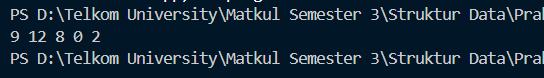
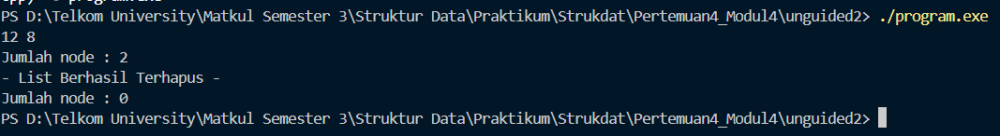

# <h1 align="center">Laporan Praktikum Modul 4 -SINGLY Linked List (Bagian Pertama)</h1>

<p align="center">Faiz Az-Zahra Winanto Putra - 10311243001</p>

  

## Dasar Teori

Senarai Berantai (Linked List)
Senarai berantai adalah sekumpulan komponen, yang dinamakan dengan simpul. Setiap simpul (kecuali simpul terakhir) memuat alamat dari simpul berikutnya. Jadi, setiap simpul di dalam sebuah senarai berantai mempunyai dua komponen: satu untuk menyimpan informasi relevan (yaitu, data) dan satu lagi untuk menyimpan alamat, yang disebut dengan link, dari simpul berikutnya di dalam senarai berantai. Alamat dari simpul pertama disimpan di dalam lokasi yang terpisah, yang disebut dengan kepala (head atau first). 

Senarai berantai: Sekumpulan item, dinamakan dengan simpul, dimana di dalamnya urutan simpul ditentukan berdasarkan alamat, dinamakan dengan link, yang disimpan di dalam setiap simpul.[1]


## Guided

### 1. Linked List Guided 1 

list.h
```C++
#ifndef LIST_H
#define LIST_H
#define Nil NULL
#include<iostream>

using namespace std;

//deklarasi isi data struct mahasiswa
struct mahasiswa{
    string nama;
    string nim;
    int umur;
};

typedef mahasiswa dataMahasiswa; //Memberikan nama alias dataMahasiswa untuk struct mahasiswa.

typedef struct node *address; //Mendefinisikan alias address sebagai pointer ke struct node

struct node{ // node untuk isi dari linked listnya, isi setiap node adalah data & pointer next
    dataMahasiswa isidata;
    address next;
};

  
struct linkedlist{ //ini linked list nya
    address first;
};


//semua function & prosedur yang akan dipakai
bool isEmpty(linkedlist List);
void createList(linkedlist &List);
address alokasi(string nama, string nim, int umur);
void dealokasi(address &node);
void printList(linkedlist List);
void insertFirst(linkedlist &List, address nodeBaru);
void insertAfter(linkedlist &List, address nodeBaru, address Prev);
void insertLast(linkedlist &List, address nodeBaru);

#endif
```

list.cpp

```C++
#include "list.h"
#include <iostream>
using namespace std;

//I.S = Initial State / kondisi awal
//F.S = Final State / kondisi akhir

//fungsi untuk cek apakah list kosong atau tidak
bool isEmpty(linkedlist List) {
    if(List.first == Nil){
        return true;
    } else {
        return false;
    }
}

//pembuatan linked list kosong
void createList(linkedlist &List) {
    /* I.S. sembarang
       F.S. terbentuk list kosong */
    List.first = Nil;
}

//pembuatan node baru dengan menerapkan manajemen memori
address alokasi(string nama, string nim, int umur) {
    /* I.S. sembarang
       F.S. mengembalikan alamat node baru dengan isidata = sesuai parameter dan next = Nil */

    address nodeBaru = new node;
    nodeBaru->isidata.nama = nama;
    nodeBaru->isidata.nim = nim;
    nodeBaru->isidata.umur = umur;
    nodeBaru->next = Nil;
    return nodeBaru;
}

//penghapusan node dengan menerapkan manajemen memori
void dealokasi(address &node) {
    /* I.S. P terdefinisi
       F.S. memori yang digunakan node dikembalikan ke sistem */
    node->next = Nil;
    delete node;
}

//prosedur-prosedur untuk insert / menambahkan node baru kedalam list
void insertFirst(linkedlist &List, address nodeBaru) {
    /* I.S. sembarang, P sudah dialokasikan
       F.S. menempatkan elemen list (node) pada awal list */
    nodeBaru->next = List.first;
    List.first = nodeBaru;
}

void insertAfter(linkedlist &List, address nodeBaru, address Prev) {
    /* I.S. sembarang, nodeBaru dan Prev alamat salah satu elemen list (node)
       F.S. menempatkan elemen (node) sesudah elemen node Prev */
    if (Prev != Nil) {
        nodeBaru->next = Prev->next;
        Prev->next = nodeBaru;
    } else {
        cout << "Node sebelumnya tidak valid!" << endl;
    }
}

 
void insertLast(linkedlist &List, address nodeBaru) {
    /* I.S. sembarang, nodeBaru sudah dialokasikan
       F.S. menempatkan elemen nodeBaru pada akhir list */
    if (isEmpty(List) == true) {
        List.first = nodeBaru;
    } else {
        address nodeBantu = List.first;
        while (nodeBantu->next != Nil) {
            nodeBantu = nodeBantu->next;
        }
        nodeBantu->next = nodeBaru;
    }
}

 
//prosedur untuk menampilkan isi list
void printList(linkedlist List) {
    /* I.S. list mungkin kosong
       F.S. jika list tidak kosong menampilkan semua info yang ada pada list */
    if (isEmpty(List) == true) {
        cout << "List kosong." << endl;
    } else {
        address nodeBantu = List.first;
        while (nodeBantu != Nil) {
            cout << "Nama : " << nodeBantu->isidata.nama << ", NIM : " << nodeBantu->isidata.nim
            << ", Usia : " << nodeBantu->isidata.umur << endl;
            nodeBantu = nodeBantu->next;
        }
    }
}
```

main.cpp

```C++
#include "list.h"
#include<iostream>

using namespace std;


int main(){
    linkedlist List;
    address nodeA, nodeB, nodeC, nodeD, nodeE = Nil;
    createList(List);

    dataMahasiswa mhs;

  
    nodeA = alokasi("Faiz ", "10311243001", 20);
    nodeB = alokasi("Juan", "14134331212", 19);
    nodeC = alokasi("Yossika", "24134141122", 20);
    nodeD = alokasi("Yunan", "123414131313", 19);
    nodeE = alokasi("Nanda", "12413134131", 20);

  
    insertFirst(List, nodeA);
    insertLast(List, nodeB);
    insertAfter(List, nodeC, nodeA);
    insertAfter(List, nodeD, nodeC);
    insertLast(List, nodeE);

    cout << "--- ISI LIST SETELAH DILAKUKAN INSERT ---" << endl;
    printList(List);

    return 0;
}
```


Program ini merupakan implementasi **Linked List** dalam C++ untuk menyimpan data mahasiswa berupa nama, NIM, dan umur. Struktur `node` digunakan untuk menampung data dan pointer ke elemen berikutnya, sedangkan `linkedlist` menyimpan alamat elemen pertama. Program menyediakan fungsi untuk membuat list kosong, memeriksa apakah list kosong, menambah node di awal, di tengah (setelah node tertentu), dan di akhir list, serta menampilkan seluruh isi list. Pada fungsi `main`, beberapa data mahasiswa dialokasikan dan dimasukkan ke dalam list menggunakan berbagai metode penyisipan, lalu seluruh data ditampilkan ke layar dalam urutan sesuai penyisipan.
### 2. Linked List Guided 2 (Delete List)

list.h
```C++
#ifndef LIST_H
#define LIST_H
#define Nil NULL
#include <iostream>

using namespace std;

  
//deklarasi isi data struct mahasiswa
struct mahasiswa{
    string nama;
    string nim;
    int umur;
};

typedef mahasiswa dataMahasiswa; //Memberikan nama alias dataMahasiswa untuk struct mahasiswa.

typedef struct node *address; //Mendefinisikan alias address sebagai pointer ke struct node


struct node{ // node untuk isi dari linked listnya, isi setiap node adalah data & pointer next
    dataMahasiswa isidata;
    address next;
};


struct linkedlist{ //ini linked list nya
    address first;
};

  


bool isEmpty(linkedlist List);
void createList(linkedlist &List);

address alokasi(string nama, string nim, int umur);

void dealokasi(address &node);
void printList(linkedlist List);
void insertFirst(linkedlist &List, address nodeBaru);
void insertAfter(linkedlist &List, address nodeBaru, address Prev);
void insertLast(linkedlist &List, address nodeBaru);


void delFirst(linkedlist &List);
void delLast(linkedlist &List);
void delAfter(linkedlist &List, address nodeHapus, address nodePrev);

int nbList(linkedlist List);
void deleteList(linkedlist &List);

#endif
```

list.cpp

```C++
#include "list.h"
#include <iostream>

using namespace std;
//I.S = Initial State / kondisi awal
//F.S = Final State / kondisi akhir


//fungsi untuk cek apakah list kosong atau tidak
bool isEmpty(linkedlist List) {
    if(List.first == Nil){
        return true;
    } else {
        return false;
    }
}

//pembuatan linked list kosong
void createList(linkedlist &List) {
    List.first = Nil;
}

//pembuatan node baru
address alokasi(string nama, string nim, int umur) {

    address nodeBaru = new node;
    nodeBaru->isidata.nama = nama;
    nodeBaru->isidata.nim = nim;
    nodeBaru->isidata.umur = umur;
    nodeBaru->next = Nil;
    return nodeBaru;
}


//penghapusan node
void dealokasi(address &node) {
    node->next = Nil;
    delete node;
}


//prosedur-prosedur untuk insert / menambahkan node baru kedalam list
void insertFirst(linkedlist &List, address nodeBaru) {
    nodeBaru->next = List.first;
    List.first = nodeBaru;
}

  
void insertAfter(linkedlist &List, address nodeBaru, address Prev) {
    if (Prev != Nil) { //Previous (sebelumnya) tidak boleh NULL
        nodeBaru->next = Prev->next;
        Prev->next = nodeBaru;
    } else {
        cout << "Node sebelumnya tidak valid!" << endl;
    }
}

void insertLast(linkedlist &List, address nodeBaru) {
    if (isEmpty(List)) {
        List.first = nodeBaru;
    } else {
        address nodeBantu = List.first;
        while (nodeBantu->next != Nil) {
            nodeBantu = nodeBantu->next;
        }
        nodeBantu->next = nodeBaru;
    }
}

  
//prosedur-prosedur untuk delete / menghapus node yang ada didalam list
void delFirst(linkedlist &List){


    address nodeHapus;
    if (isEmpty(List) == false) {
        nodeHapus = List.first;
        List.first = List.first->next;
        nodeHapus->next = Nil;
        dealokasi(nodeHapus);
    } else {
        cout << "List kosong!" << endl;
    }
}

  
void delLast(linkedlist &List){

    address nodeHapus, nodePrev;
    if(isEmpty(List) == false){
        nodeHapus = List.first;
        if(nodeHapus->next == Nil){
            List.first->next = Nil;
            dealokasi(nodeHapus);
        } else {
            while(nodeHapus->next != Nil){
                nodePrev = nodeHapus;
                nodeHapus = nodeHapus->next;
            }
            nodePrev->next = Nil;
            dealokasi(nodeHapus);
        }
    } else {
        cout << "list kosong" << endl;
    }
}

  
void delAfter(linkedlist &List, address nodeHapus, address nodePrev){

    if(isEmpty(List) == true){
        cout << "List kosong!" << endl;
    } else { //jika list tidak kosong
        if (nodePrev != Nil && nodePrev->next != Nil) {
            nodeHapus = nodePrev->next;      
            nodePrev->next = nodeHapus->next;  
            nodeHapus->next = Nil;        
            dealokasi(nodeHapus);
        } else {
            cout << "Node sebelumnya (prev) tidak valid!" << endl;
        }
    }
}

  
//prosedur untuk menampilkan isi list
void printList(linkedlist List) {
    if (isEmpty(List)) {
        cout << "List kosong." << endl;
    } else {
        address nodeBantu = List.first;
        while (nodeBantu != Nil) {
            cout << "Nama : " << nodeBantu->isidata.nama << ", NIM : " << nodeBantu->isidata.nim << ", Usia : " << nodeBantu->isidata.umur << endl;
            nodeBantu = nodeBantu->next;
        }
    }
}

  
//function untuk menampilkan jumlah node didalam list
int nbList(linkedlist List) {
    int count = 0;
    address nodeBantu = List.first;
    while (nodeBantu != Nil) {
        count++;
        nodeBantu = nodeBantu->next;
    }
    return count;
}

  
//prosedur untuk menghapus list (menghapus semua node didalam list)
void deleteList(linkedlist &List){

    address nodeBantu, nodeHapus;
    nodeBantu = List.first;
    while(nodeBantu != Nil){
        nodeHapus = nodeBantu;
        nodeBantu = nodeBantu->next;
        dealokasi(nodeHapus);
    }
    List.first = Nil;
    cout << "List sudah terhapus!" << endl;
}
```

main.cpp

```C++
 
#include "list.h"
#include<iostream>

using namespace std;


int main(){
    linkedlist List;
    address nodeA, nodeB, nodeC, nodeD, nodeE = Nil;
    createList(List);

    dataMahasiswa mhs;

    nodeA = alokasi("Dhimas", "2311102151", 20);
    nodeB = alokasi("Arvin", "2211110014", 21);
    nodeC = alokasi("Rizal", "2311110029", 20);
    nodeD = alokasi("Satrio", "2211102173", 21);
    nodeE = alokasi("Joshua", "2311102133", 21);

  
    insertFirst(List, nodeA);
    insertLast(List, nodeB);
    insertAfter(List, nodeC, nodeA);
    insertAfter(List, nodeD, nodeC);
    insertLast(List, nodeE);

  
    cout << "ISI LIST SETELAH DILAKUKAN INSERT" << endl;
    printList(List);
    cout << "jumlah node : " << nbList(List) << endl;
    cout << endl;


    delFirst(List);
    delLast(List);
    delAfter(List, nodeD, nodeC);

    cout << "ISI LIST SETELAH DILAKUKAN DELETE" << endl;
    printList(List);
    cout << "jumlah node : " << nbList(List) << endl;
    cout << endl;

    deleteList(List);
    cout << "ISI LIST SETELAH DILAKUKAN HAPUS LIST" << endl;
    printList(List);
    cout << "jumlah node : " << nbList(List) << endl;
    cout << endl;

    return 0;
}
```

Program ini untuk menyimpan data mahasiswa berupa nama, NIM, dan umur. Struktur `node` menyimpan data dan pointer ke node berikutnya, sedangkan `linkedlist` menyimpan alamat node pertama. Fungsi-fungsi seperti `createList`, `alokasi`, `insert`, dan `delete` digunakan untuk membuat list, menambah, serta menghapus node. Fungsi `printList` menampilkan isi list, `nbList` menghitung jumlah node, dan `deleteList` menghapus seluruh data. Pada `main.cpp`, program membuat beberapa data mahasiswa, melakukan operasi penambahan dan penghapusan node, lalu menampilkan hasilnya untuk menunjukkan perubahan isi list.

## Unguided

### 1.  Unguided 1

singlylist.h
```C++
#ifndef SINGLYLIST_H
#define SINGLYLIST_H
#include <iostream>

using namespace std;
  

typedef int infotype;

struct ElmList {
    infotype info;
    ElmList* next;
};

typedef ElmList* address;

struct List {
    address first;
};

  
void createList(List &L);
address alokasi(infotype x);
void dealokasi(address &P);
void printInfo(List L);
void insertFirst(List &L, address P);

#endif
```

singlylist.cpp

```C++
#include "Singlylist.h"

void createList(List &L) {
    L.first = nullptr;
}

  
address alokasi(infotype x) {
    address P = new ElmList;
    if (P != nullptr) {
        P->info = x;
        P->next = nullptr;
    }
    return P;
}


void dealokasi(address &P) {
    delete P;
    P = nullptr;
}

 
void insertFirst(List &L, address P) {
    if (P != nullptr) {
        P->next = L.first;
        L.first = P;
    }
}


void printInfo(List L) {
    address P = L.first;
    while (P != nullptr) {
        cout << P->info << " ";
        P = P->next;
    }
    cout << endl;
}
```

main.cpp

```C++
#include "Singlylist.h"

int main() {
    List L;
    address P1, P2, P3, P4, P5;

    createList(L);

    P1 = alokasi(2);
    insertFirst(L, P1);

    P2 = alokasi(0);
    insertFirst(L, P2);

    P3 = alokasi(8);
    insertFirst(L, P3);

    P4 = alokasi(12);
    insertFirst(L, P4);

    P5 = alokasi(9);
    insertFirst(L, P5);

    printInfo(L);

    return 0;
}
```


### Output Unguided 1 :

##### Output 1

Program di atas membuat dan mengelola singly linked list. Struktur `List` menyimpan pointer ke elemen pertama, sedangkan setiap `ElmList` berisi data dan pointer ke elemen berikutnya. Fungsi-fungsinya meliputi pembuatan list kosong (`createList`), alokasi node baru (`alokasi`), penghapusan node (`dealokasi`), penambahan elemen di awal list (`insertFirst`), dan penampilan isi list (`printInfo`). Di fungsi `main`, lima angka (2, 0, 8, 12, 9) dimasukkan ke depan secara berurutan, sehingga hasil akhirnya yang tercetak adalah **9 12 8 0 2**.

  
### 2. Unguided 2

singlylist.h
```C++

#ifndef SINGLYLIST_H
#define SINGLYLIST_H

#include <iostream>
using namespace std;

typedef int infotype;

  
struct ElmList {
    infotype info;
    ElmList* next;
};


typedef ElmList* address;

struct List {
    address first;
};

  

void createList(List &L);
address alokasi(infotype x);

void dealokasi(address &P);
void printInfo(List L);
void insertFirst(List &L, address P);

void deleteFirst(List &L, address &P);
void deleteLast(List &L, address &P);
void deleteAfter(List &L, address Prec, address &P);
int nbList(List L);

void deleteList(List &L);

#endif
```

singlylist.cpp
```C++
#include "Singlylist.h"

void createList(List &L) {
    L.first = nullptr;
}


address alokasi(infotype x) {
    address P = new ElmList;

    if (P != nullptr) {
        P->info = x;
        P->next = nullptr;
    }
    return P;
}


void dealokasi(address &P) {
    delete P;
    P = nullptr;
}


void insertFirst(List &L, address P) {
    if (P != nullptr) {
        P->next = L.first;
        L.first = P;
    }
}

 
void printInfo(List L) {
    address P = L.first;

    while (P != nullptr) {
        cout << P->info << " ";
        P = P->next;
    }
    cout << endl;
}

void deleteFirst(List &L, address &P) {

    if (L.first != nullptr) {
        P = L.first;
        L.first = P->next;
        P->next = nullptr;
    }
}

 
void deleteLast(List &L, address &P) {
    if (L.first != nullptr) {
        address Q = L.first;
        if (Q->next == nullptr) {
            P = Q;
            L.first = nullptr;
        } else {
            while (Q->next->next != nullptr) {
                Q = Q->next;
            }
            P = Q->next;
            Q->next = nullptr;
        }
    }
}

void deleteAfter(List &L, address Prec, address &P) {
    if (Prec != nullptr && Prec->next != nullptr) {
        P = Prec->next;
        Prec->next = P->next;
        P->next = nullptr;
    }
}

  
int nbList(List L) {
    int count = 0;

    address P = L.first;
    while (P != nullptr) {
        count++;
        P = P->next;
    }
    return count;
}

  
void deleteList(List &L) {
    address P;
    while (L.first != nullptr) {
        deleteFirst(L, P);
        dealokasi(P);
    }
}
```

main.cpp
```C++
#include "Singlylist.h"


int main() {
    List L;
    address P1, P2, P3, P4, P5, Pdel;
    createList(L);

    P1 = alokasi(2); insertFirst(L, P1);
    P2 = alokasi(0); insertFirst(L, P2);
    P3 = alokasi(8); insertFirst(L, P3);
    P4 = alokasi(12); insertFirst(L, P4);
    P5 = alokasi(9); insertFirst(L, P5);

    deleteFirst(L, Pdel);
    dealokasi(Pdel);

    deleteLast(L, Pdel);
    dealokasi(Pdel);


    address Prec = L.first->next;
    deleteAfter(L, Prec, Pdel);
    dealokasi(Pdel);

    printInfo(L);

    cout << "Jumlah node : " << nbList(L) << endl;

    deleteList(L);
    cout << "- List Berhasil Terhapus -" << endl;
    cout << "Jumlah node : " << nbList(L) << endl;

    return 0;
}
```
### Output Unguided 2 :

##### Output 1


Program ini membuat list dinamis yang berisi node dengan data bertipe `int` dan pointer ke elemen berikutnya. Fungsi-fungsi yang disediakan meliputi pembuatan list kosong, penambahan data di awal (`insertFirst`), penghapusan elemen pertama, terakhir, atau setelah elemen tertentu, pencetakan isi list, penghitungan jumlah node, serta penghapusan seluruh list.

Pada fungsi `main`, lima data (2, 0, 8, 12, 9) dimasukkan ke list, kemudian beberapa elemen dihapus menggunakan fungsi delete. Setelah itu, program menampilkan isi list dan jumlah node yang tersisa, lalu menghapus seluruh list hingga kosong.

## Kesimpulan
Pada Minggu keempat/modul ke 4 praktikum sudah mempelajari singly linked list merupakan salah satu struktur data dinamis yang terdiri atas rangkaian elemen (node), di mana setiap elemen memiliki dua bagian: **data (info)** dan **penunjuk (pointer)** yang mengarah ke elemen berikutnya. Melalui implementasi ini, pengguna dapat menambahkan, menghapus, dan menelusuri data secara efisien tanpa harus mengatur ulang seluruh struktur seperti pada array.
  

## Referensi

[1] Sianipar, Rismon Hasiholan. _Struktur Data C++ dengan Pemrograman Generik_. Vol. 1. Penerbit ANDI, 2015. Diakses pada 12 Oktober 2025 melalui [https://books.google.co.id/books?hl=id&lr=&id=DGl2DwAAQBAJ&oi=fnd&pg=PA1&dq=TIPE+DATA+ABSTRAK+C%2B%2B&ots=saVt9dzPb9&sig=GPhIn9j4GXp6Z6xX_JiPTMmp14g&redir_esc=y#v=onepage&q=TIPE%20DATA%20ABSTRAK%20C%2B%2B&f=false
