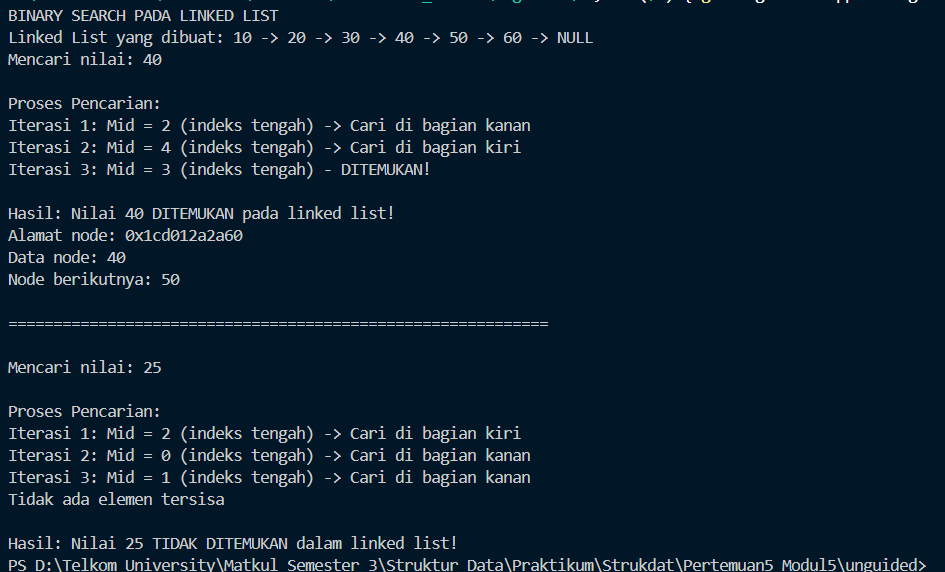
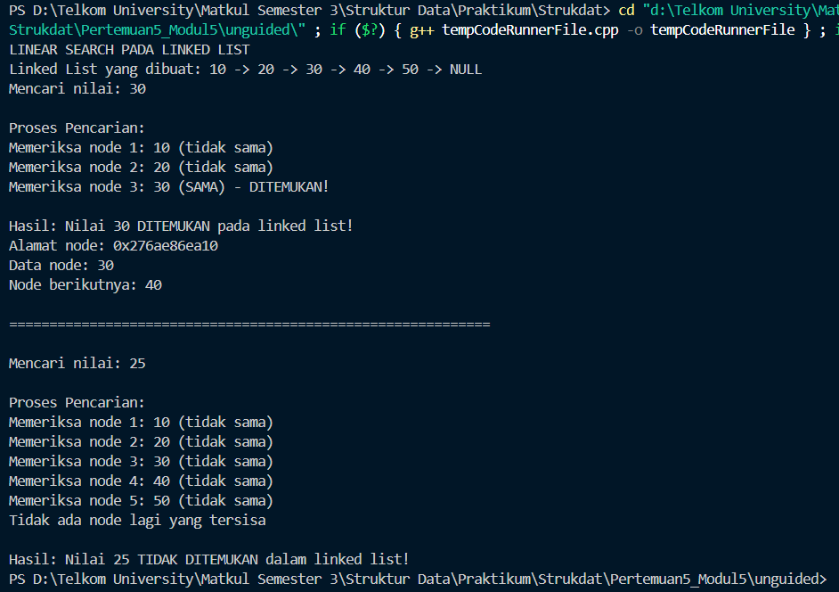

# <h1 align="center">Laporan Praktikum Modul 5 -SINGLY Linked List (Bagian Kedua)</h1>

<p align="center">Faiz Az-Zahra Winanto Putra - 10311243001</p>

  

## Dasar Teori

Pencarian (searching) merupakan suatupekerjaan yang sering dikerjakan dalam kehidupansehari–hari. Ada kalanya pencarian dilakukandengan tujuan hanya untuk mengetahui apakahdata tersebut ada dalam sekumpulan data atautidak, atau mungkin di lain waktu posisi dari datayang dicari tersebut dibutuhkan untuk keperluantertentu, atau jika kemunculan data lebih dari satukali maka semua posisi dan frekuensikemunculannnyaingin ditampilkan.

##### Metode dalam Pencarian

###### Binary Search
Pencarian Biner hanya dapat dilakukan pada barisan bilangan yang telah diurutkan baiksecara menaik (ascending) maupun menurun(descending). Pencarian Biner melakukan pencarian data X dalam barisan A[1] ... A[n]dengan dimulai dari data tengah pada barisan A. Jika nilai data X sama dengan nilai data tengahbarisan A, maka pencarian dihentikan dandinyatakan sukses. Sedangkan jika tidak sama maka,

1.Untuk data yang diurutkan secara menaik(ascending), pencarian akan dilanjutkan ke½ bagian kiri apabila nilai data X lebih kecil daripada nilai data tengah padabarisan A. Sedangkan apabila nilai data X lebih besar daripada nilai data tengah pada barisanA, maka pencarian akan dilanjutkan ke ½ bagian kanan.

2.Untuk data yang diurutkan secara menurun(descending), pencarian akan dilanjutkanke ½ bagian kiri apabila nilai data X lebihbesar daripada nilai data tengah padabarisan A. Sedangkan apabila nilai data Xlebih kecil daripada nilai data tengah padabarisan A, maka pencarian akandilanjutkan ½ bagian kiri.

###### Linear Search
Pencarian Linier dapat dilakukan padabarisan bilangan yang terurut secara menaik(ascending) atau menurun (descending) ataupuntidak terurut. Pencarian Linier dilakukan dengan cara membandingkan data yang dicari (X) dengandata dalam barisan A[1] ... A[n]dengan dimulai dari data elemen pertama pada barisan A. Jika perbandingan bernilai sama, maka pencarian dihentikan dan dinyatakan sukses. Sedangkan apabila perbandingan tidak bernilai sama maka,

1.Jika data tidak terurut (data acak), makapencarian akan dilanjutkan ke data selanjutnya.

2.Jika data terurut secara menaik (ascending),maka pencarian hanya akan dilanjutkan ke dataselanjutnya yang berada di sebelah kanan datayang sedang dibandingkan apabila data yangdicari (X) lebih besar daripada data yangsedang dibandingkan sekarang. [1]


## Guided

### 1.  Guided 1 

listBuah.h
```C++
#ifndef LISTBUAH_H
#define LISTBUAH_H

#define Nil NULL

#include <iostream>

using namespace std;

struct buah {
    string nama;
    int jumlah;
    float harga;
};

typedef buah dataBuah;

typedef struct node *address;

struct node {
    dataBuah isidata;
    address next;
};


struct linkedlist {
    address first;
};

  
bool isEmpty(linkedlist List);
void createList(linkedlist &List);

address alokasi(string nama, int jumlah, float harga);

void dealokasi(address &node);
void printList(linkedlist List);
void insertFirst(linkedlist &List, address nodeBaru);
void insertAfter(linkedlist &List, address nodeBaru, address Prev);
void insertLast(linkedlist &List, address nodeBaru);
void delFirst(linkedlist &List);
void delLast(linkedlist &List);
void delAfter(linkedlist &List, address nodeHapus, address nodePrev);

int nbList(linkedlist List);
void deleteList(linkedlist &List);

void updateFirst(linkedlist List);
void updateLast(linkedlist List);
void updateAfter(linkedlist List, address prev);
#endif
```

listBuah.cpp

```C++
#include "listBuah.h"

#include <iostream>

using namespace std;

//fungsi untuk cek apakah list kosong atau tidak
bool isEmpty(linkedlist List) {
    if(List.first == Nil){
        return true;
    } else {
        return false;
    }
}

//pembuatan linked list kosong
void createList(linkedlist &List) {
    List.first = Nil;
}

//pembuatan node baru dengan menerapkan manajemen memori
address alokasi(string nama, int jumlah, float harga) {
    address nodeBaru = new node;

    nodeBaru->isidata.nama = nama;
    nodeBaru->isidata.jumlah = jumlah;
    nodeBaru->isidata.harga = harga;
    nodeBaru->next = Nil;

    return nodeBaru;
}

  
//penghapusan node dengan menerapkan manajemen memori
void dealokasi(address &node) {
    node->next = Nil;
    delete node;

}

  
//prosedur-prosedur untuk insert / menambahkan node baru kedalam list
void insertFirst(linkedlist &List, address nodeBaru) {
    nodeBaru->next = List.first;
    List.first = nodeBaru;

}

  

void insertAfter(linkedlist &List, address nodeBaru, address Prev) {
    if (Prev != Nil) {
        nodeBaru->next = Prev->next;
        Prev->next = nodeBaru;
    } else {
        cout << "Node sebelumnya tidak valid!" << endl;
    }
}

  

void insertLast(linkedlist &List, address nodeBaru) {
    if (isEmpty(List)) {

        List.first = nodeBaru;

    } else {

        address nodeBantu = List.first;

        while (nodeBantu->next != Nil) {

            nodeBantu = nodeBantu->next;

        }

        nodeBantu->next = nodeBaru;

    }

}


//prosedur-prosedur untuk delete / menghapus node yang ada didalam list

void delFirst(linkedlist &List){

    address nodeHapus;

    if (isEmpty(List) == false) {

        nodeHapus = List.first;

        List.first = List.first->next;

        nodeHapus->next = Nil;

        dealokasi(nodeHapus);

        cout << "Node pertama berhasil terhapus!" << endl;

    } else {

        cout << "List kosong!" << endl;

    }

}

  

void delLast(linkedlist &List){

    address nodeHapus, nodePrev;

    if(isEmpty(List) == false){

        nodeHapus = List.first;

        if(nodeHapus->next == Nil){

            List.first->next = Nil;

            dealokasi(nodeHapus);

        } else {

            while(nodeHapus->next != Nil){

                nodePrev = nodeHapus;

                nodeHapus = nodeHapus->next;

            }

            nodePrev->next = Nil;

            dealokasi(nodeHapus);

        }

        cout << "Node terakhir berhasil terhapus!" << endl;

    } else {

        cout << "list kosong" << endl;

    }

}

  

void delAfter(linkedlist &List, address nodeHapus, address nodePrev){

    if(isEmpty(List) == true){

        cout << "List kosong!" << endl;

    } else { //jika list tidak kosong

        if (nodePrev != Nil && nodePrev->next != Nil) {

            nodeHapus = nodePrev->next;      

            nodePrev->next = nodeHapus->next;  

            nodeHapus->next = Nil;        

            dealokasi(nodeHapus);

            cout << "Node setelah node " << nodePrev->isidata.nama << " berhasil terhapus!" << endl;

        } else {

            cout << "Node sebelumnya (prev) tidak valid!" << endl;

        }

    }

}

  

//prosedur untuk menampilkan isi list

void printList(linkedlist List) {

    if (isEmpty(List)) {

        cout << "List kosong." << endl;

    } else {

        address nodeBantu = List.first;

        while (nodeBantu != Nil) {

            cout << "Nama Buah : " << nodeBantu->isidata.nama << ", Jumlah : " << nodeBantu->isidata.jumlah << ", Harga : " << nodeBantu->isidata.harga << endl;

            nodeBantu = nodeBantu->next;

        }

    }

}

  

//function untuk menampilkan jumlah node didalam list

int nbList(linkedlist List) {

    int count = 0;

    address nodeBantu = List.first;

    while (nodeBantu != Nil) {

        count++;

        nodeBantu = nodeBantu->next;

    }

    return count;

}

  

//prosedur untuk menghapus list (menghapus semua node didalam list)

void deleteList(linkedlist &List){

    address nodeBantu, nodeHapus;

    nodeBantu = List.first;

    while(nodeBantu != Nil){

        nodeHapus = nodeBantu;

        nodeBantu = nodeBantu->next;

        dealokasi(nodeHapus);

    }

    List.first = Nil;

    cout << "List berhasil terhapus!" << endl;

}

  

/*----- MATERI PERTEMUAN 5 - SINGLY LINKED LIST (BAGIAN KEDUA) - PART 1 (UPDATE) -----*/

//prosedur-prosedur untuk melakukan update data node

void updateFirst(linkedlist List){

    if(isEmpty(List) == true){

        cout << "List kosong!" << endl;

    } else {

        cout << "Masukkan update data node pertama : " << endl;

        cout << "Nama buah : ";

        cin >> List.first->isidata.nama;

        cout << "Jumlah : ";

        cin >> List.first->isidata.jumlah;

        cout << "Harga : ";

        cin >> List.first->isidata.harga;

        cout << "Data Berhasil Diupdate!" << endl;

        cout << endl;

    }

}

  

void updateLast(linkedlist List){

    if (isEmpty(List) == true) {

        cout << "List Kosong!" << endl;

    } else {

        address nodeBantu = List.first;

        while (nodeBantu->next != Nil) {

            nodeBantu = nodeBantu->next;

        }

        cout << "masukkan update data node terakhir : " << endl;

        cout << "Nama buah : ";

        cin >> nodeBantu->isidata.nama;

        cout << "Jumlah : ";

        cin >> nodeBantu->isidata.jumlah;

        cout << "Harga : ";

        cin >> nodeBantu->isidata.harga;

        cout << "Data Berhasil Diupdate!" << endl;

        cout << endl;

    }

}

  

void updateAfter(linkedlist List, address nodePrev){

    if(isEmpty(List) == true){

        cout << "List kosong!" << endl;

    } else {

        if (nodePrev != Nil && nodePrev->next != Nil){

            address nodeBantu = nodePrev->next;

            cout << "masukkan update data node setelah node " << nodePrev->isidata.nama << " : " << endl;

            cout << "Nama buah : ";

            cin >> nodeBantu->isidata.nama;

            cout << "Jumlah : ";

            cin >> nodeBantu->isidata.jumlah;

            cout << "Harga : ";

            cin >> nodeBantu->isidata.harga;

            cout << "Data Berhasil Diupdate!" << endl;

            cout << endl;

        } else {

            cout << "Node sebelumnya (prev) tidak valid!" << endl;

        }

    }

  

}
```

main.cpp

```C++
#include "listBuah.h"
#include <iostream>

using namespace std;

  
int main() {
    linkedlist List;
    address nodeA, nodeB, nodeC, nodeD, nodeE = Nil;
    createList(List);

    dataBuah dtBuah;

    nodeA = alokasi("Jeruk", 100, 3000);
    nodeB = alokasi("Apel", 75, 4000);
    nodeC = alokasi("Pir", 87, 5000);
    nodeD = alokasi("Semangka", 43, 11500);
    nodeE = alokasi("Durian", 15, 31450);

  
    insertFirst(List, nodeA);
    insertLast(List, nodeB);
    insertAfter(List, nodeC, nodeA);
    insertAfter(List, nodeD, nodeC);
    insertLast(List, nodeE);

    cout <<"--- ISI LIST SETELAH DILAKUKAN INSERT---" << endl;
    printList(List);
    cout <<"jumlah node:" << nbList(List) << endl;
    cout << endl;


    updateFirst(List);
    updateLast(List);
    updateAfter(List, nodeD);

    cout <<"--- ISI LIST SETELAH DILAKUKAN UPDATE---" << endl;
    printList(List);
    cout << "jumlah node:" << nbList(List) << endl;
    cout << endl;

    return 0;

}
```

Program di atas merupakan implementasi **singly linked list** dalam C++ untuk mengelola data buah yang berisi nama, jumlah, dan harga. Struktur data yang digunakan terdiri dari `buah` untuk menyimpan data, `node` untuk menghubungkan antar data melalui pointer `next`, dan `linkedlist` sebagai penunjuk node pertama. Program menyediakan fungsi untuk membuat list, menambah (`insertFirst`, `insertAfter`, `insertLast`), menghapus (`delFirst`, `delLast`, `delAfter`), menampilkan (`printList`), menghitung jumlah data (`nbList`), serta memperbarui isi node (`updateFirst`, `updateLast`, `updateAfter`).
### 2. Guided (Linear Search)

linear.cpp
```C++
#include <iostream>

using namespace std;

struct Node {
    int data;
    Node* next;
};

Node* linearSearch(Node* head, int key) {
    Node* current = head;
    while (current != nullptr) {
        if (current->data == key)
            return current;
        current = current->next;
    }
    return nullptr;
}

void append(Node* &head, int value) {
    Node* newNode = new Node{value, nullptr};
    
    if (!head) head = newNode;
    else {
        Node* temp = head;
        while (temp->next) temp = temp->next;
        temp->next = newNode;
    }
}

int main() {
    Node* head = nullptr;
    append(head, 10); append(head, 20); append(head, 30);
    Node* result = linearSearch(head, 30);

    cout << (result ? "Found" : "Not Found") << endl;

    return 0;
}
```

Program di atas membuat **linked list** dan melakukan **pencarian linear** terhadap data di dalamnya. Struktur `Node` menyimpan nilai (`data`) dan pointer ke node berikutnya (`next`). Fungsi `append()` menambahkan elemen baru di akhir list, sedangkan `linearSearch()` mencari nilai tertentu dengan menelusuri setiap node dari awal hingga akhir. Pada fungsi `main()`, list diisi dengan data 10, 20, dan 30, lalu program mencari nilai 30 dan menampilkan hasilnya **“Found”** jika ditemukan, atau **“Not Found”** jika tidak.

### 3. Guided (Binary Search)

binary.cpp
```C++
#include <iostream>

using namespace std;

struct Node {
    int data;
    Node* next;
};

Node* linearSearch(Node* head, int key) {
    Node* current = head;
    while (current != nullptr) {
        if (current->data == key)
            return current;
        current = current->next;
    }
    return nullptr;
}

void append(Node* &head, int value) {
    Node* newNode = new Node{value, nullptr};
    
    if (!head) head = newNode;
    else {
        Node* temp = head;
        while (temp->next) temp = temp->next;
        temp->next = newNode;
    }
}

int main() {
    Node* head = nullptr;
    append(head, 10); append(head, 20); append(head, 30);
    Node* result = linearSearch(head, 30);

    cout << (result ? "Found" : "Not Found") << endl;

    return 0;
}
```

Program di atas membuat dan mencari data dalam **linked list** menggunakan metode **binary search**. Struktur `Node` menyimpan nilai (`data`) dan pointer ke node berikutnya (`next`). Fungsi `append()` menambahkan node baru di akhir list, sedangkan `binarySearch()` mencari nilai tertentu (`key`) dengan menghitung jumlah node, lalu menelusuri node tengah untuk dibandingkan dengan nilai yang dicari. Jika ditemukan, fungsi mengembalikan pointer ke node tersebut; jika tidak, mengembalikan `nullptr`. Di fungsi `main()`, list diisi dengan data 10–50 dan dilakukan pencarian nilai 40, kemudian hasilnya ditampilkan sebagai “Found” atau “Not Found”.
## Unguided

### 1.  Unguided 1

```C++
#include <iostream>
#include <iomanip>

using namespace std;

  

// Definisi node

struct Node {

    int data;      

    Node* next;    

};

  
  

void append(Node*& head, int value) {

    Node* newNode = new Node{value, nullptr};  // Membuat node baru

    if (!head) {

        // Jika linked list kosong, node baru menjadi head

        head = newNode;

    } else {

        Node* temp = head;

        while (temp->next) {

            temp = temp->next;

        }

        // Hubungkan node terakhir dengan node baru

        temp->next = newNode;

    }

}

  
  

void visualizeList(Node* head) {
    cout << "Linked List yang dibuat: ";
    Node* current = head;
    while (current) {
        cout << current->data;
        if (current->next) {
            cout << " -> ";
        }
        current = current->next;
    }
    cout << " -> NULL" << endl;
}

  
  

Node* binarySearch(Node* head, int key) {
    int size = 0;
    for (Node* current = head; current; current = current->next) {
        size++;
    }
    if (size == 0) {
        cout << "Linked list kosong!" << endl;
        return nullptr;

    }

    cout << "\nProses Pencarian:" << endl;

    int left = 0;          

    int right = size - 1;  

    int iterasi = 1;        

    // Binary Search Algorithm

    while (left <= right) {

        int mid = left + (right - left) / 2;

        Node* midNode = head;

        for (int i = 0; i < mid; i++) {

            midNode = midNode->next;

        }

        cout << "Iterasi " << iterasi << ": Mid = " << mid

             << " (indeks tengah)";

        if (midNode->data == key) {

            cout << " - DITEMUKAN!" << endl;

            cout << "\nHasil: Nilai " << key

                 << " DITEMUKAN pada linked list!" << endl;

            cout << "Alamat node: " << midNode << endl;

            cout << "Data node: " << midNode->data << endl;

            // Tampilkan node berikutnya

            if (midNode->next != nullptr) {

                cout << "Node berikutnya: " << midNode->next->data << endl;

            } else {

                cout << "Node berikutnya: NULL (ini adalah node terakhir)" << endl;

            }

            return midNode;

        }

        // Jika key lebih kecil dari midNode, cari di bagian kiri

        else if (key < midNode->data) {

            cout << " -> Cari di bagian kiri" << endl;

            right = mid - 1;

        }

        // Jika key lebih besar dari midNode, cari di bagian kanan

        else {

            cout << " -> Cari di bagian kanan" << endl;

            left = mid + 1;

        }

        iterasi++;

    }

    cout << "Tidak ada elemen tersisa" << endl;

    cout << "\nHasil: Nilai " << key

         << " TIDAK DITEMUKAN dalam linked list!" << endl;

    return nullptr;

}

  
  

void deleteList(Node*& head) {

    Node* current = head;

    while (current) {

        Node* temp = current;

        current = current->next;

        delete temp;

    }

    head = nullptr;

}

  

int main() {

    Node* head = nullptr;  

    cout << "BINARY SEARCH PADA LINKED LIST" << endl;

    append(head, 10);

    append(head, 20);

    append(head, 30);

    append(head, 40);

    append(head, 50);

    append(head, 60);

    visualizeList(head);

    //  Mencari nilai yang ada (40)

    cout << "Mencari nilai: 40" << endl;

    Node* result1 = binarySearch(head, 40);

    cout << "\n" << string(60, '=') << endl;

    // Mencari nilai yang tidak ada (25)

    cout << "\nMencari nilai: 25" << endl;

    Node* result2 = binarySearch(head, 25);

    deleteList(head);

    return 0;

}
```


### Output Unguided 1 :

##### Output 1


Program di atas merupakan implementasi **binary search pada linked list** berurutan. Struktur `Node` menyimpan data dan pointer ke node berikutnya. Fungsi `append()` menambah elemen di akhir list, sedangkan `visualizeList()` menampilkan isi list. Fungsi utama `binarySearch()` mencari nilai tertentu dengan menghitung ukuran list, menentukan posisi tengah (`mid`), lalu membandingkan nilai node tengah dengan nilai yang dicari. Jika cocok, data ditampilkan beserta alamat node; jika tidak, pencarian dilanjutkan ke kiri atau kanan hingga ditemukan atau tidak ada lagi elemen. Fungsi `deleteList()` menghapus seluruh node untuk mencegah kebocoran memori. Pada fungsi `main()`, list dibuat berisi angka 10–60, lalu dilakukan pencarian nilai **40** (ditemukan) dan **25** (tidak ditemukan).

### 2. Unguided 2

```C++
#include <iostream>
#include <iomanip>
using namespace std;


struct Node {
    int data;      
    Node* next;    
};

  
void append(Node*& head, int value) {
    Node* newNode = new Node{value, nullptr};
    if (!head) {
        // Jika linked list kosong, node baru menjadi head
        head = newNode;
    } else {
        Node* temp = head;
        while (temp->next) {
            temp = temp->next;
        }
        // Hubungkan node terakhir dengan node baru
        temp->next = newNode;
    }
}

 

void visualizeList(Node* head) {
    cout << "Linked List yang dibuat: ";
    Node* current = head;
    while (current) {
        cout << current->data;
        if (current->next) {
            cout << " -> ";
        }
        current = current->next;
    }
    cout << " -> NULL" << endl;
}


// Fungsi Linear Search pada Linked List dengan visualisasi detail
Node* linearSearch(Node* head, int key) {
    // Jika linked list kosong
    if (head == nullptr) {
        cout << "Linked list kosong!" << endl;
        return nullptr;
    }
    cout << "\nProses Pencarian:" << endl;
    Node* current = head;  
    int nodeNumber = 1;    
    while (current != nullptr) {
        // Tampilkan node yang sedang diperiksa
        cout << "Memeriksa node " << nodeNumber << ": "
             << current->data;

        // Cek apakah data pada node current sama dengan key

        if (current->data == key) {
            // Data ditemukan
            cout << " (SAMA) - DITEMUKAN!" << endl;
            cout << "\nHasil: Nilai " << key
                 << " DITEMUKAN pada linked list!" << endl;
            cout << "Alamat node: " << current << endl;
            cout << "Data node: " << current->data << endl;

            // Tampilkan node berikutnya jika ada

            if (current->next != nullptr) {
                cout << "Node berikutnya: " << current->next->data << endl;
            } else {
                cout << "Node berikutnya: NULL (ini adalah node terakhir)" << endl;
            }
            return current;
        } else {
           // Data tidak sama, lanjut ke node berikutnya
            cout << " (tidak sama)" << endl;
        }
        // Pindah ke node berikutnya
        current = current->next;
        nodeNumber++;
    }
    cout << "Tidak ada node lagi yang tersisa" << endl;
    cout << "\nHasil: Nilai " << key
         << " TIDAK DITEMUKAN dalam linked list!" << endl;
    return nullptr;
}


void deleteList(Node*& head) {
    Node* current = head;
    while (current) {
        Node* temp = current;
        current = current->next;
        delete temp;
    }
    head = nullptr;
}


int main() {
    Node* head = nullptr;
    cout << "LINEAR SEARCH PADA LINKED LIST" << endl;

    append(head, 10);
    append(head, 20);
    append(head, 30);
    append(head, 40);
    append(head, 50);

    visualizeList(head);

    // Mencari nilai yang ada (30)
    cout << "Mencari nilai: 30" << endl;
    Node* result1 = linearSearch(head, 30);
    cout << "\n" << string(60, '=') << endl;
    // Mencari nilai yang tidak ada (25)
    cout << "\nMencari nilai: 25" << endl;
    Node* result2 = linearSearch(head, 25);
    deleteList(head);
    return 0;
}
```

### Output Unguided 2 :

##### Output 1


Program ini menerapkan **pencarian linear (Linear Search)** pada **Linked List** menggunakan C++. Data disimpan dalam node yang saling terhubung, dan fungsi `append()` menambah node di akhir list. Fungsi `linearSearch()` memeriksa setiap node secara berurutan untuk menemukan nilai yang dicari, lalu menampilkan hasilnya beserta detail node. Program juga menampilkan isi Linked List dan menghapus semua node di akhir untuk mencegah kebocoran memori.

## Kesimpulan
Pada Minggu 6 /modul ke 5 praktikum sudah mempelajari pencarian, banyak pencarian yang sudah dipelajari : binary serach, linear search. untuk Binary search adalah Pencarian Biner hanya dapat dilakukan pada barisan bilangan yang telah diurutkan baiksecara menaik (ascending) maupun menurun(descending). Pencarian Biner melakukan pencarian data X dalam barisan A[1] ... A[n]dengan dimulai dari data tengah pada barisan A. Jika nilai data X sama dengan nilai data tengahbarisan A, maka pencarian dihentikan dandinyatakan sukses. Sedangkan Linear Search adalah Pencarian Linier dapat dilakukan padabarisan bilangan yang terurut secara menaik(ascending) atau menurun (descending) ataupuntidak terurut. Pencarian Linier dilakukan dengan cara membandingkan data yang dicari (X) dengandata dalam barisan A[1] ... A[n]dengan dimulai dari data elemen pertama pada barisan A. Jika perbandingan bernilai sama, maka pencarian dihentikan dan dinyatakan sukses.
  

## Referensi

[1] Situmorang, H. (2017). Analisa algoritma pada metoda pencarian linier, biner dan interpolasi. _Jurnal Mahajana Informasi_, _2_(2), 31-41. https://e-journal.sari-mutiara.ac.id/index.php/7/article/view/177/194

