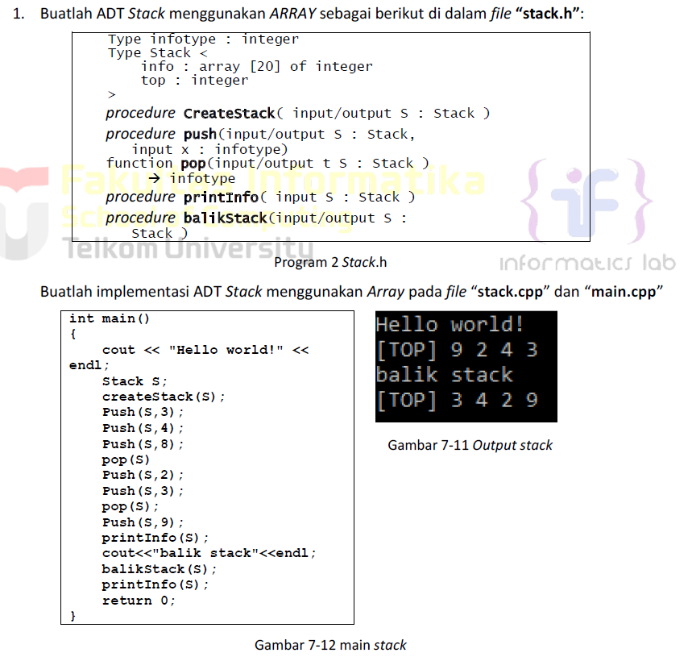
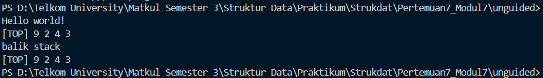
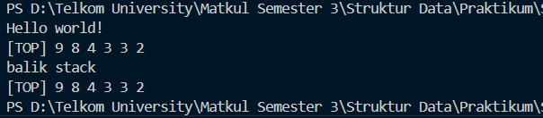
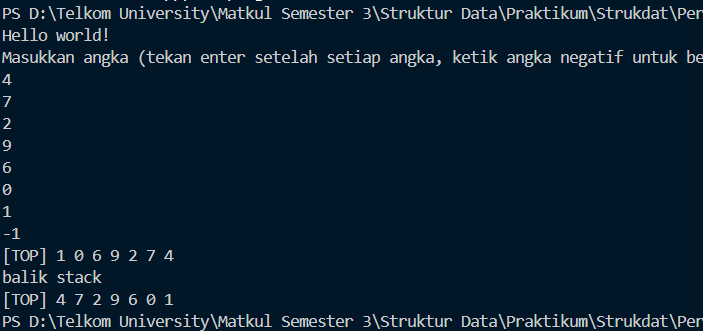

# <h1 align="center">Laporan Praktikum Modul 7 - Stack</h1>

<p align="center">Faiz Az-Zahra Winanto Putra - 10311243001</p>

  

## Dasar Teori

Stack bisa diartikan sebagai suatu kumpulan data yang seolah-olah ada data yang diletakkan di atas data yang lain. Perlu diingat, di dalam stack kita bisa menambahkan (menyisipkan) dan mengambil (menghapus) data melalui ujung yang sama yang disebut sebagai ujung atas stack (top of stack). Stack mempunyai sifat LIFO (Last In First Out), yaitu yang terakhir masuk adalah yang pertama keluar.[1]

Bentuk penyajian stack bisa menggunakan tipe data array, tetapi sebenarnya penyajian stack dengan menggunakan array kurang tepat karena banyaknya elemen dalam array adalah statis, sedangkan dalam stack banyaknya elemen sangat bervariasi atau dinamis. Meskipun demikian, array bisa digunakan untuk penyajian stack, tetapi dengan anggapan bahwa banyaknya elemen maksimal dari suatu stack tidak melebihi batas maksimum banyaknya elemen array. Pada suatu saat, ukuran stack akan sama dengan ukuran array. Bila diteruskan menambah data, maka akan terjadi overflow. Oleh karena itu, perlu ditambahkan data untuk mencatat posisi ujung stack. Ada dua macam penyajian stack menggunakan array, yaitu Single Stack dan Double Stack[2]

## Guided

### 1.  Guided 1 

stack.h
```C++
#ifndef STACK_H
#define STACK_H
#define Nil NULL

#include <iostream>
using namespace std; 

typedef struct node *address; 

struct node{
    int dataAngka;
    address next;
};

struct stack{
    address top;
};

bool isEmpty(stack listStack);
void createStack(stack &listStack);
address alokasi(int angka);
void dealokasi(address &node);
void push(stack &listStack, address nodeBaru);
void pop(stack &listStack);
void update(stack &listStack, int posisi);
void view(stack listStack);
void searchData(stack listStack, int data);

#endif
```

stack.cpp

```C++
#include "stack.h"
#include <iostream>

using namespace std;

bool isEmpty(stack listStack){
    if(listStack.top == Nil){
        return true;
    } else {
        return false;
    }
}

void createStack(stack &listStack){
    listStack.top = Nil;
}

address alokasi(int angka){
    address nodeBaru = new node;
    nodeBaru->dataAngka = angka;
    nodeBaru->next = Nil;
    return nodeBaru;
}

void dealokasi(address &node){
    node->next = Nil;
    delete node;
}

void push(stack &listStack, address nodeBaru){
    nodeBaru->next = listStack.top;
    listStack.top = nodeBaru;
    cout << "Node " << nodeBaru->dataAngka << " berhasil ditambahkan kedalam stack!" << endl;
}

void pop(stack &listStack){
    address nodeHapus;
    if(isEmpty(listStack) == true){
        cout << "Stack kosong!" << endl;
    } else {
        nodeHapus = listStack.top;
        int data = nodeHapus->dataAngka;
        listStack.top = listStack.top->next;
        nodeHapus->next = Nil;
        dealokasi(nodeHapus);
        cout << "node " <<  data << " berhasil dihapus dari stack!" << endl;
    }
}

void update(stack &listStack, int posisi){
    if(isEmpty(listStack) == true){
        cout << "Stack kosong!" << endl;
    } else {
        if(posisi <= 0){
            cout << "Posisi tidak valid!" << endl;
        } else {
            address nodeBantu = listStack.top;
            int count = 1;
            bool found = false;
            while(nodeBantu != Nil){
                if(count < posisi){
                    nodeBantu = nodeBantu->next;
                    count++;
                } else if(count == posisi){
                    cout << "Update node poisisi ke-" << posisi << endl;
                    cout << "Masukkan angka : ";
                    cin >> nodeBantu->dataAngka;
                    cout << "Data berhasil diupdate!" << endl;
                    cout << endl;
                    found = true;
                    break;
                }
            }
            if(found == false){
                cout << "Posisi " << posisi << " tidak valid!" << endl;
            }
        }
    }
}

void view(stack listStack){ //mencetak dari tumpukan paling atas ke tumpukan paling bawah
    if(isEmpty(listStack) == true){
        cout << "List kosong!" << endl;
    } else {
        address nodeBantu = listStack.top;
        while(nodeBantu != Nil){
            cout << nodeBantu->dataAngka << " ";
            nodeBantu = nodeBantu->next;
        }
    }
    cout << endl;
}

void searchData(stack listStack, int data){
    if(isEmpty(listStack) == true){
        cout << "List kosong!" << endl;
    } else {
        address nodeBantu = listStack.top;
        int posisi = 1;
        bool found = false;
        cout << "Mencari data " << data << "..." << endl;
        while(nodeBantu != Nil){
            if(nodeBantu->dataAngka == data){
                cout << "Data " << data << " ditemukan pada posisi ke-" << posisi << endl;
                found = true;
                cout << endl;
                break;
            } else {
                posisi++;
                nodeBantu = nodeBantu->next;
            }
        }
        if(found == false){
            cout << "Data " << data << " tidak ditemukan didalam stack!" << endl;
            cout << endl;
        }
    }
}
```

main.cpp

```C++
#include "stack.h"
#include <iostream>

using namespace std;

int main(){
    stack listStack;
    address nodeA, nodeB, nodeC, nodeD, nodeE = Nil;
    createStack(listStack);

    nodeA = alokasi(1);
    nodeB = alokasi(2);
    nodeC = alokasi(3);
    nodeD = alokasi(4);
    nodeE = alokasi(5);

    push(listStack, nodeA);
    push(listStack, nodeB);
    push(listStack, nodeC);
    push(listStack, nodeD);
    push(listStack, nodeE);
    cout << endl;

    cout << "--- Stack setelah push ---" << endl;
    view(listStack);
    cout << endl;

    pop(listStack);
    pop(listStack);
    cout << endl;

    cout << "--- Stack setelah pop 2 kali ---" << endl;
    view(listStack);
    cout << endl;

    update(listStack, 2);
    update(listStack, 1);
    update(listStack, 4);
    cout << endl;

    cout << "--- Stack setelah update ---" << endl;
    view(listStack);
    cout << endl;

    searchData(listStack, 4);
    searchData(listStack, 9);

    return 0;
}
```

Program ini merupakan implementasi struktur data stack menggunakan linked list dalam bahasa C++. Stack didefinisikan dengan struct yang memiliki pointer top untuk menunjukkan elemen teratas, sementara setiap elemen adalah node yang menyimpan data integer (dataAngka) dan pointer next ke elemen berikutnya. Fungsi-fungsi utama meliputi isEmpty untuk memeriksa apakah stack kosong, createStack untuk inisialisasi stack, alokasi untuk membuat node baru, dealokasi untuk menghapus node, push untuk menambahkan elemen ke puncak stack, pop untuk menghapus elemen dari puncak, update untuk mengubah nilai elemen pada posisi tertentu, view untuk menampilkan semua elemen dari puncak ke dasar, dan searchData untuk mencari elemen berdasarkan nilai. Dalam program utama, stack dibuat dan diisi dengan lima elemen (1 hingga 5) melalui push, kemudian ditampilkan. Selanjutnya, dua elemen dihapus dengan pop, diikuti pembaruan nilai pada posisi 2 dan 1 (posisi 4 gagal karena tidak valid), dan akhirnya pencarian data 4 (ditemukan) serta 9 (tidak ditemukan), menunjukkan operasi dasar stack seperti LIFO (Last In, First Out).

### 2. Guided 2

##### stack.h
```c
#ifndef STACK_H 
#define STACK_H

#include <iostream>
#define MaxEl 20
#define Nil -1

typedef int infotype;

struct Stack{
    infotype info[MaxEl]; // Array untuk menyimpan elemen stack
    int top;
}; 

void CreateStack(Stack &S);
bool isEmpty(Stack S);
bool isFull(Stack S);
void push(Stack &S, infotype X); // Prosedur untuk menambah elemen baru ke dalam stack 
infotype pop(Stack &S); // Prosedur untuk menghapus elemen teratas dari stack 
void printInfo(Stack S); 
void balikStack(Stack &S); // Prosedur untuk membalik urutan elemen dalam stack

#endif
```

##### stack.cpp
```c
#include "stack.h"
using namespace std; 

// Fungsi untuk membuat stack baru dengan menginisialisasi top = Nil
void CreateStack(Stack &S) {
    S.top = Nil;  // Inisialisasi top dengan nilai Nil mendakan stack kosong
}

// Fungsi untuk mengecek apakah stack kosong
bool isEmpty(Stack S) {
    return S.top == Nil;  // Mengembalikan true jika top bernilai Nil, false jika tidak
}

// Fungsi untuk mengecek apakah stack penuh
bool isFull(Stack S) {
    return S.top == MaxEl - 1;  // Mengembalikan true jika top mencapai batas maksimum (MaxEl-1)
}

// Fungsi untuk menambah elemen ke dalam stack (push)
void push(Stack &S, infotype x) {
    if (!isFull(S)) {  // Cek apakah stack belum penuh
        S.top++;  // Increment nilai top
        S.info[S.top] = x;  // Masukkan nilai x ke array info pada indeks top
    } else {
        cout << "Stack Penuh!" << endl;  // Tampilkan pesan jika stack penuh
    }
}

// Fungsi untuk mengambil elemen teratas dari stack (pop)
infotype pop(Stack &S) {
    infotype x = -999;  // Inisialisasi nilai default jika stack kosong
    if (!isEmpty(S)) {  // Cek apakah stack tidak kosong
        x = S.info[S.top];  // Ambil nilai teratas
        S.top--;  // Decrement nilai top
    } else {
        cout << "Stack Kosong!" << endl;  // Tampilkan pesan jika stack kosong
    }
    return x;  // Kembalikan nilai yang diambil
}

// Fungsi untuk menampilkan isi stack
void printInfo(Stack S) {
    if (isEmpty(S)) {  // Cek apakah stack kosong
        cout << "Stack Kosong" << endl;  // Tampilkan pesan jika kosong
    } else {
        cout << "[TOP] ";  // Tampilkan penanda posisi top
        for (int i = S.top; i >= 0; i--) {  // Loop dari top sampai dasar stack
            cout << S.info[i] << " ";  // Tampilkan setiap elemen
        }
        cout << endl;  // Pindah baris setelah selesai
    }
}

// Fungsi untuk membalik urutan elemen dalam stack
void balikStack(Stack &S) {
    if (!isEmpty(S)) {  // Cek apakah stack tidak kosong
        Stack temp1, temp2;  // Deklarasi dua stack temporary
        CreateStack(temp1); CreateStack(temp2);  // Inisialisasi kedua stack temporary

        while (!isEmpty(S)) { push(temp1, pop(S)); }  // Pindahkan semua elemen ke temp1 (urutan terbalik)

        while (!isEmpty(temp1)) { push(temp2, pop(temp1)); }  // Pindahkan ke temp2 (urutan terbalik lagi)

        while (!isEmpty(temp2)) { push(S, pop(temp2)); }  // Kembalikan ke stack asal (urutan sudah benar)
    }
}
```

##### main.cpp
```c
#include "stack.h"
#include <iostream>

using namespace std;

int main() {
    Stack S;
    CreateStack(S);

    push(S, 3);
    push(S, 4);
    push(S, 8);
    pop(S);
    push(S, 2);
    push(S, 3);
    pop(S);
    push(S, 9);

    cout << "Stack Awal:" << endl;
    printInfo(S);

    cout << "balik stack" << endl;
    balikStack(S);

    cout << "Stack Setelah dibalik:" << endl;
    printInfo(S);

    return 0;
}
```

Program ini merupakan implementasi struktur data stack menggunakan array dalam bahasa pemrograman C++, dengan kapasitas maksimal 20 elemen. Stack didefinisikan sebagai struct yang berisi array info untuk menyimpan data integer dan variabel top untuk menunjukkan indeks elemen teratas. Fungsi-fungsi utama meliputi CreateStack untuk inisialisasi stack kosong, isEmpty dan isFull untuk memeriksa kondisi stack, push untuk menambahkan elemen ke puncak stack (dengan pengecekan kapasitas), pop untuk menghapus dan mengembalikan elemen teratas, printInfo untuk menampilkan isi stack dari puncak ke dasar, serta balikStack untuk membalik urutan elemen dengan menggunakan dua stack temporary sebagai bantuan. Dalam program utama, stack dibuat dan dioperasikan melalui serangkaian push (menambahkan 3, 4, 8, 2, 3, 9) dan pop (menghapus beberapa elemen), kemudian ditampilkan sebelum dan sesudah proses pembalikan urutan elemen, menunjukkan prinsip LIFO (Last In, First Out) dan manipulasi stack secara efisien.

## Unguided

### 1.  Unguided 1


stack.cpp
```C++
#include <iostream>

#include "stack.h"

using namespace std;

  

void createStack(Stack &S) {

    S.top = -1;

}

  

void push(Stack &S, infotype x) {

    if (S.top < 19) {

        S.top++;

        S.info[S.top] = x;

    } else {

        cout << "Stack penuh!" << endl;

    }

}

  

infotype pop(Stack &S) {

    if (S.top >= 0) {

        infotype x = S.info[S.top];

        S.top--;

        return x;

    } else {

        cout << "Stack kosong!" << endl;

        return -1;

    }

}

  

void printInfo(const Stack &S) {

    cout << "[TOP] ";

    for (int i = S.top; i >= 0; i--) {

        cout << S.info[i] << " ";

    }

    cout << endl;

}

  

void balikStack(Stack &S) {

    Stack temp;

    createStack(temp);

  

    while (S.top >= 0) {

        push(temp, pop(S));

    }

  

    // copy kembali ke S

    while (temp.top >= 0) {

        push(S, pop(temp));

    }

}
```

stack.h
```C++
#ifndef STACK_H
#define STACK_H


typedef int infotype;

struct Stack {
    infotype info[20];
    int top;
};

  
void createStack(Stack &S);
void push(Stack &S, infotype x);
infotype pop(Stack &S);
void printInfo(const Stack &S);
void balikStack(Stack &S);

#endif
```


main.cpp
```C++
#include <iostream>

#include "stack.h"

using namespace std;

int main() {
    cout << "Hello world!" << endl;

    Stack S;
    createStack(S);

    push(S, 3);
    push(S, 4);
    push(S, 8);
    pop(S);
    push(S, 2);
    push(S, 3);
    pop(S);
    push(S, 9);

    printInfo(S);  

    cout << "balik stack" << endl;
    balikStack(S);
    printInfo(S);

    return 0;

}
```

### Output Unguided 1 :

##### Output 1

Program ini membuat ADT Stack berbasis array yang dapat melakukan operasi dasar seperti menambah (push), menghapus (pop), mencetak isi stack, dan membalik urutannya. Stack direpresentasikan dengan array dan indeks `top`. Fungsi `balikStack` menggunakan stack sementara untuk membalik isi stack. Di fungsi `main`, beberapa operasi push dan pop dilakukan, lalu isi stack ditampilkan sebelum dan sesudah dibalik.

### Unguided 2


stack.h

```c++
#ifndef STACK_H
#define STACK_H

  

typedef int infotype;

  

struct Stack {

    infotype info[20];

    int top;

};

  

void createStack(Stack &S);

void push(Stack &S, infotype x);

infotype pop(Stack &S);

void printInfo(const Stack &S);

void balikStack(Stack &S);

  

// Tambahan

void pushAscending(Stack &S, infotype x);

  

#endif
```


stack.cpp

```C++
#include <iostream>

#include "stack.h"

using namespace std;

  

void createStack(Stack &S) {

    S.top = -1;

}

  

void push(Stack &S, infotype x) {

    if (S.top < 19) {

        S.top++;

        S.info[S.top] = x;

    } else {

        cout << "Stack penuh!" << endl;

    }

}


infotype pop(Stack &S) {

    if (S.top >= 0) {

        infotype x = S.info[S.top];

        S.top--;

        return x;

    } else {

        cout << "Stack kosong!" << endl;

        return -1;

    }

}

  

void printInfo(const Stack &S) {

    cout << "[TOP] ";

    for (int i = S.top; i >= 0; i--) {

        cout << S.info[i] << " ";

    }

    cout << endl;

}

  

void balikStack(Stack &S) {

    Stack Temp;

    createStack(Temp);

  

    while (S.top >= 0) {

        push(Temp, pop(S));

    }

  

    while (Temp.top >= 0) {

        push(S, pop(Temp));

    }

}

  

// ===============================

// pushAscending

// ===============================

void pushAscending(Stack &S, infotype x) {

    Stack Temp;

    createStack(Temp);

  

    // pindahkan elemen ke temp selama nilai > x

    while (S.top >= 0 && S.info[S.top] > x) {

        push(Temp, pop(S));

    }

  

    // taruh x di posisi seharusnya

    push(S, x);

  

    // kembalikan elemen yang tadi dipindahkan

    while (Temp.top >= 0) {

        push(S, pop(Temp));

    }

}
```

main.cpp
```C++
#include <iostream>
#include "stack.h"

using namespace std;

int main() {
    cout << "Hello world!" << endl;

    Stack S;

    createStack(S);

    pushAscending(S, 3);
    pushAscending(S, 4);
    pushAscending(S, 8);
    pushAscending(S, 2);
    pushAscending(S, 3);
    pushAscending(S, 9);

    printInfo(S);


    cout << "balik stack" << endl;
    balikStack(S);
    printInfo(S);


    return 0;

}
```

##### Output Unguided 2

Program ini membuat stack berbasis array dan menambahkan fitur **pushAscending**, yaitu memasukkan elemen sambil menjaga agar isi stack tetap terurut naik. Fungsi ini memindahkan elemen yang lebih besar ke stack sementara, menempatkan elemen baru di posisi yang tepat, lalu mengembalikan elemen yang dipindahkan. Di fungsi utama, beberapa nilai dimasukkan dengan pushAscending sehingga stack langsung tersusun ascending, kemudian ditampilkan sebelum dan sesudah dibalik menggunakan fungsi balikStack.

### Unguided 3

stack.h

```c
#ifndef STACK_H
#define STACK_H

typedef int infotype;

  
struct Stack {
    infotype info[20];
    int top;
};

  

void createStack(Stack &S);
void push(Stack &S, infotype x);
infotype pop(Stack &S);
void printInfo(Stack S);
void balikStack(Stack &S);
void pushAscending(Stack &S, infotype x);
void getInputStream(Stack &S);
  

#endif
```

stack.cpp

```c
#include "stack.h"

#include <iostream>

using namespace std;

  

void createStack(Stack &S) {

    S.top = -1;

}

  

void push(Stack &S, infotype x) {

    if (S.top < 19) {

        S.top++;

        S.info[S.top] = x;

    } else {

        cout << "Stack penuh!" << endl;

    }

}

  

infotype pop(Stack &S) {

    infotype x = 0;

    if (S.top >= 0) {

        x = S.info[S.top];

        S.top--;

    } else {

        cout << "Stack kosong!" << endl;

    }

    return x;

}

  

void printInfo(Stack S) {

    if (S.top >= 0) {

        cout << "[TOP] ";

        for (int i = S.top; i >= 0; i--) {

            cout << S.info[i] << " ";

        }

        cout << endl;

    } else {

        cout << "Stack kosong!" << endl;

    }

}

  

void balikStack(Stack &S) {

    Stack temp;

    createStack(temp);

    while (S.top >= 0) {

        push(temp, pop(S));

    }

    S = temp;

}

  

void pushAscending(Stack &S, infotype x) {

    Stack temp;

    createStack(temp);

    // Pop semua elemen yang lebih besar dari x ke stack temporary

    while (S.top >= 0 && S.info[S.top] > x) {

        push(temp, pop(S));

    }

    // Push elemen x ke posisi yang tepat

    push(S, x);

    // Kembalikan elemen-elemen dari temp ke S

    while (temp.top >= 0) {

        push(S, pop(temp));

    }

}

  

void getInputStream(Stack &S) {

    infotype input;

    cout << "Masukkan angka (tekan enter setelah setiap angka, ketik angka negatif untuk berhenti):" << endl;

    cin >> input;

    while (input >= 0) {

        push(S, input);

        cin >> input;

    }

}
```

main.cpp

```c 
#include "stack.h"
#include <iostream>
using namespace std;

int main() {
    cout << "Hello world!" << endl;
    Stack S;
    createStack(S);
    getInputStream(S);
    printInfo(S);
    cout << "balik stack" << endl;
    balikStack(S);
    printInfo(S);
    return 0;
}
```

##### Output Unguided 3

Program ini merupakan implementasi struktur data stack dalam bahasa C++ menggunakan array statis dengan kapasitas maksimal 20 elemen, yang mendukung operasi dasar dan penyisipan terurut. Header file stack.h mendefinisikan struktur Stack dengan array info untuk data integer dan variabel top, serta mendeklarasikan fungsi seperti createStack untuk inisialisasi, push untuk menambahkan elemen (dengan pengecekan overflow), pop untuk menghapus elemen teratas (dengan pengecekan underflow), printInfo untuk mencetak isi stack dari atas ke bawah, balikStack untuk membalik urutan elemen menggunakan stack sementara, pushAscending yang memasukkan elemen baru ke posisi tepat agar stack tetap terurut naik, dan getInputStream untuk membaca input angka dari pengguna secara interaktif hingga angka negatif dimasukkan. Implementasi di stack.cpp menangani logika operasi tersebut dengan pesan error untuk kondisi penuh atau kosong. File main.cpp mendemonstrasikan penggunaan stack dengan memanggil getInputStream untuk mengisi stack berdasarkan input pengguna, mencetak isi stack, membalik urutannya menggunakan balikStack, dan mencetak hasil akhir, menunjukkan sifat LIFO stack dengan kemampuan input dinamis dan penyisipan terurut.

## Kesimpulan
Kesimpulannya, Stack merupakan salah satu bentuk struktur data dimana prinsip operasi yang digunakan seperti tumpukan. Seperti halnya tumpukan, elemen yang bisa diambil terlebih dahulu adalah elemen yang paling atas, atau elemen yang pertama kali masuk, prinsip ini biasa disebut LIFO (Last In First Out).
  

## Referensi

[1] Utami, E., Kom, M., Dhuhita, W. M. P., Kom, S., & Kom, M. (2017). _Langkah Mudah Belajar Struktur Data Menggunakan C/C++_. Elex Media Komputindo. Diakses pada 11 November 2025 melalui [[https://books.google.co.id/books?hl=id&lr=&id=rURGDwAAQBAJ&oi=fnd&pg=PP1&dq=stack+pada+c%2B%2B&ots=4Vkoybrv8g&sig=2CX6ATOvs9s2QQXKKvY9H74V8rc&redir_esc=y#v=onepage&q=stack%20pada%20c%2B%2B&f=false]].
 
[2] Juliansyah, N., Sari, S. Y., & Dristyan, F. (2024). Optimasi Struktur Data Stack dan Queue Menggunakan Array Dinamis. _Fusion: Journal of Research in Engineering, Technology and Applied Sciences_, _1_(2), 90-97. Diakses pada 11 November 2025 melalui [[https://ejurnal.faaslibsmedia.com/index.php/fusion/article/view/264/120]]
